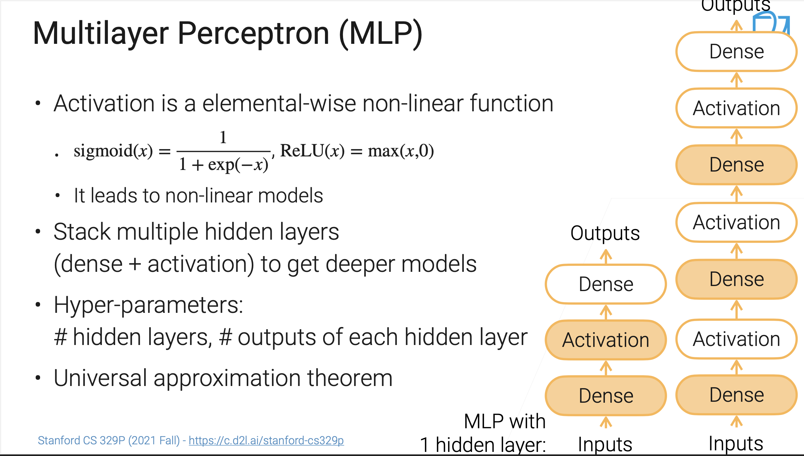
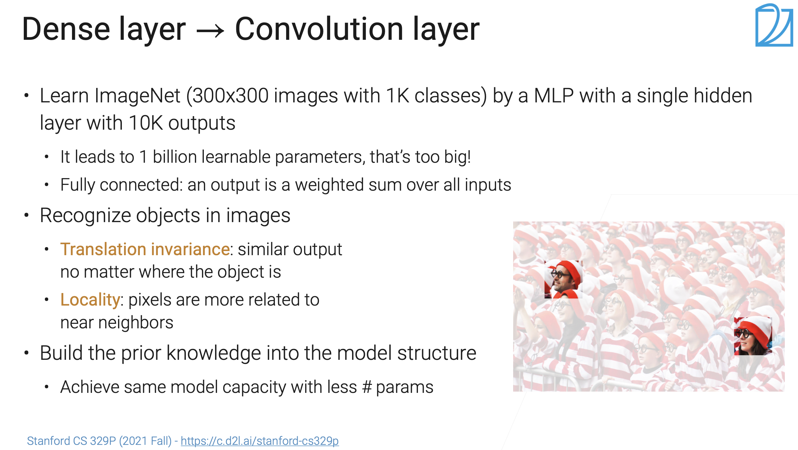
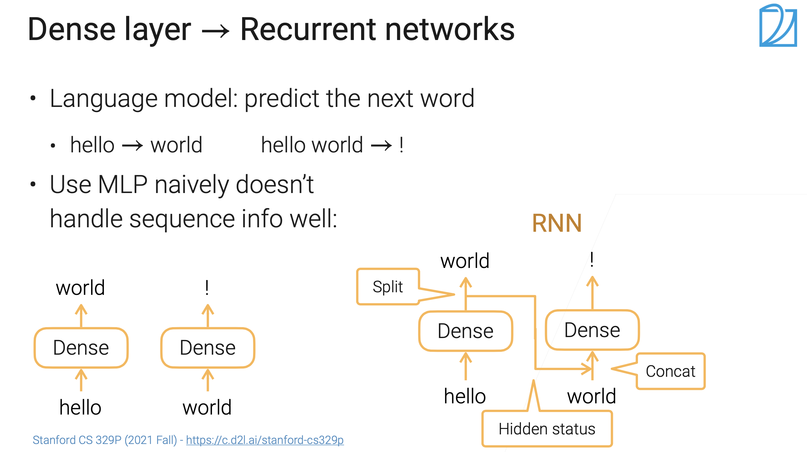
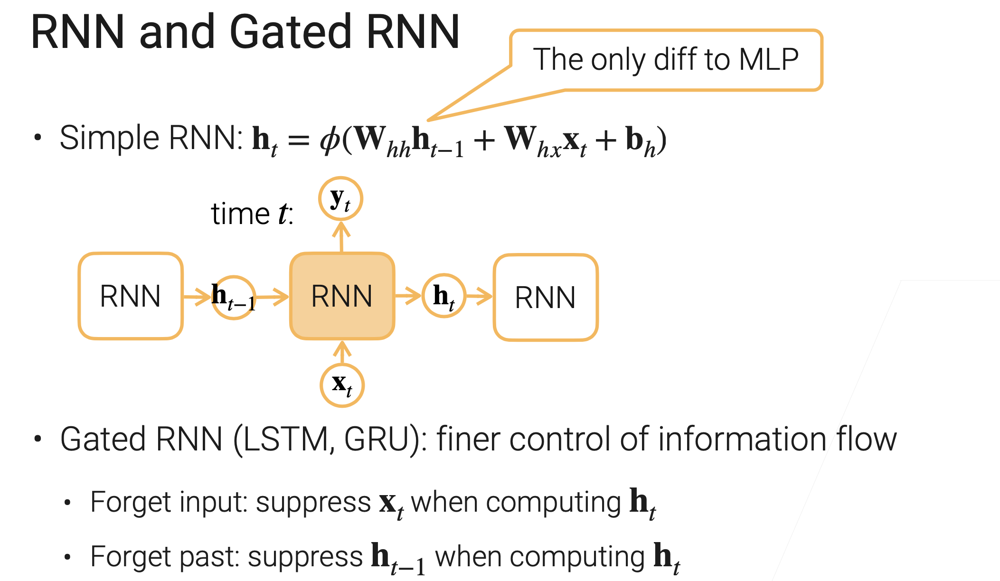
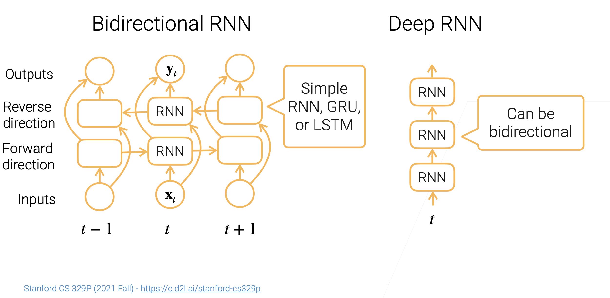

# Deep Learning (Neual Network)

[TOC]

## Res

>  More on machine learning go to ↗️ [Machine Learning](../Machine Learning/Machine Learning.md) 

【跟着李沐【动手学深度学习】课程，大佬亲授全方面解读“花书”，带你从入门到精通（人工智能/深度学习/计算机视觉/图像处理）】 https://www.bilibili.com/video/BV1QP411j7jB/?share_source=copy_web&vd_source=7740584ebdab35221363fc24d1582d9d

【10.1 深度神经网络架构【斯坦福21秋季：实用机器学习中文版】】 https://www.bilibili.com/video/BV1WY411p7Zp/?share_source=copy_web&vd_source=7740584ebdab35221363fc24d1582d9d

## MLP

## Convolution Neural Network (CNN)

Recognize objects in images:

- **Translation invariance:** similar output no matter where the object is
- **Locality**:pixels are more related to near neighbors

### Convolution Layer

### Pooling Layer

## Recurrent Neural Network (RNN)

### Gated RNN

### Bi-RNN & Deep RNN

## Recommended Readings

[Deep Learning vs. Machine Learning]: https://dzone.com/articles/deep-learning-vs-machine-learning-the-hottest-topi