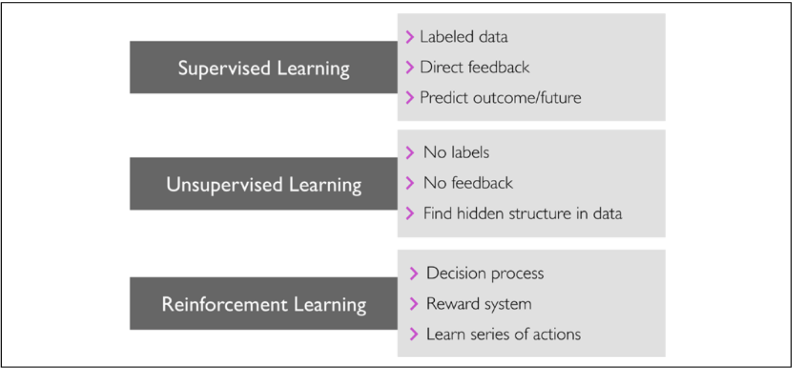
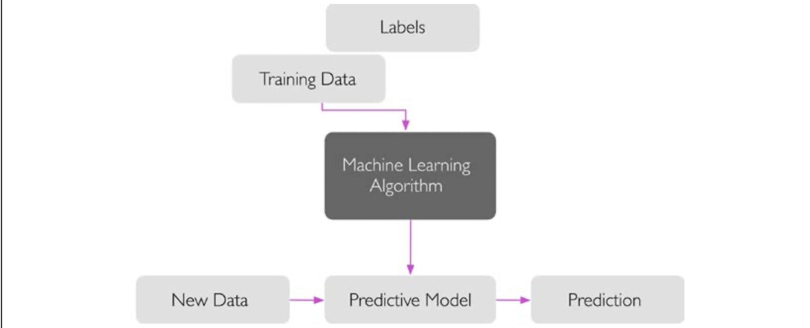

# ML Learning Models (Statistic MOdels)

[TOC]

## Res
↗ [Neural Network Models](../../Deep%20Learning%20(Neural%20Network)/🪸%20Neural%20Network%20Models/Neural%20Network%20Models.md)

## Overview

## Types of Machine Learning

### Supervised Learning

> More on ↗️ [Supervised Learning](Supervised Learning/Supervised Learning.md)

The main goal in supervised learning is to learn a model from labeled training
 data that allows us to make predictions about unseen or future data. Here, the
 term "supervised" refers to a set of training examples (data inputs) where the desired output signals (labels) are already known. The following figure summarizes a typical supervised learning workflow, where the labeled training data is passed

to a machine learning algorithm for fitting a predictive model that can make predictions on new, unlabeled data inputs:

#### Self-supervised learning

generate labels from data.

E.g. word2vec, BERT

#### Classification

Classification is a subcategory of supervised learning where the goal is to predict the categorical class labels of new instances, based on past observations. Those class labels are **discrete**, unordered values that can be understood as the group memberships of the instances. 

#### Regression

A second type of supervised learning is the prediction of **continuous outcomes**, which is also called **regression analysis**. In regression analysis, we are given a number of predictor (**explanatory**) variables and a continuous response variable (**outcome**), and we try to find a relationship between those variables that allows us to predict an outcome.

> :bulb: The emphases here is **continuous outcomes**, which means the input might still be discrete whil the outcome required is continuous. 

### Semi-supervised learning

#### Self-training

#### GAN

generating fake data with trivial label from unlabeled data.

### Reinforcement learning

Another type of machine learning is **reinforcement learning**. In reinforcement learning, the goal is to develop a system (**agent**) that improves its performance based on interactions with the environment. Since the information about the current state of the environment typically also includes a so-called **reward signal**, we can think
 of reinforcement learning as a field related to supervised learning. However, in reinforcement learning, this feedback is not the correct ground truth label or value, but a measure of how well the action was measured by a reward function. Through its interaction with the environment, an agent can then use reinforcement learning to learn a series of actions that maximizes this reward via an exploratory trial-and-error approach or deliberative planning.

### Unsupervised learning

In supervised learning, we know the right answer beforehand when we train a model, and in reinforcement learning, we define a measure of reward for particular actions carried out by the agent. In unsupervised learning, however, we are dealing with unlabeled data or data of unknown structure. Using unsupervised learning techniques, we are able to explore the structure of our data to extract meaningful information without the guidance of a known outcome variable or reward function.

#### Clustering

**Clustering** is an exploratory data analysis technique that allows us to organize a
 pile of information into meaningful subgroups (**clusters**) without having any prior knowledge of their group memberships. Each cluster that arises during the analysis defines a group of objects that share a certain degree of similarity but are more dissimilar to objects in other clusters, which is why clustering is also sometimes called **unsupervised classification**. 

#### Dimensionality reduction

Another subfield of unsupervised learning is **dimensionality reduction**. Often, we are working with data of high dimensionality—each observation comes with a high number of measurements—that can present a challenge for limited storage space and the computational performance of machine learning algorithms. Unsupervised dimensionality reduction is a commonly used approach in feature preprocessing

to remove noise from data, which can also degrade the predictive performance of certain algorithms, and compress the data onto a smaller dimensional subspace while retaining most of the relevant information.

Sometimes, dimensionality reduction can also be useful for visualizing data;

## Ref