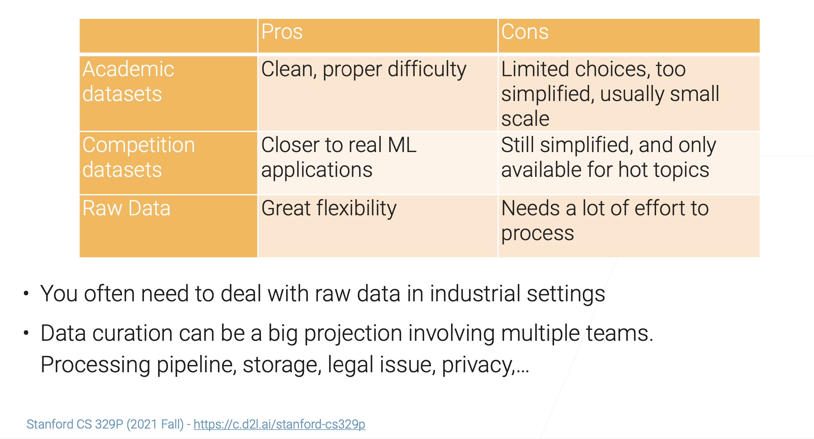
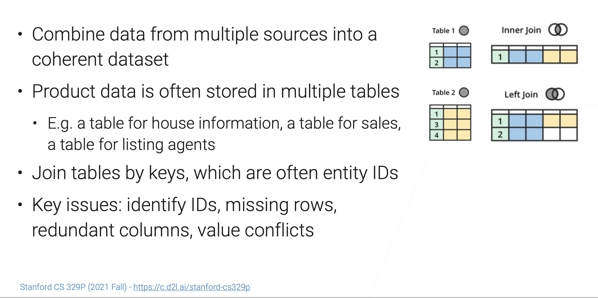
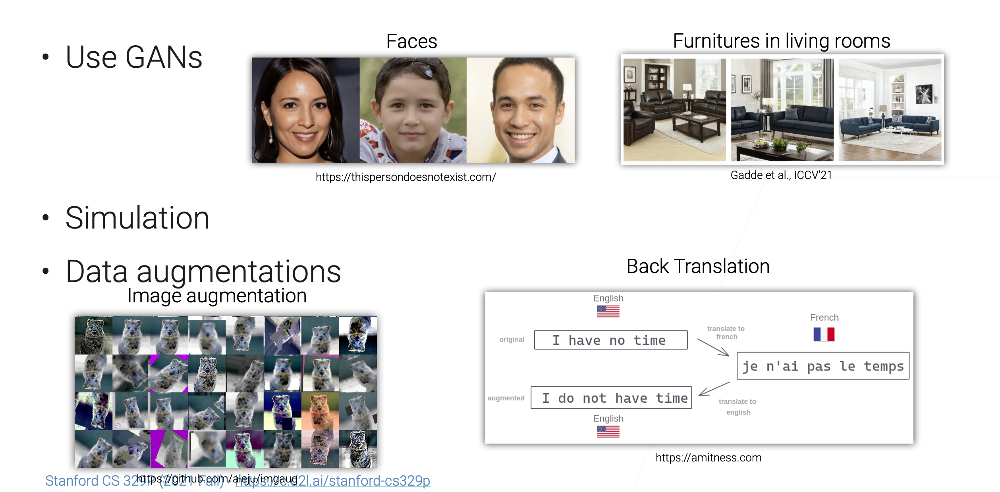

# Data Acquisition

[TOC]

## External Dataset

### Popular ML datasets

- MNIST: digits written by employees of the US Census Bureau • ImageNet: millions of images from image search engines
- AudioSet: YouTube sound clips for sound classification
- LibriSpeech: 1000 hours of English speech from audiobook
- Kinetics: YouTube videos clips for human actions classification
- KITTI: traffic scenarios recorded by cameras and other sensors
- Amazon Review: customer reviews and from Amazon online shopping • SQuAD: question-answer pairs derived from Wikipedia

:link: More at https://en.wikipedia.org/wiki/List_of_datasets_for_machine-learning_research

### Where to Find Datasets

- Paperswithcodes Datasets: academic datasets with leaderboard

- Kaggle Datasets: ML datasets uploaded by data scientists
- Google Dataset search: search datasets in the Web
- Various toolkits datasets: tensorflow, huggingface
- Various conference/company ML competitions
- Open Data on AWS: 100+ large-scale raw data
- Data lakes in your own organization

### Datasets Comparison

### Data Integration

## Generate Synthetic Data

## Web Scraping

The goal is to extract data from website.

- Noisy,weaklabels,canbespammy
- Availableatscale
- E.g. price comparison/ trackingwebsite

Many ML datasets are obtained by web scraping 

- E.g. ImageNet,Kinetics

🆚 Web crawling VS scrapping

- Crawling: indexing whole pages on Internet

- Scraping: scraping particular data from webpages of a website

### Tools

- curl
- Headless browser
- Lots of IP

[Common Crawl](https://commoncrawl.org/) 

### Legal Consideration

- Web scraping isn’t illegal by itself
- But you should
  - NOT scrape data have sensitive information (E.g. private data involving username/ password, personal health/medical information)
- NOT scape copyrighted data(E.g.YouTubevideos,Flickrphotos)
- Follow the Terms of Service that explicitly prohibits webs craping
- Consult a lawyer if you are doing it for profit.

