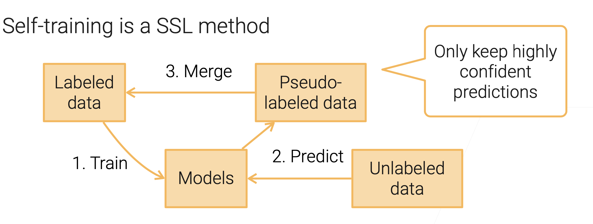
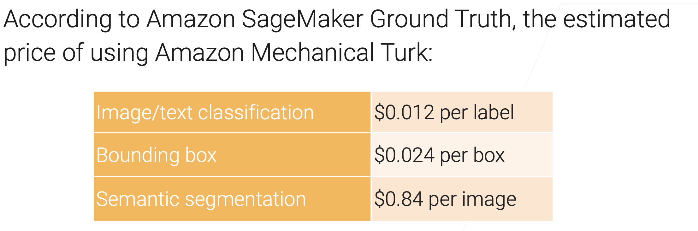
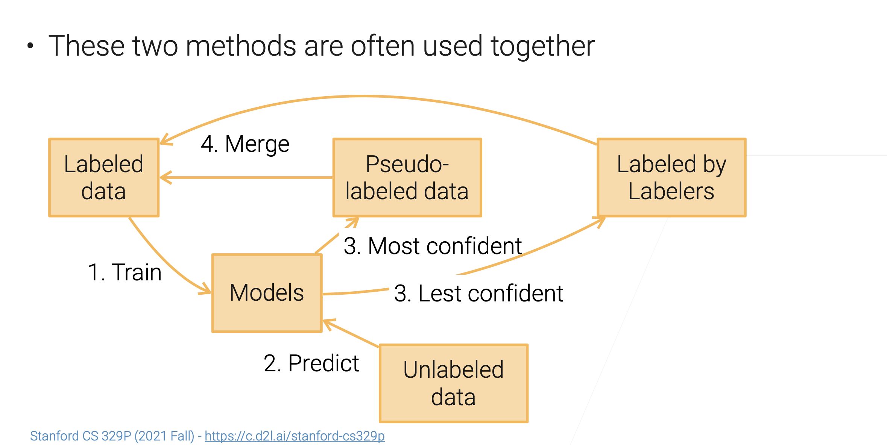
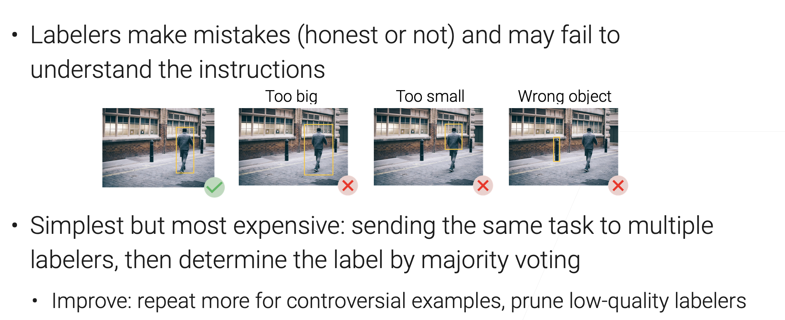

# Data Labeling

[TOC]

## Semi-Supervised Learning (SSL)

Focus on the scenario where there is a small amount of labeled data, along with large amount of unlabeled data.

SSL makes below assumptions on data distribution to use unlabeled data:

- **Continuity assumption**: examples with similar features are more likely to have the same label.
- **Cluster assumption**:data have inherent cluster structure, examples in the same cluster tend to have the same label.
- **Manifold assumption**:data lie on a manifold of much lower dimension than the input space.

### Self-training

## Label through Crowdsourcing

### [Amazon Mechanical Turk](https://www.mturk.com)

Amazon Mechanical Turk is a crowdsourcing website for businesses to hire remotely located "crowdworkers" to perform discrete on-demand tasks that computers are currently unable to do. It is operated under Amazon Web Services, and is owned by Amazon.

e.g. ImageNet

### Challenges

- **Simplify user interaction**: design easy tasks, clear instructions and simple to use interface
  - Needs to find qualified workers for complex jobs (e.g.label medical images)
- **Cost**: reduce  $$tasks \times time$$  per task sent to labelers
- **Quality control**: label qualities generated by different labelers vary

### Reduce #tasks: Active Learning

Focus on same scenario as SSL but with human in the loop.

- **Self training**: Model helps propagate labels to unlabeled data.
- **Active learning**: Model select the most “**interesting**” data for labelers.

#### Uncertainty sampling

Choose the most uncertaint lable for labelers to label.

#### Query-by-committee

Trains multiple models and select samples that models disagree with.

#### Active Learning + Self Learning

### Quality control

【1.4 数据标注【斯坦福21秋季：实用机器学习中文版】】 【精准空降到 25:06】 https://www.bilibili.com/video/BV1HL41147aL/?share_source=copy_web&vd_source=7740584ebdab35221363fc24d1582d9d&t=1506

## Weak Supervision

Semi-automatically generate labels. Less accurate than manual ones,but good enough for training

### Data programming

TODO
