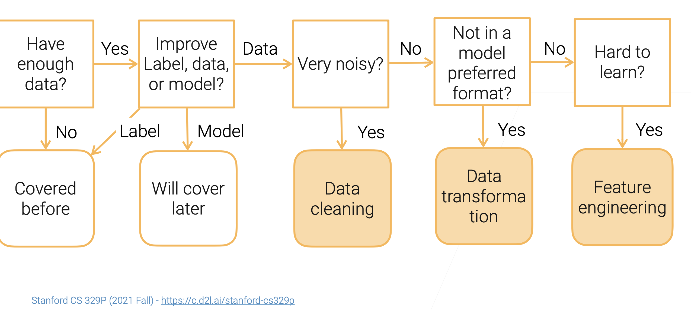
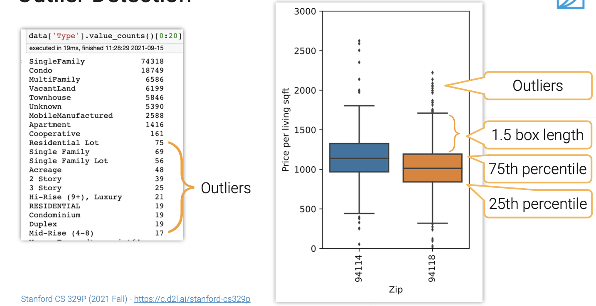
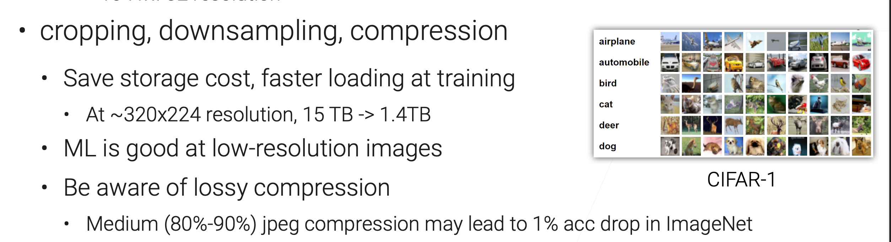

#  Data Preprocessing

[TOC]

## Data Cleaning

【2.2 数据清理【斯坦福21秋季：实用机器学习中文版】】 https://www.bilibili.com/video/BV1kQ4y1Q7mx/?share_source=copy_web&vd_source=7740584ebdab35221363fc24d1582d9d

### Data Errors

#### Outlier

#### Rule violations

##### Functional dependencies

##### Denial constraints

#### Pattern violations

##### Syntactic patterns

##### Semantic patterns

## Data Transformation

【2.3 数据变换【斯坦福21秋季：实用机器学习中文版】】 https://www.bilibili.com/video/BV1pQ4y167ej/?share_source=copy_web&vd_source=7740584ebdab35221363fc24d1582d9d

### Tabular Transformations (Normalization for Real Value Columns)

### Image Transformations

#### cropping

#### downsampling

#### whitening

### Video Transformations

#### clipping

#### samplingframes

### Text Transformation

#### Stemming and lemmatization

#### Tokenization

text corpus (Unigram, WordPiece)

## Feature Engineering (FE)

