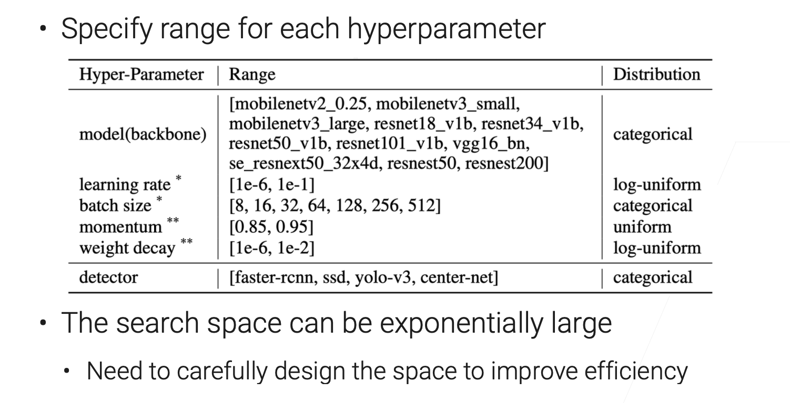
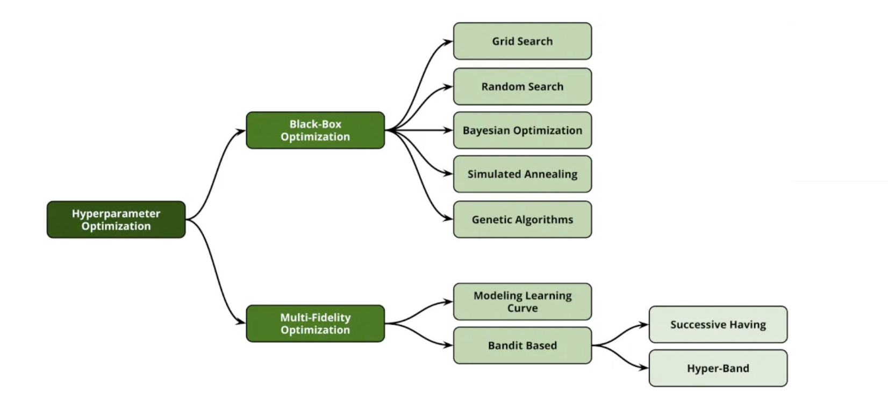

# HPO Algorithms

[TOC]

## Res

【9.2 超参数优化【斯坦福21秋季：实用机器学习中文版】】 https://www.bilibili.com/video/BV1FM4y1c7yG/?share_source=copy_web&vd_source=7740584ebdab35221363fc24d1582d9d

## Search Space

## HPO algorithms: Black-box or Multi-fidelity

**Black-box**: treats a training job as a black-box in HPO:

- Completesthetrainingprocessforeachtrial

**Multi-fidelity**: modifies the training job to speed up the search

- Train on subsampled datasets
- Reduce modelsize (e.g less #layers, #channels) 
- Stop bad configuration earlier

### Black-box

#### Grid Search

#### Random Search

#### Bayesian Optimization (BO)

### Multi-Fidelity

#### Successive Halving

#### Hyperband

## Ref