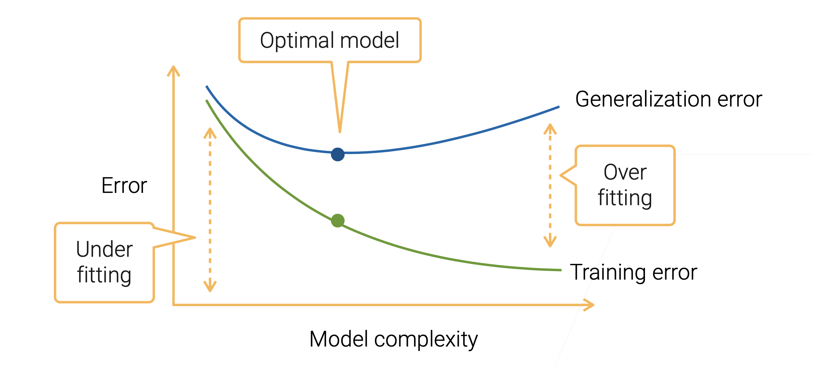
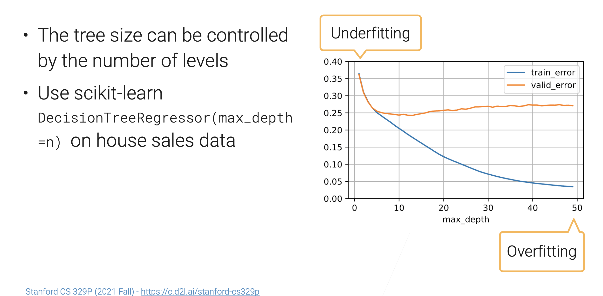
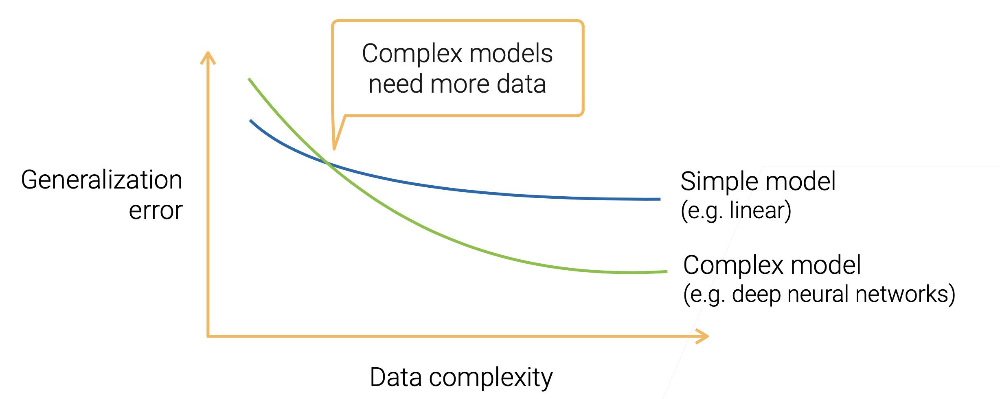
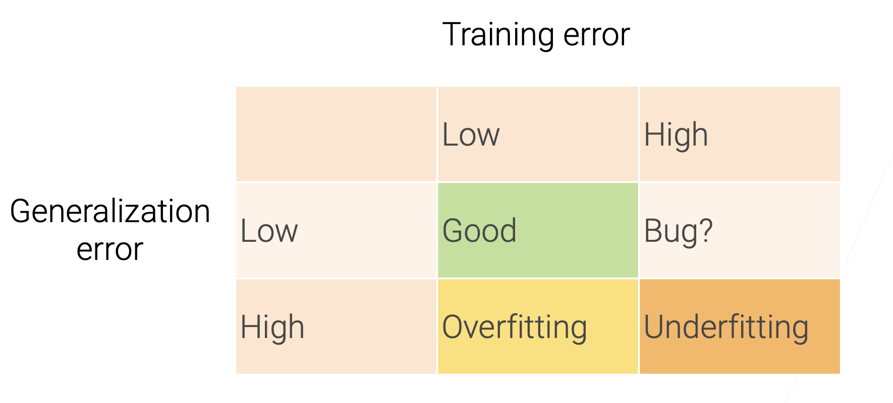
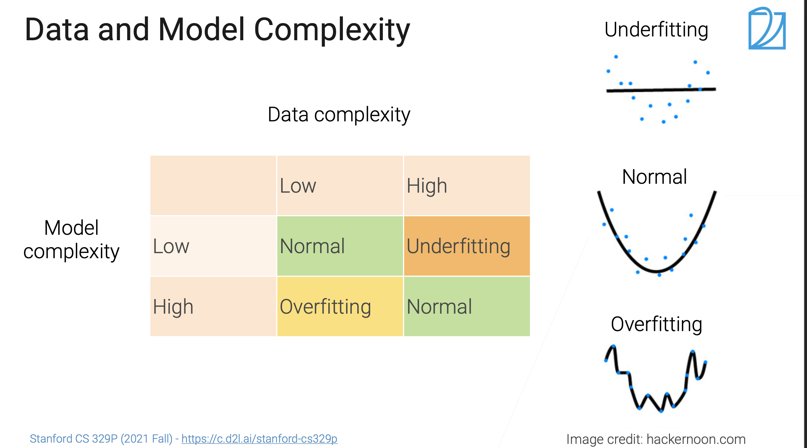

# Evaluation Metrics

[TOC]

## Intro

## Error

### Training Error

**Training error**: model error on the training data

### Generalization Error

**Generalization error**: model error on new data

#### Bias

#### Variance

### 🎯 Reduce Bias & Variance

↗️ [Model Combination](../Model Combination/Model Combination.md) 

## Complexity

### Model Complexity

#### Model Complexity Example: Decision Tree

### Data Complexity

## Underfitting & Overfitting

## Ref

