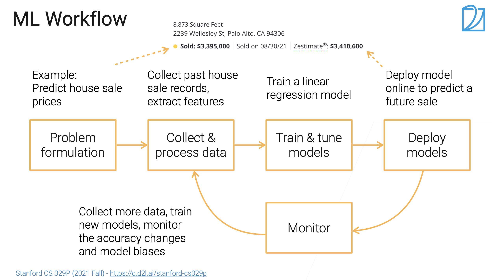
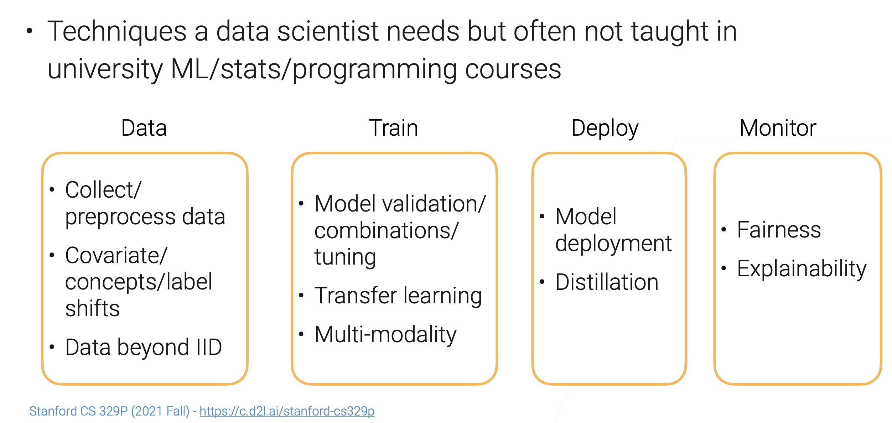
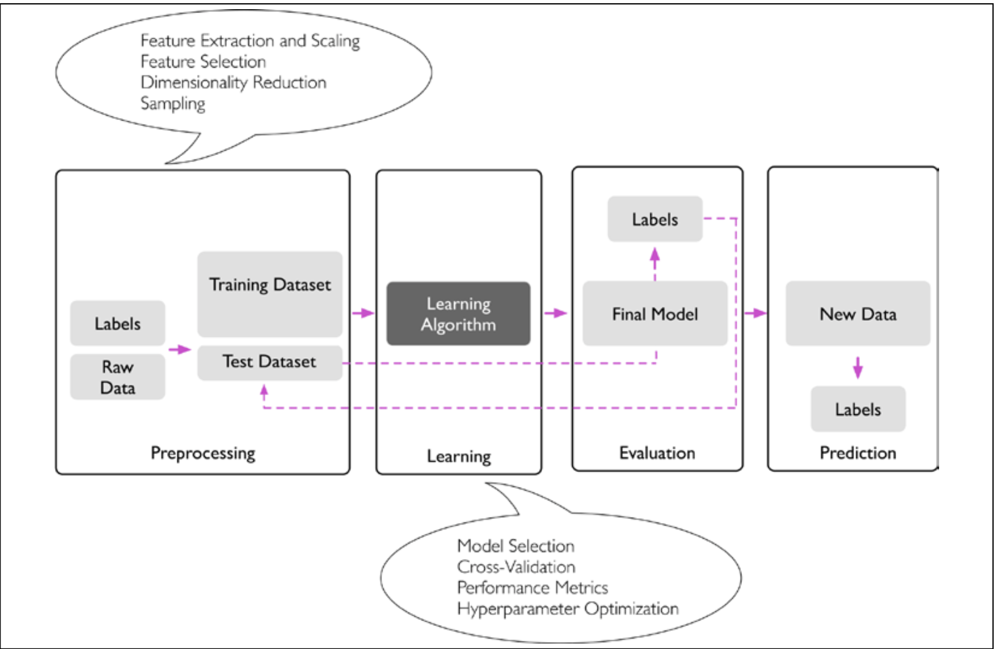

# Machine Learning

[TOC]

## Res

🏫 [CS 329P : Practical Machine Learning](../../../🏠 Assets/Stanford/CS 329P : Practical Machine Learning/CS 329P :  Practical Machine Learning.md)

- https://c.d2l.ai/stanford-cs329p/syllabus.html
- 【1.1 课程介绍【斯坦福21秋季：实用机器学习中文版】】 https://www.bilibili.com/video/BV13U4y1N7Uo/?share_source=copy_web&vd_source=7740584ebdab35221363fc24d1582d9d

【00 预告【动手学深度学习v2】】 https://www.bilibili.com/video/BV1if4y147hS/?share_source=copy_web&vd_source=7740584ebdab35221363fc24d1582d9d

↗️ [Statistical Learning Theory](📌 Statistical Learning Theory/Statistical Learning Theory.md) 

↗️ [Deep Learning (Neual Network)](../Deep Learning (Neural Network)/Deep Learning (Neual Network).md) 

## 🌄 Overview

### Roles in ML

- **Domain experts**: have business insights, know what data is important and where to find it, identify the real impact of a ML model,
- **Data scientists**: full stack on data mining, model training and deployment.
- **ML experts**: customize SOTA ML models.
- **SDE (Software develop engineer)**: develop/maintain data pipelines, model training and serving pipelines.

## Run ML model on GPU

## 📚 Prepare the dataset

<small>How data scientists spent their time (source: Anaconda survey 2020)</small>

↗️ [Dataset](Dataset/Dataset.md)

## Types of machine learning

More specific contents follow ↗️ [ML Learning Models](ML Learning Models/ML Learning Models.md).

## 🏭 Machine learning system

### Preprocessing

#### Regularization

Many machine learning algorithms also require that the selected features are on the same scale for optimal performance, which is often achieved by transforming the features in the range [0, 1] or a standard normal distribution with zero mean and unit variance, as we will see in later chapters.

#### Dimensionality reduction

Some of the selected features may be highly correlated and therefore redundant
 to a certain degree. In those cases, dimensionality reduction techniques are useful for compressing the features onto a lower dimensional subspace

### Training and selecting a predictive model

#### Cross-Validation

#### Hyperparameter Optimization

### Evaluating models and predicting unseen data instances

## Ref