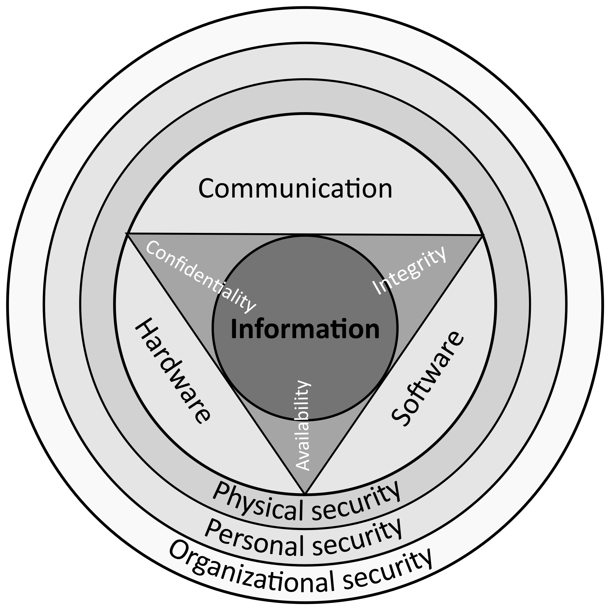

# Network Security

[TOC]

## Res
### Related Topics
↗ [Computer Networking and Communication](../../🔑%20CS_Core/🏎️%20Computer%20Networking%20and%20Communication/Computer%20Networking%20and%20Communication.md)

### Learn it by doing it!
💉 [Network Penetration (Pen-testing)](../🥇%20Best%20Practice/💉%20Network%20Penetration%20(Pen-testing)/Network%20Penetration%20(Pen-testing).md)
⚔️ [Red Team & Blue Team](../🥇%20Best%20Practice/Red%20Team%20&%20Blue%20Team/Red%20Team%20&%20Blue%20Team.md)

🎏 [Network Traffic Analysis](../🥇%20Best%20Practice/Forensics/Network%20Traffic%20Analysis/Network%20Traffic%20Analysis.md)
↗ [CTF /Web](../🥇%20Best%20Practice/CTF/Web/Web.md)

↗ [Web Security](../Application%20Security/💉%20Web%20Security/Web%20Security.md)
↗ [Comprehensive Defense Systems & Security Products](../🛌%20Comprehensive%20Defense%20Systems%20&%20Security%20Products/Comprehensive%20Defense%20Systems%20&%20Security%20Products.md)

🔥 https://github.com/qazbnm456/awesome-web-security
Needless to say, most websites suffer from various types of bugs which may eventually lead to vulnerabilities. Why would this happen so often? There can be many factors involved including misconfiguration, shortage of engineers' security skills, etc. To combat this, here is a curated list of Web Security materials and resources for learning cutting-edge penetration techniques, and I highly encourage you to read the article "[So you want to be a web security researcher?](https://portswigger.net/blog/so-you-want-to-be-a-web-security-researcher)" first.

## Intro
> 关注对网络设备，通讯链路、服务器、终端的安全，即OSI 7层模型

Network Security includes security issues in all OSI 7 layers, in which web security (which lies in the application layer, but web security is a subset of application layer security) is often the most interesting to the public.

> In general, the term  "web" focus more on the application layer, while the term "network" refers to the whole networking system. However, in the security field, they don't seem to have that much distinction. (??? 🙈)

### Web Security
In general, web security refers to **the protective measures and protocols that organizations adopt to protect the organization from cyber criminals and threats that use the web channel**. Web security is critical to business continuity and to protecting data, users, and companies from risk.

### ☠️ Network Security
> 🔗 https://en.wikipedia.org/wiki/Network_security

**Network security** consists of the 
1. Security Risk
2. Security Services
3. Security Mechanisms (Policies & Processes & Practices)
	1. prevent
	2. detect
	3. monitor 
	4. defend
unauthorized access, misuse, modification, or denial of a computer network and network-accessible resources.

#### Security Risks

↗ [Network Treats & Attacks](Network%20Treats%20&%20Attacks/Network%20Treats%20&%20Attacks.md)

#### Security Services

Recall the Security Tria:

#### Security Mechanisms
↗ [Cryptography](../🚬%20Cryptology/🤐%20Cryptography/Cryptography.md)

↗ [Network Security Basics & Protocols](🏇%20Network%20Security%20Basics%20&%20Protocols/Network%20Security%20Basics%20&%20Protocols.md)

↗ [Cybersecurity Basics & InfoSec](../🏰%20Cybersecurity%20Basics%20&%20InfoSec/Cybersecurity%20Basics%20&%20InfoSec.md)
- Classification
- Security Control
- Access Control
	- Identification 
	- Authentication 
	- Authorization
↗ [Networking Access Control](🏇%20Network%20Security%20Basics%20&%20Protocols/Networking%20Access%20Control/Networking%20Access%20Control.md)
↗ [InfoSec /Access Control](../🏰%20Cybersecurity%20Basics%20&%20InfoSec/Identity%20&%20Access%20Management%20(IAM)/Access%20Control%20(访问控制)/Access%20Control%20(访问控制).md)

↗ [IDS (Intrusion Detection Systems)](../🛌%20Comprehensive%20Defense%20Systems%20&%20Security%20Products/IDS%20(Intrusion%20Detection%20Systems)/IDS%20(Intrusion%20Detection%20Systems).md)

## Network Security Zones
> 🔗 https://www.ibm.com/docs/en/zos/2.2.0?topic=concepts-network-security-zones

==A network security zone is an administrative name for a collection of systems that require the same access control policy.== IP addresses are used to map systems into security zones. This requires that the IP addresses used in your multilevel secure network be predictably associated with a single system or group of systems with the same access control policy. A network security zone can contain a single IP address or any combination of IP addresses and subnetworks. All of the IP addresses in a security zone must have the same security label, though all IP addresses with the same security label do not have to be in the same security zone.

[目前网络安全域划分有哪些基本方法]: https://www.wangan.com/wenda/7206
>1. 按照业务系统来划分;
>2. 按照防护等级来划分;
>3. 按照系统行为来划分;

## Ref
[企业网络安全最佳实践指南(五)]: https://www.freebuf.com/articles/es/253992.html

> 1、网络安全防御理论
> 
> 常见的网络安全防御理论有PDR/P2DR模型、边界防御、纵深防御、河防、塔防、下一代纵深防御等。
> （1）PDR/P2DR模型
> （2）边界防御体系
> （3）纵深防御体系
> （4）河防体系
> （5）塔防体系
> （6）下一代纵深防御体系
> * 上述防御体系不一一展开详述。

