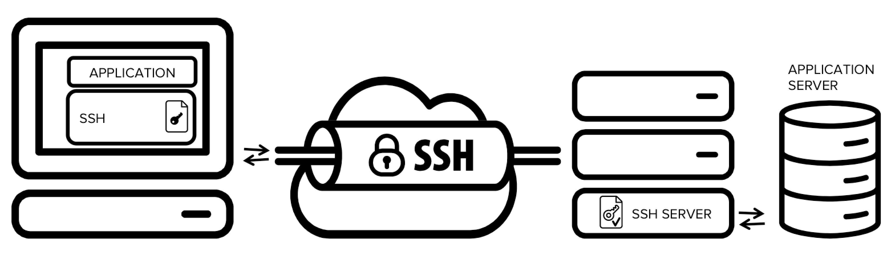

# SSH Tunneling

[TOC]

## Res

## Intro
### What is an SSH tunnel?
SSH tunneling is a method of transporting arbitrary networking data over an encrypted SSH connection. It can be used to add encryption to legacy applications. It can also be used to implement VPNs (Virtual Private Networks) and access intranet services across firewalls.

The SSH connection is used by the application to connect to the application server. With tunneling enabled, the application contacts to a port on the local host that the SSH client listens on. The SSH client then forwards the application over its encrypted tunnel to the server. The server then connects to the actual application server - usually on the same machine or in the same data center as the SSH server. The application communication is thus secured, without having to modify the application or end user workflows.

