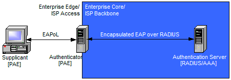

# EAPoL (EAP over LAN)

[TOC]

## Res
↗ [IEEE 802.1x](../IEEE%20802.1x.md)
↗ [Authentication (身份鉴别)](../../../../../../⛈️%20Risk%20Management/🐺%20Risk%20Countermeasures%20&%20Security%20Control/Identity%20&%20Access%20Management%20(IAM)/Access%20Control%20(访问控制)/Authentication%20(身份鉴别)/Authentication%20(身份鉴别).md)

↗ [PPP (Point-to-Point Protocol)](../../../../../../../🔑%20CS%20Core/🏎️%20Computer%20Networking%20and%20Communication/📌%20Computer%20Networking%20Basics%20(Protocol%20Part)/0x06%20Data%20Link%20Layer/Switched%20LAN/〰️%20P2P%20Channels/PPP%20(Point-to-Point%20Protocol)/PPP%20(Point-to-Point%20Protocol).md)

## Intro
> ↗ [IEEE 802.1x /Intro](../IEEE%20802.1x.md#Intro)

According to IEEE 802.1x standard, EAPol is the encapsulation of EAP over IEEE 802 network.

## Ref

[802.1x（dot1x）协议详解 - 大西洋里的鱼的文章 - 知乎]: https://zhuanlan.zhihu.com/p/151693854

https://youtu.be/FgRtfpCOlaM

[SDN课程1-认识NCE控制器和系列]: https://www.bilibili.com/video/BV1x84y1q7NU/?share_source=copy_web&vd_source=7740584ebdab35221363fc24d1582d9d

[CN105978810A - 基于sdn的用户认证方法及系统 - Google Patents]: https://patents.google.com/patent/CN105978810A/zh
[基于SDN的虚拟机网络访问控制系统设计与 实现]: https://image.hanspub.org/Html/20-1541222_28914.htm
[25 张图详解交换机：秒懂二层交换机的 16 个问题]: https://www.sdnlab.com/25464.html

