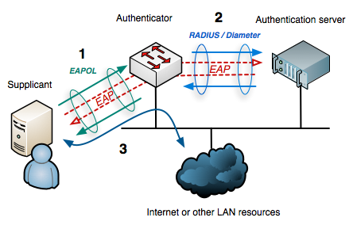
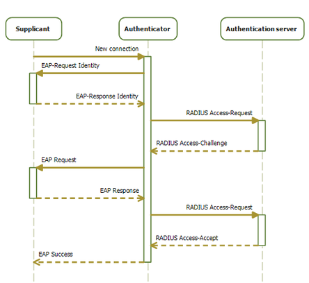

# IEEE 802.1x

[TOC]

## Res
### Related Topics
↗ [IEEE 802.1](../../../../../../🔑%20CS_Core/🏎️%20Computer%20Networking%20and%20Communication/📌%20Computer%20Networking%20Basics/0x06%20Data%20Link%20Layer/Switched%20LAN/Broadcast%20Channels/IEEE%20802%20Family/IEEE%20802.1.md)
↗ [EAP (Extensible Authentication Protocol)](../../📌%20Physical%20&%20Link%20Layer%20Security%20Protocols/EAP%20(Extensible%20Authentication%20Protocol)/EAP%20(Extensible%20Authentication%20Protocol).md)

## Intro
> 🔗 https://en.wikipedia.org/wiki/IEEE_802.1X
> ↗ [EAP /Related Glossaries](../../📌%20Physical%20&%20Link%20Layer%20Security%20Protocols/EAP%20(Extensible%20Authentication%20Protocol)/EAP%20(Extensible%20Authentication%20Protocol).md#Related%20Glossaries)
> ↗ [EAPoL /Intro](IEEE%20802.1x%20Implementations/EAPoL%20(EAP%20over%20LAN).md#Intro)

> ‼️ **IEEE 802.1X** is an [IEEE Standard](https://en.wikipedia.org/wiki/IEEE_Standard) for **port-based [Network Access Control](https://en.wikipedia.org/wiki/Network_Access_Control) (PNAC)**. It is part of the [IEEE 802.1](https://en.wikipedia.org/wiki/IEEE_802.1) group of networking protocols. It provides an [authentication](https://en.wikipedia.org/wiki/Authentication) mechanism to devices wishing to attach to a [LAN](https://en.wikipedia.org/wiki/Local_area_network) or [WLAN](https://en.wikipedia.org/wiki/Wireless_LAN).

<small>EAP data is first encapsulated in EAPOL frames between the Supplicant and Authenticator, then re-encapsulated between the Authenticator and the Authentication server using RADIUS or Diameter <a>https://en.wikipedia.org/wiki/Diameter_(protocol)</a>).</small>

**IEEE 802.1x** defines the authentication machenism used in IEEE 802 network.
- There are three primary components of 802.1X authentication:
  1. the user's wireless device;
  2. the wireless access point ([AP](https://www.techtarget.com/searchmobilecomputing/definition/access-point)) or authenticator;
  3. the authentication database or the [authentication server](https://www.techtarget.com/searchsecurity/definition/authentication-server).

EAPoL is one of the authentication mechanism defined by 802.1x. EAPoL confirms with EAP which is defined if RFC 3748.

> ‼️ IEEE 802.1x defines **EAPol** as an authentication mechanism. Before authenticated, 802.1x denied any traffic except the EAPoL package; After successfully authenticated, 802.1x allows any traffic from that authenticated user. 

802.1x is a work group under ↗ [IEEE 802.1](../../../../../../🔑%20CS_Core/🏎️%20Computer%20Networking%20and%20Communication/📌%20Computer%20Networking%20Basics/0x06%20Data%20Link%20Layer/Switched%20LAN/Broadcast%20Channels/IEEE%20802%20Family/IEEE%20802.1.md).

### 802.1x End Hosts /Roles
> ↗ [EAPoL /Intro](IEEE%20802.1x%20Implementations/EAPoL%20(EAP%20over%20LAN).md#Intro)

客户端：局域网用户终端设备，但必须是支持EAPOL（Extensible Authentication Protocol over LAN，局域网可扩展认证协议）的设备（如PC机），可通过启动客户端设备上安装的802.1x客户端软件发起802.1x认证。

设备端：支持802.1x协议的网络设备（如交换机），对所连接的客户端进行认证。它为客户端提供接入局域网的端口，可以是物理端口，也可以是逻辑端口（如Eth-Trunk口）。

认证服务器：为设备端802.1x协议提供认证服务的设备，是真正进行认证的设备，实现对用户进行认证、授权和计费，通常为RADIUS服务器。

### 802.1x Trigger
802.1x的认证过程可以由客户端主动发起，也可以由设备端主动发起。
- 在“客户端主动触发方式”中，由客户端主动向设备端发送EAPOL-Start（EAPOL开始）报文来触发认证；
- 而“设备端主动触发方式”中用于支持不能主动发送EAPOL-Start报文的客户端，例如Windows XP自带的802.1x客户端。

设备端主动触发方式中又有两种以下具体的触发方式
- DHCP报文触发：设备在收到用户的DHCP请求报文后主动触发对用户的802.1x认证，仅适用于客户端采用DHCP方式自动分配IP地址的情形。因为DHCP请求报文是以广播方式发送的，所以在同一网段中的设备都可以收到，故设备端不一定就是担当DHCP服务器的设备。
- 源MAC地址未知报文触发：当设备收到源MAC地址未知的报文时主动触发对用户的802.1x认证。若设备端在设置的时长内没有收到客户端的响应，则重发该报文。

### 802.1x Authentication Principle
无论是哪种触发方式，802.1x认证系统都是使用EAP协议来实现客户端、设备端和认证服务器之间认证信息的交换。在客户端与设备端之间使用的是基于以太局域网的EAPOL格式封装EAP报文，然后承载于以太网数据帧中进行交互；而设备端与RADIUS服务器之间的EAP报文可以使用以下两种方式进行交互：

1. **EAP中继**：来自客户端的EAP报文到达设备端后，直接使用EAPOR（EAP over RADIUS）格式封装在RADIUS报文中，再发送给RADIUS服务器，则RADIUS服务器来从封装的EAP报文中获取客户端认证信息，然后再对客户端进行认证。
	1. 这种认证方式的优点是设备端的工作很简单，不需要对来自客户端的EAP报文进行任何处理，只需要用EAPOR对EAP报文进行封装即可，根本不管客户端的认证信息。同时在这种认证方式中，设备端与RADIUS服务器之间可支持多种EAP认证方法，例如 MD5-Challenge、EAP-TLS、PEAP等，但要求服务器端也支持相应的认证方法。

3. **EAP终结**：来自客户端的EAP报文在设备端进行终结，然后由设备端将从EAP报文中提取的客户端认证信息封装在标准的RADIUS报文（**不再是EAPOR格式**）中，与RADIUS服务器之间采用**PAP（Password Authentication Protocol，密码验证协议** 或 **CHAP（Challenge Handshake Authentication Protocal，质询握手验证协议** 方式对客户端进行认证（当然在RAIUDS服务器端必须配置合法用户的用户名和密码信息）。
	1. 这种认证方式的优点是现有的RADIUS服务器基本均可支持PAP和CHAP认证，无需升级服务器，但设备端的工作比较繁重，因为在这种认证方式中，设备端不仅要从来自客户端的EAP报文中提取客户端认证信息，还要通过标准的RAIUDS协议对这些信息进行封装，且不能支持除MD5-Challenge之外的其它EAP认证方法。

## Protocol Operation
> 🔗 https://en.wikipedia.org/wiki/IEEE_802.1X#Protocol_operation

### Port Entities

### Typical Authentication Process

<small>Sequence diagram of the 802.1X progression</small>

1. **Initialization** - On detection of a new supplicant, the port on the switch (authenticator) is enabled and set to the "unauthorized" state. In this state, only 802.1X traffic is allowed; other traffic, such as the [Internet Protocol](https://en.wikipedia.org/wiki/Internet_Protocol "Internet Protocol")(and with that [TCP](https://en.wikipedia.org/wiki/Transmission_Control_Protocol "Transmission Control Protocol")and [UDP](https://en.wikipedia.org/wiki/User_Datagram_Protocol "User Datagram Protocol")), is dropped
2. **Initiation** - To initiate authentication the authenticator will periodically transmit EAP-Request Identity frames to a special Layer 2 address (01:80:C2:00:00:03) on the local network segment. The supplicant listens on this address, and on receipt of the EAP-Request Identity frame, it responds with an EAP-Response Identity frame containing an identifier for the supplicant such as a User ID. The authenticator then encapsulates this Identity response in a [RADIUS](https://en.wikipedia.org/wiki/RADIUS "RADIUS") Access-Request packet and forwards it on to the authentication server. The supplicant may also initiate or restart authentication by sending an EAPOL-Start frame to the authenticator, which will then reply with an EAP-Request Identity frame.
3. **Negotiation** _(Technically EAP negotiation)_ The authentication server sends a reply (encapsulated in a [RADIUS](https://en.wikipedia.org/wiki/RADIUS "RADIUS") Access-Challenge packet) to the authenticator, containing an EAP Request specifying the EAP Method (The type of EAP based authentication it wishes the supplicant to perform). The authenticator encapsulates the EAP Request in an EAPOL frame and transmits it to the supplicant. At this point, the supplicant can start using the requested EAP Method, or do a NAK ("Negative Acknowledgement") and respond with the EAP Methods it is willing to perform.
2. **Authentication** If the authentication server and supplicant agree on an EAP Method, EAP Requests and Responses are sent between the supplicant and the authentication server (translated by the authenticator) until the authentication server responds with either an EAP-Success message (encapsulated in a [RADIUS](https://en.wikipedia.org/wiki/RADIUS "RADIUS") Access-Accept packet), or an EAP-Failure message (encapsulated in a [RADIUS](https://en.wikipedia.org/wiki/RADIUS "RADIUS") Access-Reject packet). If authentication is successful, the authenticator sets the port to the "authorized" state and normal traffic is allowed, if it is unsuccessful the port remains in the "unauthorized" state. When the supplicant logs off, it sends an EAPOL-logoff message to the authenticator, the authenticator then sets the port to the "unauthorized" state, once again blocking all non-EAP traffic.

## Techniques Paired with 802.1x
### VLAN下发

### Guest VLAN
#### PGV（Port-based Guest VLAN）

#### MGV（MAC-based Guest VLAN）

### Auth-Fail VLAN
#### PAFV（Port-based Auth-Fail VLAN）

#### MAFV（MAC-based Auth-Fail VLAN）

### ACL

### Port-specific Mandatory Domain

指定端口的强制认证域

## EAD (Endpoint Admission Defense)
802.1X支持EAD快速部署配置

[Endpoint Admission Defense -- H3C](https://www.h3c.com/en/Products_and_Solutions/InterConnect/Campus_Network/Solutions/202210/1701424_748048_0.htm)

[HP IMC Endpoint Admission Defense Software - Overview](https://support.hpe.com/hpesc/public/docDisplay?docId=emr_na-c04459926)

## Ref
[802.1x（dot1x）协议详解 - 大西洋里的鱼的文章 - 知乎]: https://zhuanlan.zhihu.com/p/151693854
[802.1X认证原理]: http://www.tlcement.com/366410.html
[802.1X(dot1x)技术简介]: https://cshihong.github.io/2019/05/30/802.1X认证原理/
[5.1802.1X原理]: https://www.bilibili.com/video/BV1CP411V7Bf/?share_source=copy_web&vd_source=7740584ebdab35221363fc24d1582d9d
[20 - 802.1x & EAP]: https://www.bilibili.com/video/BV1nK411V7Dw/?share_source=copy_web&vd_source=7740584ebdab35221363fc24d1582d9d
[Wi-Fi 安全协议 - 802.1X]: https://blog.csdn.net/xiaozy115/article/details/102930808

