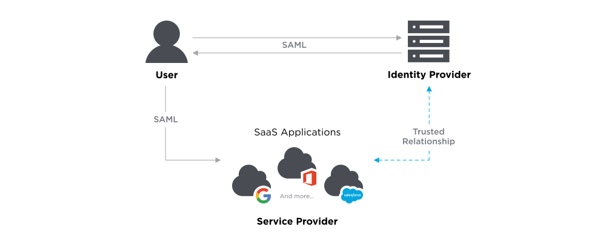
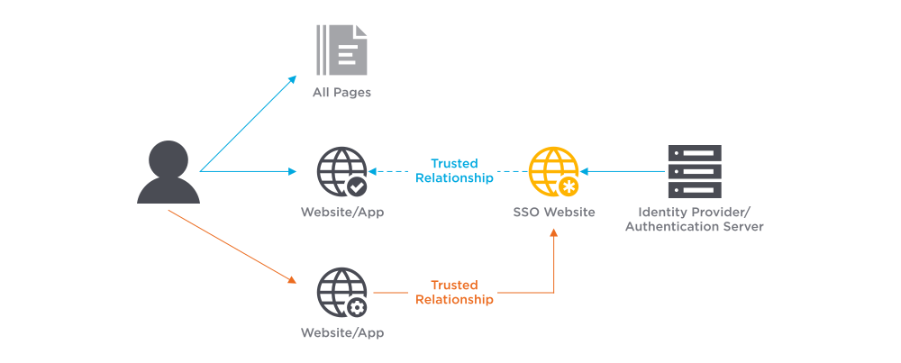

# Web Authentication Protocols

[TOC]

## Res

## Intro
### Authentication Protocols Process
典型身份鉴别协议的基本过程: 
(1)注册
(2)登录 
(3)鉴别
(4)口令修改
(5)注销(选)

## Web Authentication Protocols Overview
### Integrated Web Authentication (IWA)
#TODO 

rather trational 

### JWT

### [OAuth](https://oauth.net)

An **open protocol** to allow **secure authorization** in a **simple** and **standard** method from web, mobile and desktop applications.

👉 [Learn more about OAuth 2.0 »](https://oauth.net/2/) 

### [OIDC, OpenID Connect](https://openid.net/connect/)

OpenID Connect (OIDC) is **an open authentication protocol that works on top of the OAuth 2.0 framework**. Targeted toward consumers, OIDC allows individuals to use single sign-on (SSO) to access relying party sites using OpenID Providers (OPs), such as an email provider or social network, to authenticate their identities.

### Central Authentication Service, CAS
> 🔗 https://www.okta.com/identity-101/central-authentication-service/

Central authentication service, or CAS, is a single sign-on (SSO) protocol that allows websites to authenticate users.

Login credentials are only used once for multiple applications for [authentication](https://www.okta.com/identity-101/authentication/) without revealing the secure password. The application requiring authorization will redirect a user to a centralized trusted single server, the CAS server.

The CAS protocol can be used to authenticate untrusted web applications requiring a service ticket for access. CAS is a tool to authenticate a user, but this is not the same as authorizing one. Authorization is specific to the actual application.

The CAS approach can be simple to maintain and distribute to a large network of computers after the initial configuration. It can offer users convenience, consistency, and a high level of security.

### SAML

*SAML* is an acronym used to describe the Security Assertion Markup Language (SAML). SAML is an open standard used for authentication. Based upon the Extensible Markup Language (XML) format, web applications use SAML to transfer authentication data between two parties - the identity provider (IdP) and the service provider (SP).

<small>SAML</small>

#### SAML SSO

SAML Single Sign-On is a mechanism that leverages SAML allowing users to log on to multiple web applications after logging into the identity provider. As the user only has to log in once, SAML SSO provides a faster, seamless user experience.

<small>SAML SSO</small>

#### 🆚 How Does OAuth Compare to SAML?
OAuth and SAML are both protocols we use for allowing access. However, the primary difference between the two is that we use **SAML for authentication and OAuth for authorization**.

If we revisit the airline analogy, the passenger's ID is the SAML assertion, and the ticket the OAuth token. The airline uses the ID to verify the passenger’s identity before allowing them to board the aircraft. However, once the passengers are on the plane, the flight attendants use the ticket to confirm the passengers' status and entitlement. For example, they may have a first-class ticket giving them access to seats and amenities not accessible by passengers in economy.

## Ref
[secure authentication]: https://www.securecoding.com/blog/secure-authentication/
[自己动手做一个简单的 Telegram 入群验证 Bot |]: https://tstrs.me/1490.html
[用于识别、认证和验证的生物识别认证系统]: https://www.boonedam.com/zh-cn/accessories-and-additions/biometric-authentication-systems
[微信官方文档 -- 生物认证]: https://developers.weixin.qq.com/miniprogram/dev/framework/open-ability/bio-auth.html

- 小程序通过 [SOTER](https://github.com/Tencent/soter) 提供生物认证方式。
- 目前暂时只支持指纹识别认证。设备支持的生物认证方式可使用 [wx.checkIsSupportSoterAuthentication](https://developers.weixin.qq.com/miniprogram/dev/api/open-api/soter/wx.checkIsSupportSoterAuthentication.html) 查询

[22. Anonymous Authentication（匿名认证）]: https://www.cnblogs.com/jrkl/p/13513429.html

[SAML Explained in Plain English]: https://www.onelogin.com/learn/saml

