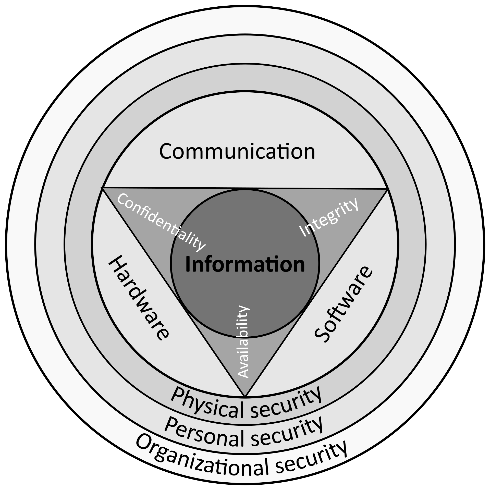

# Cybersecurity Basics & InfoSec

[TOC]

## Res
### Related Topics
↗ [Cryptology & Secure Communication](../🚬%20Cryptology%20&%20Secure%20Communication/Cryptology%20&%20Secure%20Communication.md)
↗ [Risk Management](../⛈️%20Risk%20Management/Risk%20Management.md)
↗ [Software Security](🍦%20Software%20Security/Software%20Security.md)

↗ [Cyber Ranges & Labs](../☠️%20Kill%20Chain/🎯%20Cyber%20Ranges%20&%20Labs/Cyber%20Ranges%20&%20Labs.md)
↗ [SEED Project](../☠️%20Kill%20Chain/🎯%20Cyber%20Ranges%20&%20Labs/🧪%20Ranges%20&%20Security%20Labs/SEED%20Project/SEED%20Project.md)

### Other Resources

## Intro: Information Security
> 🔗 https://en.wikipedia.org/wiki/Information_security

**Information security**, sometimes shortened to **InfoSec**, is the practice of protecting [information](https://en.wikipedia.org/wiki/Information) by mitigating information risks.

It is part of [information risk management](https://en.wikipedia.org/wiki/Risk_management_information_systems). 

It typically involves preventing or reducing the probability of unauthorized/inappropriate access to [data](https://en.wikipedia.org/wiki/Data), or the unlawful use, [disclosure](https://en.wikipedia.org/wiki/Data_breach), disruption, deletion, corruption, modification, inspection, recording, or devaluation of information. It also involves actions intended to reduce the adverse impacts of such incidents. Protected information may take any form, e.g. electronic or physical, tangible (e.g. [paperwork](https://en.wikipedia.org/wiki/Document)) or intangible (e.g. [knowledge](https://en.wikipedia.org/wiki/Knowledge)). 

Information security's primary focus is the balanced protection of the [confidentiality](https://en.wikipedia.org/wiki/Confidentiality), [integrity](https://en.wikipedia.org/wiki/Integrity), and [availability](https://en.wikipedia.org/wiki/Availability) of data (also known as the CIA triad) while maintaining a focus on efficient [policy](https://en.wikipedia.org/wiki/Policy) implementation, all without hampering organization [productivity](https://en.wikipedia.org/wiki/Productivity). This is largely achieved through a structured [risk management](https://en.wikipedia.org/wiki/Risk_management) process that involves: 
- identifying information and related [assets](https://en.wikipedia.org/wiki/Asset_(computer_security)), plus potential [threats](https://en.wikipedia.org/wiki/Threat_(computer)), [vulnerabilities](https://en.wikipedia.org/wiki/Vulnerability_(computing)), and impacts;
- evaluating the risks;
- deciding how to address or treat the risks i.e. to avoid, mitigate, share or accept them;
- where risk mitigation is required, selecting or designing appropriate security controls and implementing them;
- monitoring the activities, making adjustments as necessary to address any issues, changes and improvement opportunities.

To standardize this discipline, academics and professionals collaborate to offer guidance, policies, and industry standards on [password](https://en.wikipedia.org/wiki/Password), [antivirus software](https://en.wikipedia.org/wiki/Antivirus_software), [firewall](https://en.wikipedia.org/wiki/Firewall_(computing)), [encryption software](https://en.wikipedia.org/wiki/Encryption_software), [legal liability](https://en.wikipedia.org/wiki/Legal_liability), [security awareness](https://en.wikipedia.org/wiki/Security_awareness) and training, and so forth. This [standardization](https://en.wikipedia.org/wiki/Standardization) may be further driven by a wide variety of laws and regulations that affect how data is accessed, processed, stored, transferred and destroyed. However, the implementation of any standards and guidance within an entity may have limited effect if a culture of [continual improvement](https://en.wikipedia.org/wiki/Continual_improvement_process) isn't adopted.

<small>Computer Security & Risk Management</small>

↗ [Computer Architecture /Computer Organization & Architecture](../../🔑%20CS%20Core/🧬%20Computer%20System/Computer%20Architecture/Computer%20Architecture.md#Computer%20Organization%20&%20Architecture)

### Difference Between InfoSec & CyberSec?
#infoSec #Cybersecurity

最开始只有信息安全。
安全圈里的大佬们，一直觉得信息安全很重要，要从“计算机科学与技术”一级学科中独立出来，自成一级学科。怎奈，大佬们上书了数年，都以失败告终。

终于有一天，中央提出了“没有网络安全，就没有国家安全”。安全圈里的大佬们觉得机会来了。于是不申请“信息安全”一级学科，改为申请“网络空间安全”一级学科。

过审了。

“网络空间安全”就成了一级学科。招生指标更多了。

作者：吉事尚左
链接：https://www.zhihu.com/question/318261855/answer/818206085
来源：知乎
著作权归作者所有。商业转载请联系作者获得授权，非商业转载请注明出处。

## 🛡️ InfoSec Principles & Objectives
> **网络空间安全**：广泛涵盖了基础设施及信息系统、信息资源本身、信息资源在社会/国家层面的影响。与信息安全以数据保护为中心不同，网络空间安全强调数据+人（社会组织）两个核心资产的保护。与这些核心资产相关的资产，如信息系统软硬件，社会舆论，国家领土完整性等，也自然而然地囊括进来。 ↗ [CyberSecurity /What is Cybersecurity?](../CyberSecurity.md#What%20is%20Cybersecurity?)
> 
> **信息安全**：重点在信息资源本身的保护。当然也涉及支持信息资源的信息系统的保护，但是对系统的保护的目的也是从保护信息资源本身出发的。
> 
> ↗ [CIA Threats & Countermeasures](../⛈️%20Risk%20Management/🐗%20Cybersecurity%20Threats%20&%20Attacks/CIA%20Threats%20&%20Countermeasures.md)
> ↗ [Cybersecurity Threats & Attacks](../⛈️%20Risk%20Management/🐗%20Cybersecurity%20Threats%20&%20Attacks/Cybersecurity%20Threats%20&%20Attacks.md)
> ↗ [Cryptology & Secure Communication](../🚬%20Cryptology%20&%20Secure%20Communication/Cryptology%20&%20Secure%20Communication.md)

信息本身的机密性（**Confidentiality**）、完整性（**Integrity**）和可用性（**Availability**）的保持，即防止未经授权使用信息、防止对信息的非法修改和破坏、确保及时可靠地使用信息。
- 机密性：确保信息没有非授权的泄漏，不被非授权的个人、组织和计算机程序使用
- 完整性：确保信息没有遭到篡改和破坏
- 可用性：确保拥有授权的用户或程序可以及时、正常使用信息

网络空间安全（这段讲的应该是信息安全，但是原文写的是“网络空间安全”）的最终任务是保护信息资源被合法用户安全使用，并禁止非法用户、入侵者、攻击者和黑客非法偷盗、使用信息资源。

网络空间安全（应该是信息安全，但是原文如此）的保护机制包括电磁辐射、环境安全、计算机技术、网络技术等技术因素，还包括信息安全管理（含系统安全管理、安全服务管理和安全机制管理）、法律和心理因素等机制。

国际信息系统安全认证组织（InternationalInformation Systems Security Consortium，简称ISC2）将信息安全划分为5重屏障共10大领域并给出了它们涵盖的知识结构

### CIA Triad

<small>The CIA Triad. The triad seems to have first been mentioned in a NIST <a>https://en.wikipedia.org/wiki/NIST</a> publication in 1977</small>

> ↗ [CIA Threats & Countermeasures](../⛈️%20Risk%20Management/🐗%20Cybersecurity%20Threats%20&%20Attacks/CIA%20Threats%20&%20Countermeasures.md)

Data Confidentiality, Data Integrity, Authentication and Non-repudiation are core principles of modern-day Cryptology.

1. **Confidentiality (机密性)** refers to certain rules and guidelines usually executed under confidentiality agreements which ensure that the information is restricted to certain people or places. ==(Encryption)==
2. **Data integrity (完整性)** refers to maintaining and making sure that the data stays accurate and consistent over its entire life cycle. ==(Encryption, Communication Channel)==
3. **Authentication (真实性)** is the process of making sure that the piece of data being claimed by the user belongs to it. ==(Message Authentication)==
4. **Non-repudiation (不可抵赖性)** refers to ability to make sure that a person or a party associated with a contract or a communication cannot deny the authenticity of their signature over their document or the sending of a message. ==(Message Authentication)==

> Other infosec attributes includes:
>  1. Availability
>  2. Reliability
>  3. Controllability
>  4. Accountability

---
> 🔗 https://textbook.cs161.org/crypto/intro.html

You might be thinking that authenticity and integrity seem very closely related, and you would be correct; it makes sense that before you can prove that a message came from a particular person, you first have to prove that the message was not changed. In other words, before you can prove authenticity, you first have to be able to prove integrity. However, these are not identical properties and we will take a look at some edge cases as we delve further into the cryptographic unit.

You can think about cryptographic algorithms that ensure integrity and authenticity as adding a seal on the message that is being sent. Alice uses the key to add a special seal, like a piece of tape on the envelope, on the message. She then sends the sealed message over the unsecure channel. If Mallory tampers with the message, she will break the tape on the envelope, and therefore break the seal. Without the key, Mallory cannot create her own seal. When Bob receives the message, he checks that the seal is untampered before unsealing the envelope and revealing the message.

Most cryptographic algorithms that guarantee integrity and authenticity work as follows: Alice generates a _tag_ or a _signature_ on a message. She sends the message with the tag to Bob. When Bob receives the message and the tag, he verifies that the tag is valid for the message that was sent. If the attacker modifies the message, the tag should no longer be valid, and Bob’s verification will fail. This will let Bob detect if the message has been altered and is no longer the original message from Alice. The attacker should not be able to generate valid tags for their malicious messages.

A related property that we may want our cryptosystem to have is _deniability_. If Alice and Bob communicate securely, Alice might want to publish a message from Bob and show it to a judge, claiming that it came from Bob. If the cryptosystem has deniability, there is no cryptographic proof available to guarantee that Alice’s published message came from Bob. For example, consider a case where Alice and Bob use the same key to generate a signature on a message, and Alice publishes a message with a valid signature. Then the judge cannot be sure that the message came from Bob–the signature could have plausibly been created by Alice.

|                              | Symmetric-key                                     | Asymmetric-key                                        |
| ---------------------------- | ------------------------------------------------- | ----------------------------------------------------- |
| Confidentiality              | Block ciphers with chaining modes (e.g., AES-CBC) | Public-key encryption(e.g., El Gamal, RSA encryption) |
| Integrity and authentication | MACs (e.g., AES-CBC-MAC)                          | Digital signatures (e.g., RSA signatures)             |

#### 🎯 Confidentiality
In information security, confidentiality "is the property, that information is not made available or disclosed to unauthorized individuals, entities, or processes."
#### 🎯 Integrity
数据完整性是防止非法实体对交换数据的修改、插入、替换和删除，或者如果被修改、插入、替换和删除时可以被检测出来。数据完整性可以通过消息认证模式来保证。

In IT security, [data integrity](https://en.wikipedia.org/wiki/Data_integrity) means maintaining and assuring the accuracy and completeness of data over its entire lifecycle. This means that data cannot be modified in an unauthorized or undetected manner. This is not the same thing as [referential integrity](https://en.wikipedia.org/wiki/Referential_integrity) in [databases](https://en.wikipedia.org/wiki/Databases), although it can be viewed as a special case of consistency as understood in the classic [ACID](https://en.wikipedia.org/wiki/ACID) model of [transaction processing](https://en.wikipedia.org/wiki/Transaction_processing)

More broadly, integrity is an information security principle that involves human/social, process, and commercial integrity, as well as data integrity. As such it touches on aspects such as credibility, consistency, truthfulness, completeness, accuracy, timeliness, and assurance.
#### 🎯 Availability
↗ [Authentication (身份鉴别)](../⛈️%20Risk%20Management/🐺%20Risk%20Countermeasures%20&%20Security%20Control/Identity%20&%20Access%20Management%20(IAM)/Access%20Control%20(访问控制)/Authentication%20(身份鉴别)/Authentication%20(身份鉴别).md)
↗ [Message Authentication (报文鉴别，消息鉴别)](../🚬%20Cryptology%20&%20Secure%20Communication/🤐%20Cryptography/Modern%20Cryptography/Cryptographic%20Techniques%20for%20Integrity%20&%20Authentication/Message%20Authentication%20(报文鉴别，消息鉴别)/Message%20Authentication%20(报文鉴别，消息鉴别).md)

For any information system to serve its purpose, the information must be [available](https://en.wikipedia.org/wiki/Availability) when it is needed.

🔗 [High availability](https://en.wikipedia.org/wiki/High_availability) systems aim to remain available at all times, preventing service disruptions due to power outages, hardware failures, and system upgrades.

### Other Security Models & Attributes
Debate continues about whether or not this CIA triad is sufficient to address rapidly changing technology and business requirements, with recommendations to consider expanding on the intersections between availability and confidentiality, as well as the relationship between **security** and **privacy**. 
- In 1992 and revised in 2002, the [OECD](https://en.wikipedia.org/wiki/OECD "OECD")'s _Guidelines for the Security of Information Systems and Networks proposed the nine generally accepted principles: [awareness](https://en.wikipedia.org/wiki/Information_security_awareness "Information security awareness"), responsibility, response, ethics, democracy, risk assessment, security design and implementation, security management, and reassessment. Building upon those, in 2004 the [NIST](https://en.wikipedia.org/wiki/NIST "NIST")'s _Engineering Principles for Information Technology Security proposed 33 principles. From each of these derived guidelines and practices.

- In 1998, [Donn Parker](https://en.wikipedia.org/wiki/Donn_Parker "Donn Parker") proposed an alternative model for the classic CIA triad that he called the [six atomic elements of information](https://en.wikipedia.org/wiki/Parkerian_Hexad "Parkerian Hexad"). The elements are [confidentiality](https://en.wikipedia.org/wiki/Confidentiality "Confidentiality"), [possession](https://en.wikipedia.org/wiki/Ownership "Ownership"), [integrity](https://en.wikipedia.org/wiki/Integrity "Integrity"), [authenticity](https://en.wikipedia.org/wiki/Authentication "Authentication"), [availability](https://en.wikipedia.org/wiki/Availability "Availability"), and [utility](https://en.wikipedia.org/wiki/Utility "Utility"). The merits of the [Parkerian Hexad](https://en.wikipedia.org/wiki/Parkerian_Hexad "Parkerian Hexad") are a subject of debate amongst security professionals.

- In 2011, [The Open Group](https://en.wikipedia.org/wiki/The_Open_Group "The Open Group") published the information security management standard [O-ISM3](https://en.wikipedia.org/wiki/Open_Information_Security_Maturity_Model "Open Information Security Maturity Model"). This standard proposed an [operational definition](https://en.wikipedia.org/wiki/Operational_definition "Operational definition") of the key concepts of security, with elements called "security objectives", related to [access control](https://en.wikipedia.org/wiki/Access_control "Access control") (9), [availability](https://en.wikipedia.org/wiki/Availability "Availability") (3), [data quality](https://en.wikipedia.org/wiki/Data_quality "Data quality") (1), compliance, and technical (4). In 2009, [DoD](https://en.wikipedia.org/wiki/DoD "DoD") [Software Protection Initiative](https://spi.dod.mil/) [Archived](https://web.archive.org/web/20160925225224/https://www.spi.dod.mil/) 2016-09-25 at the [Wayback Machine](https://en.wikipedia.org/wiki/Wayback_Machine "Wayback Machine") released the [Three Tenets of Cybersecurity](https://spi.dod.mil/threat.htm) [Archived](https://web.archive.org/web/20200510012626/https://spi.dod.mil/threat.htm) 2020-05-10 at the [Wayback Machine](https://en.wikipedia.org/wiki/Wayback_Machine "Wayback Machine")which are System Susceptibility, Access to the Flaw, and Capability to Exploit the Flaw. Neither of these models are widely adopted.
#### 🎯 Non-repudiation
> 抗抵赖机制旨在生成、收集、维护有关已声明的事件或动作的证据，并使该证据可得并且确认该证据，以此来解决关于此事件或动作发生或未发生而引起的争议。

In law, [non-repudiation](https://en.wikipedia.org/wiki/Non-repudiation "Non-repudiation") implies one's intention to fulfill their obligations to a contract. It also implies that one party of a transaction cannot deny having received a transaction, nor can the other party deny having sent a transaction.

It is important to note that while technology such as cryptographic systems can assist in non-repudiation efforts, **the concept is at its core a legal concept transcending the realm of technology**. It is not, for instance, sufficient to show that the message matches a digital signature signed with the sender's private key, and thus only the sender could have sent the message, and nobody else could have altered it in transit ([data integrity](https://en.wikipedia.org/wiki/Data_integrity "Data integrity")). The alleged sender could in return demonstrate that the digital signature algorithm is vulnerable or flawed, or allege or prove that his signing key has been compromised. The fault for these violations may or may not lie with the sender, and such assertions may or may not relieve the sender of liability, but the assertion would invalidate the claim that the signature necessarily proves authenticity and integrity. As such, the sender may repudiate the message (**because authenticity and integrity are pre-requisites for non-repudiation**)
#### Accountability

## 🛡️ Information System Security Design Principles
> 🔗 https://textbook.cs161.org/principles/principles.html

1. Know your threat model
2. Consider Human Factors
3. Security is economics
4. Detect if you can’t prevent
5. Defense in depth
6. Least privilege
7. Separation of responsibility
8. Ensure complete mediation
9. Shannon’s Maxim /Kerckhoff’s Principle
10. Use fail-safe defaults
11. Design security in from the start
12. The Trusted Computing Base (TCB)
13. TOCTTOU Vulnerabilities

## Information Governance
TBD..

## Information Assurance
↗ [Information Assurance (IA)](Information%20Assurance%20(IA).md)

## Cybersecurity Threats & Attacks
↗ [Cybersecurity Threats & Attacks](../⛈️%20Risk%20Management/🐗%20Cybersecurity%20Threats%20&%20Attacks/Cybersecurity%20Threats%20&%20Attacks.md)

## Ref
[Information Security | Wikipedia]: https://en.wikipedia.org/wiki/Information_security#Further_reading

