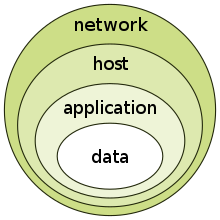

# Information Assurance (IA)

[TOC]

## Res
🏠 
🚧 

### Related Topics

## Intro: Information Assurance Basics
安全保障的定义：
- 防止信息泄露、修改和破坏；
- 检测入侵行为，计划和部署针对入侵行为的防御措施；
- 采用安全措施和容错机制在遭受攻击的情况下保证机密性、私密性、完整性、抗抵赖性、真实性、可用性和可靠性；
- 修复信息和信息系统所遭受的破坏。

## 🧩 Information Assurance Security Models (安全保障模型)
什么是安全模型
- 通过建模的思想来解决网络安全管理问题，有效抵御外部攻击，保障网络安全。
- 安全模型用于精确和形式地描述信息系统的安全特征，解释系统安全相关行为。

为什么需要安全模型
- 能准确地描述安全的重要方面与系统行为的关系。
- 能提高对成功实现关键安全需求的理解层次。
- 从中开发出一套安全性评估准则，和关键的描述变量。

### 🎯 PDR (Protection, Detection, Response)
> 美国国际互联网安全系统公司（ISS）提出，最早体现主动防御思想的安全模型。

基于时间的PDR
- 思想：承认漏洞，正视威胁，适度防护，加强检测，落实反应，建立威慑
- 缺点：难于适应网络安全环境的快速变化
- 出发点：任何防护措施都是基于时间的，是可以被攻破的
- 核心与本质：给出攻防时间表
- 固定防守，测试攻击时间；
- 固定攻击手法，测试防守时间

#### PDRR
> **PDRR**模型是：保护（**Protect**）、检测（**Detect**）、反应（**Response**）、恢复（**Recovery**）的有机结合。该模型强调的是自动故障恢复能力。

#### PPDR
> PPDR的基于思想是：在整体的安全策略的控制和指导下，综合运用防护工具（如防火墙、身份鉴别、加密等）的同时，利用检测工具（如漏洞评估、入侵检测系统）了解和评估系统的安全状态，通过适当的响应将系统调整到一个比较安全的状态。保护、检测和响应组成了一个完整的、动态的安全循环。

对PPDR的理解：
1. Policy:
	1. 模型的核心，所有的防护、检测、响应都是依据安全策略实施的。
	2. 策略体系的建立包括安全策略的制定、评估与执行等。
	3. 策略包括：
		1. 访问控制策略
		2. 加密通信策略
		3. 身份认证策略
		4. 备份恢复策略
2. Protection:
	1. 通过传统的静态安全技术和方法提高网络的防护能力，主要包括：
		1. 访问控制技术
			1. ACL
			2. Firewall
		2. 信息加密技术
		3. 身份鉴别技术
			1. 一次性口令
			2. X.509(数字证书)
3. Detection:
	1. 利用检测工具，监视、分析、审计网络活动，了解判断网络系统的安全状态。
	2. 使安全防护从被动防护演进到主动防御，是整个模型动态性的体现。
	3. 主要方法包括：
		1. 实时监控
		2. 检测
		3. 报警
4. Response:
	1. 在检测到安全漏洞和安全事件时，通过及时的响应措施将网络系统的安全性调整到风险最低的状态。
	2. 评估系统受到的危害与损失，恢复系统功能和数据，启动备份系统等。
	3. 主要方法包括：
		1. 关闭服务
		2. 跟踪
		3. 反击
		4. 消除影响

安全目标：
再看PPDR：

##### PPDR 中的数学法则
假设S系统的防护、检测和反应的时间关系如下：
- Pt=防护时间(有效防御攻击的时间)
- Dt=检测时间（发起攻击到检测到的时间）
- Rt=反应时间（检测到攻击到处理完成时间）
- Et=暴露时间
则该系统防护、检测和反应的时间关系如下：
如果Pt＞Dt＋Rt，那么S是安全的；
如果Pt＜Dt＋Rt，那么Et＝(Dt＋Rt)－Pt。

### 🎯 IATF (Information Assurance Technical Framework)
> 🔗 https://www.iatfglobaloversight.org

- NSA制定的，为保护美国政府和工业界的信息与信息技术设施提供技术指南。
- IATF的**代表理论为“深度防御（Defense-in-Depth）”**。
- 在关于实现信息保障目标的过程和方法上，IATF论述了**系统工程、系统采购、风险管理、鉴别和鉴定以及生命周期支持**等过程，指出了一条较为清晰的建设信息保障体系的路子。
#### Defense-in-Depth

##### 三个核心要素
IATF强调**人**、**技术**、**操作**这三个**核心要素**，从多种不同的角度对信息系统进行防护。
- **人（People）**：
	- 信息保障体系的核心，是第一位的要素，同时也是最脆弱的。
	- 基于这样的认识，安全管理在安全保障体系中愈显重要，包括：
		- 意识培训、组织管理、技术管理、操作管理
- **技术（Technology）**：
	- 技术是实现信息保障的重要手段。
	- 动态的技术体系：
	- 防护、检测、响应、恢复
- **操作（Operation）**：
	- 也叫运行，构成安全保障的主动防御体系。
	- 也是将各方面技术紧密结合在一起的主动的过程，包括：
		- 风险评估、安全监控、安全审计
		- 跟踪告警、入侵检测、响应恢复
##### 四个安全保障领域
IATF关注**四个信息安全保障领域**（**三保护一支撑**）这四个领域构成了完整的信息保障体系所涉及的范围，在每个领域范围内，IATF都描述了其特有的安全需求和相应的可供选择的技术措施：
- 本地计算环境
	- 目的：使用信息保障技术确保数据在进人、离开或驻留客户机和服务器时具有保密性、完整性和可用性。
	- 方法：
		- 使用安全的操作系统
		- 使用安全的应用程序
		- 安全消息传递、安全浏览、文件保护等
		- 主机入侵检测
		- 防病毒系统
		- 主机脆弱性扫描
		- 文件完整性保护
- 区域边界
	- 安全域： 
		- “域”指由单一授权通过专用或物理安全措施所控制的环境，包括物理环境和逻辑环境。
		- 区域的网络设备与其它网络设备的接入点被称为“区域边界”
	- 目标：对进出某区域（物理区域或逻辑区域）的数据流进行有效的控制与监视。
	- 方法：
		- 病毒、恶意代码防御
		- 防火墙
		- 入侵检测
		- 远程访问
		- 多级别安全
	- 
- 网络和基础设施
	- 目标：网络和支持它的基础设施必须:
		- 防止数据非法泄露
		- 防止受到拒绝服务的攻击
		- 防止受到保护的信息在发送过程中的时延、误传或未发送。
	- 方法：
		- 骨干网可用性
		- 无线网络安全框架
		- 系统高度互联和虚拟专用网
	- 《网络安全法》中与关键基础设施保护相关的内容：
		- 
- 支撑性基础设施
	- 目标：为安全保障服务提供一套相互关联的活动与基础设施
		- 密钥管理功能
		- 检测和响应功能
	- 方法：
		- 密钥管理
		- 优先权管理
		- 证书管理
		- 审计、配置
		- 信息调查、收集
	- 

在此基础上，对信息系统可以做到多层防护，实现组织的任务/业务运作。这样的防护被称为 “深度防护战略（Defense-in-Depth Strategy）”。

<small>An example: Multi-Layer Defence in Depth Security Architecture Applied in SAP S/4HANA Cloud <a>https://blogs.sap.com/2021/12/12/rise-with-sap-defence-in-depth-security-architecture-with-sap-s-4hana-cloud-public-cloud/</a></small>

## 🛟 Information System Security Assurance（信息系统安全保障）
信息系统安全保障是在信息系统的**整个生命周期中**，从**安全技术**、**安全管理**、**安全工程**和**人员**等四个保障要素提出安全保障要求（信息系统的**安全技术控制措施和技术架构能力**、**安全管理控制和管理能力**以及**安全工程实施控制措施和工程实施能力**），确保信息系统的**保密性**、**完整性**和**可用性**，降低安全风险到可接受的程度，达到保护组织机构信息和信息系统资产的目的，从而实现**保障系统实现组织机构的最终使命**。

> 信息系统安全保障的最终目的不是保护信息系统，而是保障组织机构实现其业务使命

信息系统安全保障生命周期

信息系统安全保障四个保障要素：
- 技术
	- 密码、访问控制、网络安全、漏洞及恶意代码防护等
- 工程
	- 信息系统安全工程、安全工程能力成熟度模型
- 管理
	- 安全管理体系、风险管理、应急响应与灾难恢复等
- 人员
	- 所有员工、信息系统岗位、安全专业人员

## 🛟 Cyberspace Security Assurance (网络空间安全保障)
> **关键基础设施仍然是网络空间安全保障的最核心内容**

### 🇺🇸 U.S. Cyberspace Security Assurance

美国信息安全保障的重点对象：关键基础设施
- 2001年美国出台《美国爱国者法案》，定义“关键基础设施”的含义；
- 2003年12月发布《国土安全总统令/HSPD-7》确定了17个关键基础设施；
- 2008年3月国土安全部将关键制造业类列为第18项关键基础设施；

目前美国关键基础设施和主要资源部门：
- 信息技术；
- 电信；
- 化学制品；
- 商业设施；
- 大坝；
- 商用核反应堆、材料和废弃物；
- 政府设施；
- 交通系统；
- 应急服务；
- 邮政和货运服务；
- 农业和食品；
- 饮用水和废水处理系统；
- 公共健康和医疗；
- 能源；
- 银行和金融；
- 国家纪念碑和象征性标志；
- 国防工业基地；
- 关键制造业
#### CNI
TBD
#### DAPRA - National Cyber Range (NCR) Facility
TBD

### 🇨🇳 China Cyberspace Security Assurance
#### 保障实践现状

我国网络空间安全保障基本思路
- 以**维护国家利益**为根本出发点，服从和服务于国家发展和安全
- 突出**保障重点**，推动**自主创新**，为国家发展和社会建设提供有力支撑
- 从**法律**、**管理**、**技术**和**人才**等多方面入手，采取多种安全措施动员和组织全社会力量，共同构建国家网络空间安全保障体系。

我国网络空间安全保障目标
- 保障和促进信息化发展
- 维护企业与公民的合法权益
- 构建安全可信的网络信息传播秩序
- 保护互联网知识产权

我国网络空间安全保障体系

##### 中国《国家网络空间安全战略》
📄 http://www.cac.gov.cn/2016-12/27/c_1120195926.htm (《国家网络空间安全战略》全文)

7大机遇
- 信息传播的新渠道
- 生产生活的新空间
- 经济发展的新引擎
- 文化繁荣的新载体
- 社会治理的新平台
- 交流合作的新纽带
- 国家主权的新疆域

6大挑战
- 网络渗透危害政治安全
- 网络攻击威胁经济安全
- 网络有害信息侵蚀文化安全
- 网络恐怖和违法犯罪破坏社会安全
- 网络空间的国际竞争方兴未艾
- 网络空间机遇和挑战并存，机遇大于挑战

5大目标
- 和平
- 开放
- 安全
- 合作
- 有序

4项原则
- 尊重维护网络空间主权
- 和平利用网络空间
- 依法治理网络空间
- 统筹网络安全与发展

9大战略任务
- 坚定捍卫网络空间主权
- 坚决维护国家安全
- 保护关键信息基础设施
	- 实施关键信息基础设施保护制度（焦点一）
- 加强网络文化建设
- 打击网络恐怖和违法犯罪
- 完善网络治理体系
	- 落实个⼈信息保护的战略要求（焦点二）
- 夯实网络安全基础
	- 提⾼产品服务的安全可控（焦点三）
	- 畅通信息丝绸之路（焦点四）
- 提升网络空间防护能力
- 强化网络空间国际合作
	- 强化⽹络空间国际合作（焦点五）
#### 保障实践内容
##### 网络空间安全标准化
##### 网络空间安全应急处理与信息通报
##### 网络空间安全等级保护
##### 网络空间安全风险评估
##### 灾难恢复
##### 人才队伍建设
#### 保障实践方法
##### 确定网络空间安全保障需求
网络空间安全需求是安全方案设计和安全措施实施的依据。
准确地提取安全需求
- 一方面可以保证安全措施可以全面覆盖信息系统面临的风险，是安全防护能力达到业务目标和法规政策的要求的基础
- 另一方面可以提高安全措施的针对性，避免不必要的安全投入，防止浪费

**ISPP** (Information System Protect Profile)
- 信息系统保护轮廓（ISPP）是根据组织机构使命和所处的运行环境，从组织机构的策略和风险的实际情况出发，对具体信息系统安全保障需求和能力进行具体描述。
- 表达一类产品或系统的安全目的和要求。
- ISPP是从信息系统的**所有者（用户）的角度**规范化、结构化的描述信息系统安全保障需求。
##### 设计并实施网络空间安全保障方案
以风险评估和法规要求得出的安全需求为依据
- 考虑系统的业务功能和价值
- 考虑系统风险哪些是必须处置的，哪些是可接受的
- 贴合实际具有可实施性
	- 可接受的成本
	- 合理的进度
	- 技术可实现性
	- 组织管理和文化的可接受性

**ISST** (Information System Security Target)
- 信息系统安全目标（ISST）是根据信息系统保护轮廓（ISPP）编制的信息系统安全保障方案。
- 某一特定产品或系统的安全需求
-  ISST从信息系统安全保障的**建设方（厂商）的角度**制定的信息系统安全保障方案。
##### 网络空间安全测评
依据相关标准，从安全技术、功能、机制等角度对信息技术产品、信息系统、服务提供商以及人员进行测试和评估。

- 信息产品安全测评
	- 为产品认证提供证据，增强用户对已评估产品安全的信任，向消费者提供信息技术安全产品的采购依据，推动信息技术安全产业的发展、提高信息技术安全科研和生产水平。
	- 
- 信息系统安全测评
	- 信息系统安全测评标准是GB/T20274 《信息系统安全保障评估框架》，它为信息系统安全测评提供了思路框架和操作规范
- 服务商资质测评
- 网络空间安全人员资质测评
	- 

## Ref
