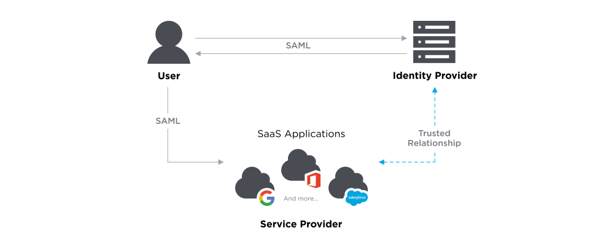
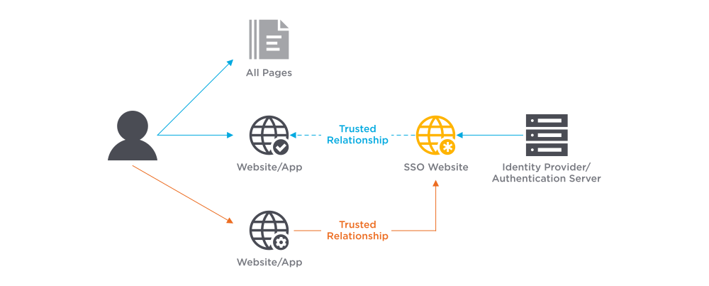

# Authentication

[TOC]

## Intro

> :link: [Authentication](https://en.wikipedia.org/wiki/Authentication)
>
> Conceptions easy to get confused:
>
> Authentication, Authorization, Access Control, Identification. 

Authentication is relevant to multiple fields. In 🎨[art](https://en.wikipedia.org/wiki/Art), 🩻[antiques](https://en.wikipedia.org/wiki/Antique), and 🐒[anthropology](https://en.wikipedia.org/wiki/Anthropology), a common problem is verifying that a given artifact was produced by a certain person or in a certain place or period of history. In 🖥️[computer science](https://en.wikipedia.org/wiki/Computer_science), verifying a user's identity is often required to allow access to confidential data or system.

Context here specifically applies to authentication in Computer Science, which is also mostly implemented as **access control**.

> :link: 
>
> [Access Control  --  wikipedia](https://en.wikipedia.org/wiki/Access_control)
>
>  [Access Control](../Access Control.md) 

In the field of access control, there are three major aspects:

- Physical Security
- Computer Security
- Telecommunication Security

...TBD

## Authentication Factors

> :warning: This entry applys to authentication in general terms, including product authentication and art authentication and also, digital authentication. 

The ways in which someone may be authenticated fall into three categories, based on what is known as the factors of authentication: something the 1️⃣ user *knows*, something the 2️⃣ user *has*, and something the 3️⃣ user *is*. Each **authentication factor** covers a range of elements used to authenticate or verify a person's identity before being granted access, approving a transaction request, signing a document or other work product, granting authority to others, and establishing a chain of authority.

Security research has determined that for a positive authentication, elements from at least two, and preferably all three, factors should be verified.[[6\]](https://en.wikipedia.org/wiki/Authentication#cite_note-6) The three factors (classes) and some of the elements of each factor are:

- the **knowledge factors**: Something the user **knows** (e.g., a [password](https://en.wikipedia.org/wiki/Password), [partial password](https://en.wikipedia.org/wiki/Partial_password), [passphrase](https://en.wikipedia.org/wiki/Pass_phrase), [personal identification number](https://en.wikipedia.org/wiki/Personal_identification_number) (PIN), [challenge–response](https://en.wikipedia.org/wiki/Challenge–response) (the user must answer a question or pattern), [security question](https://en.wikipedia.org/wiki/Security_question)).
- the **ownership factors**: Something the user **has** (e.g., wrist band, [ID card](https://en.wikipedia.org/wiki/ID_card), [security token](https://en.wikipedia.org/wiki/Security_token), [implanted device](https://en.wikipedia.org/wiki/Microchip_implant_(human)), [cell phone](https://en.wikipedia.org/wiki/Cell_phone) with a built-in [hardware token](https://en.wikipedia.org/wiki/Hardware_token), [software token](https://en.wikipedia.org/wiki/Software_token), or [cell phone](https://en.wikipedia.org/wiki/Cell_phone) holding a [software token](https://en.wikipedia.org/wiki/Software_token)).
- the **inherence factors**: Something the user **is or does** (e.g., [fingerprint](https://en.wikipedia.org/wiki/Fingerprint), [retinal](https://en.wikipedia.org/wiki/Retina) pattern, [DNA](https://en.wikipedia.org/wiki/DNA) sequence (there are assorted definitions of what is sufficient), [signature](https://en.wikipedia.org/wiki/Signature), face, voice, unique bio-electric signals, or other [biometric](https://en.wikipedia.org/wiki/Biometric) identifiers).

### Single-factor authentication

As the weakest level of authentication, only a single component from one of the three categories of factors is used to authenticate an individual's identity. The use of only one factor does not offer much protection from misuse or malicious intrusion. This type of authentication is not recommended for financial or personally relevant transactions that warrant a higher level of security

### Multi-factor authentication

> :link:  [Multi-factor authentication](https://en.wikipedia.org/wiki/Multi-factor_authentication) 

Multi-factor authentication involves two or more authentication factors (*something you know*, *something you have*, or *something you are*). Two-factor authentication is a special case of multi-factor authentication involving exactly two factors

## Authentication Machanism

Authentication machanism mainly adopts methods from modern cryptography.

↗️  [Modern Cryptography](../../🤐 Cryptography/Modern Cryptography/Modern Cryptography.md).

## 🧊 Object based Authentication

### 🤦🏼 Human-oriented Authentication

#### 1. Password based

Traditional password authentication is static, which is feasible to attack. That's where dynamic password authentication is adopted. 

##### One Time Password, OTP

“挑战—应答”、

时间同步

事件同步。

#### 2. Biometrics

- Fingerprint recognition
- Iris recognition
- Facial recognition
- Voice Identification

#### 3. Certification based

Generally, for certificate-based authentication, the system will generate a digital certificate to validate the user. It can be generated from the user’s unique Id like voter ID, passport, or other. It contains the user’s public key and digital signature, with this system will identify the right user, A system takes a digital sign from a user and uses cryptography to make sure it’s a valid user. 

#### 4. Token based

Token-based authentication is a process in which users identify with a unique tokens after the user provides credentials to the system. A token is valid only for a designated time period, after that user needs to re-generate it to use again. 

> :warning: Diff between certification & token
>
> Tokens are essentially a symmetric key. That means that the same key has to be both on the client and the server to be able to authenticate users.
>
> Certificates use an asymmetric set of keys. Certificates are based on public-key cryptography. The client keeps possession of the private, which is never shared by anyone else.
>
> In Web Security, instead of just signing a ‘challenge’, the client signs the entirety of the message that’s sent by the server.

#### 5. Anonymous Athentication

#### 6. Group Key Agreement

#### 7. 2FA

### 📻 Machine-oriented Authentication

### ✏️ Thing-oriented Authentication

> 这里的“物”与前面的“机”从物理实体上看没有本质区别，但对“物“的认证更需要强调轻量级属性。在物联网环境中，“物”意味着终端感知节点或RFID标签，这些“物”的资源有限，因此，不能使用传统的针对“机”的认证方法。
>
> 考虑到资源有限的“物”通常所传递的数据量也很有限，因此，对物的认证其实是对数据来源的认证，即一个数据无论经过多少转发，其原始来源应该可以得到鉴别。

## Single Sign On, SSO

Following are some implementations of SSO.

### JWT

### [OAuth](https://oauth.net)

An **open protocol** to allow **secure authorization** in a **simple** and **standard** method from web, mobile and desktop applications.

:point_right: [Learn more about OAuth 2.0 »](https://oauth.net/2/) 

### [OIDC, OpenID Connect](https://openid.net/connect/)

OpenID Connect (OIDC) is **an open authentication protocol that works on top of the OAuth 2.0 framework**. Targeted toward consumers, OIDC allows individuals to use single sign-on (SSO) to access relying party sites using OpenID Providers (OPs), such as an email provider or social network, to authenticate their identities.

### Central Authentication Service, CAS

### SAML

*SAML* is an acronym used to describe the Security Assertion Markup Language (SAML). SAML is an open standard used for authentication. Based upon the Extensible Markup Language (XML) format, web applications use SAML to transfer authentication data between two parties - the identity provider (IdP) and the service provider (SP).

<small>SAML</small>

#### SAML SSO

SAML Single Sign-On is a mechanism that leverages SAML allowing users to log on to multiple web applications after logging into the identity provider. As the user only has to log in once, SAML SSO provides a faster, seamless user experience.

<small>SAML SSO</small>

#### 🆚 How Does OAuth Compare to SAML?

OAuth and SAML are both protocols we use for allowing access. However, the primary difference between the two is that we use **SAML for authentication and OAuth for authorization**.

If we revisit the airline analogy, the passenger's ID is the SAML assertion, and the ticket the OAuth token. The airline uses the ID to verify the passenger’s identity before allowing them to board the aircraft. However, once the passengers are on the plane, the flight attendants use the ticket to confirm the passengers' status and entitlement. For example, they may have a first-class ticket giving them access to seats and amenities not accessible by passengers in economy.

## Ref

[网络安全之身份认证（转载） - 纹身的大熊猫的文章 - 知乎]: https://zhuanlan.zhihu.com/p/84993949

[信息系统访问控制的层次模型]: 中国科学院 计算机网络信息中心，北京 100190;2. 中国科学院研究生院，北京 100049) "吴开超，沈志宏，周园春，阎保平"

[secure authentication]: https://www.securecoding.com/blog/secure-authentication/
[自己动手做一个简单的 Telegram 入群验证 Bot |]: https://tstrs.me/1490.html
[用于识别、认证和验证的生物识别认证系统]: https://www.boonedam.com/zh-cn/accessories-and-additions/biometric-authentication-systems
[微信官方文档 -- 生物认证]: https://developers.weixin.qq.com/miniprogram/dev/framework/open-ability/bio-auth.html

- 小程序通过 [SOTER](https://github.com/Tencent/soter) 提供生物认证方式。
- 目前暂时只支持指纹识别认证。设备支持的生物认证方式可使用 [wx.checkIsSupportSoterAuthentication](https://developers.weixin.qq.com/miniprogram/dev/api/open-api/soter/wx.checkIsSupportSoterAuthentication.html) 查询

[22. Anonymous Authentication（匿名认证）]: https://www.cnblogs.com/jrkl/p/13513429.html

[SAML Explained in Plain English]: https://www.onelogin.com/learn/saml
