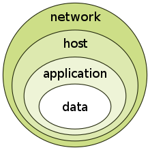

# InfoSec

[TOC]

## Res
[《计算机网络安全教程》读书笔记](https://bye-lemon.github.io/post/f2f7/)

## InfoSec Intro
> 🔗 https://en.wikipedia.org/wiki/Information_security#Further_reading

**Information security**, sometimes shortened to **InfoSec**, is the practice of protecting [information](https://en.wikipedia.org/wiki/Information) by mitigating information risks.

It is part of [information risk management](https://en.wikipedia.org/wiki/Risk_management_information_systems). 

It typically involves preventing or reducing the probability of unauthorized/inappropriate access to [data](https://en.wikipedia.org/wiki/Data), or the unlawful use, [disclosure](https://en.wikipedia.org/wiki/Data_breach), disruption, deletion, corruption, modification, inspection, recording, or devaluation of information. It also involves actions intended to reduce the adverse impacts of such incidents. Protected information may take any form, e.g. electronic or physical, tangible (e.g. [paperwork](https://en.wikipedia.org/wiki/Document)) or intangible (e.g. [knowledge](https://en.wikipedia.org/wiki/Knowledge)). 

Information security's primary focus is the balanced protection of the [confidentiality](https://en.wikipedia.org/wiki/Confidentiality), [integrity](https://en.wikipedia.org/wiki/Integrity), and [availability](https://en.wikipedia.org/wiki/Availability) of data (also known as the CIA triad) while maintaining a focus on efficient [policy](https://en.wikipedia.org/wiki/Policy) implementation, all without hampering organization [productivity](https://en.wikipedia.org/wiki/Productivity). This is largely achieved through a structured [risk management](https://en.wikipedia.org/wiki/Risk_management) process that involves: 

- identifying information and related [assets](https://en.wikipedia.org/wiki/Asset_(computer_security)), plus potential [threats](https://en.wikipedia.org/wiki/Threat_(computer)), [vulnerabilities](https://en.wikipedia.org/wiki/Vulnerability_(computing)), and impacts;
- evaluating the risks;
- deciding how to address or treat the risks i.e. to avoid, mitigate, share or accept them;
- where risk mitigation is required, selecting or designing appropriate security controls and implementing them;
- monitoring the activities, making adjustments as necessary to address any issues, changes and improvement opportunities.

To standardize this discipline, academics and professionals collaborate to offer guidance, policies, and industry standards on [password](https://en.wikipedia.org/wiki/Password), [antivirus software](https://en.wikipedia.org/wiki/Antivirus_software), [firewall](https://en.wikipedia.org/wiki/Firewall_(computing)), [encryption software](https://en.wikipedia.org/wiki/Encryption_software), [legal liability](https://en.wikipedia.org/wiki/Legal_liability), [security awareness](https://en.wikipedia.org/wiki/Security_awareness) and training, and so forth. This [standardization](https://en.wikipedia.org/wiki/Standardization) may be further driven by a wide variety of laws and regulations that affect how data is accessed, processed, stored, transferred and destroyed. However, the implementation of any standards and guidance within an entity may have limited effect if a culture of [continual improvement](https://en.wikipedia.org/wiki/Continual_improvement_process) isn't adopted.

### Why InfoSec & CyberSec?
最开始只有信息安全。
安全圈里的大佬们，一直觉得信息安全很重要，要从“计算机科学与技术”一级学科中独立出来，自成一级学科。怎奈，大佬们上书了数年，都以失败告终。

终于有一天，中央提出了“没有网络安全，就没有国家安全”。安全圈里的大佬们觉得机会来了。于是不申请“信息安全”一级学科，改为申请“网络空间安全”一级学科。

过审了。

“网络空间安全”就成了一级学科。招生指标更多了。

作者：吉事尚左
链接：https://www.zhihu.com/question/318261855/answer/818206085
来源：知乎
著作权归作者所有。商业转载请联系作者获得授权，非商业转载请注明出处。

## Principles

<small>the CIA triad</small>

### Confidentiality
In information security, confidentiality "is the property, that information is not made available or disclosed to unauthorized individuals, entities, or processes."

### Integrity
In IT security, [data integrity](https://en.wikipedia.org/wiki/Data_integrity) means maintaining and assuring the accuracy and completeness of data over its entire lifecycle. This means that data cannot be modified in an unauthorized or undetected manner. This is not the same thing as [referential integrity](https://en.wikipedia.org/wiki/Referential_integrity) in [databases](https://en.wikipedia.org/wiki/Databases), although it can be viewed as a special case of consistency as understood in the classic [ACID](https://en.wikipedia.org/wiki/ACID) model of [transaction processing](https://en.wikipedia.org/wiki/Transaction_processing)

More broadly, integrity is an information security principle that involves human/social, process, and commercial integrity, as well as data integrity. As such it touches on aspects such as credibility, consistency, truthfulness, completeness, accuracy, timeliness, and assurance.

### Availability
For any information system to serve its purpose, the information must be [available](https://en.wikipedia.org/wiki/Availability) when it is needed.

[High availability](https://en.wikipedia.org/wiki/High_availability) systems aim to remain available at all times, preventing service disruptions due to power outages, hardware failures, and system upgrades.

## Risk Management
### Defense in depth

### Security Controls
#### Administrative Control
Administrative controls (also called procedural controls) consist of approved written policies, procedures, standards, and guidelines. Administrative controls form the framework for running the business and managing people.

e.g. the [Payment Card Industry Data Security Standard](https://en.wikipedia.org/wiki/Payment_Card_Industry_Data_Security_Standard)(PCI DSS) required by [Visa](https://en.wikipedia.org/wiki/Visa_Inc.) and [MasterCard](https://en.wikipedia.org/wiki/MasterCard) is such an example. Other examples of administrative controls include the corporate security policy, [password policy](https://en.wikipedia.org/wiki/Password_policy), hiring policies, and disciplinary policies.

#### Logical Control
Logical controls (also called technical controls) use software and data to monitor and control access to information and [computing](https://en.wikipedia.org/wiki/Computing) systems. Passwords, network, and host-based firewalls, network [intrusion detection](https://en.wikipedia.org/wiki/Intrusion_detection) systems, [access control lists](https://en.wikipedia.org/wiki/Access_control_list), and data encryption are examples of logical controls.

> ⚠ An important logical control that is frequently overlooked is **the principle of least privilege,** which requires that an individual, program or system process not be granted any more access privileges than are necessary to perform the task.

- A blatant example of the failure to adhere to the principle of least privilege is logging into Windows as a user Administrator to read email and surf the web

#### Physical Control
Physical controls monitor and control the environment of the workplace and computing facilities. They also monitor and control access to and from such facilities. 

> ⚠ An important physical control that is frequently overlooked is the separation of duties, which ensures that an individual can not complete a critical task by himself.

- For example, an employee who submits a request for reimbursement should not also be able to authorize payment or print the check.

### Classification
An important aspect of information security and risk management is recognizing the value of information and defining appropriate procedures and protection requirements for the information. Not all information is equal and so not all information requires the same degree of protection. This requires information to be assigned a [security classification](https://en.wikipedia.org/wiki/Classified_information).

1. The first step in information classification is to identify a member of senior management as the owner of the particular information to be classified. 
2. Next, develop a classification policy. The policy should describe the different classification labels, define the criteria for information to be assigned a particular label, and list the required [security controls](https://en.wikipedia.org/wiki/Security_controls) for each classification.

### Access Control
Access control is generally considered in three steps: identification, [authentication](https://en.wikipedia.org/wiki/Authentication), and [authorization](https://en.wikipedia.org/wiki/Authorization).

See more on ↗️ [Access Control](Access%20Control/Access%20Control.md)

### Cryptography
Information security uses [cryptography](https://en.wikipedia.org/wiki/Cryptography) to transform usable information into a form that renders it unusable by anyone other than an authorized user; this process is called [encryption](https://en.wikipedia.org/wiki/Encryption).

> 密码学是一门关于通信安全的学科，主要研究如何保护信息的机密性、完整性和可用性。在密码学中，通常使用加密算法和解密算法来实现对信息的保护。
> 
> 信息安全是保护计算机系统和网络中的信息免受未经授权的访问、使用、泄露、破坏和干扰的一种技术、政策和管理措施的总称。信息安全包括密码学、网络安全、物理安全、应用程序安全、数据安全等多个方面。
> 在现代社会中，信息安全已经成为一个非常重要的领域。无论是政府、军队、企业还是个人，都需要保护自己的信息安全。例如，企业需要保护客户的个人数据，政府需要保护机密信息，个人需要保护自己的隐私和财产安全。
> 
> 密码学是实现信息安全的重要手段之一。通过使用密码学技术，可以保护信息的机密性和完整性，从而防止信息被未经授权的访问、泄露和篡改。常见的密码学技术包括对称加密、非对称加密和哈希函数等。

See more on ↗️ [Cryptography](../Cryptology/🤐%20Cryptography/Cryptography.md)

### RMIS

> 🔗 https://en.wikipedia.org/wiki/Risk_management_information_systems

A **risk management information system** (RMIS) is an information system that assists in consolidating property values, claims, policy, and exposure information and providing tracking and management reporting capabilities to enable the user to monitor and control the overall cost of [risk management](https://en.wikipedia.org/wiki/Risk_management).

The management of risk data and information is key to the success of any risk management effort regardless of an organization's size or industry sector. Risk management information systems/services (RMIS) are used to support expert advice and cost-effective information management solutions around key processes such as:

- Risk identification and [assessment](https://en.wikipedia.org/wiki/Risk_assessment)
- [Risk control](https://en.wikipedia.org/wiki/Risk_control)
- [Risk financing](https://en.wikipedia.org/wiki/Risk_financing)

## Process
### Security governance

#TODO 

### Incident response

## Change Management

## Business Continuity

## Laws and Regulations

## Culture

## Ref

