# TPM

[TOC]

## Res
🚀 https://github.com/tpm2-software/tpm2-tools

> The source repository for the Trusted Platform Module (TPM2.0) tools based on [tpm2-software/tpm2-tss](https://github.com/tpm2-software/tpm2-tss)
> 
> [Readthedocs](https://tpm2-tools.readthedocs.io/en/latest/) for information on installation, man-pages and more.

---

🗣 https://tpm2-software.github.io

Welcome to the tpm2-software community page.

This is the come for information related to the use of the TPM2 using the TPM2 Software Stack. We collect links to [software](https://tpm2-software.github.io/software/) that already contains support for TPM2 as well as ideas for [software](https://tpm2-software.github.io/software/) the might benefit from TPM2 support. We provide links to [external](https://tpm2-software.github.io/external/) / educational resources as well as [tutorials](https://tpm2-software.github.io/tutorials/) on how to work with the TPM2.

The core software of this community can be found at
- [https://github.com/tpm2-software](https://github.com/tpm2-software)

The mailing list for this community can be found at
- [https://lists.01.org/postorius/lists/tpm2.lists.01.org/](https://lists.01.org/postorius/lists/tpm2.lists.01.org/)

The gitter can be found at the bottom right or at
- [https://gitter.im/tpm2-software/community](https://gitter.im/tpm2-software/community)

The gitter can also be accessed via IRC [https://irc.gitter.im/](https://irc.gitter.im/)

---

## Intro

<small>TPM2 Software Stack</small>

## Ref
[Tpm2 Device Emulation With Qemu]: https://tpm2-software.github.io/2020/10/19/TPM2-Device-Emulation-With-QEMU.html
1. install swtpm
2. install qemu
	1. install guest os
3. start guest with tpm2.0

[How to Emulate a TPM 2.0 Module on LibVirt/QEMU]: https://www.smoothnet.org/qemu-tpm/

[QEMU TPM Device]: https://qemu.readthedocs.io/en/latest/specs/tpm.html

