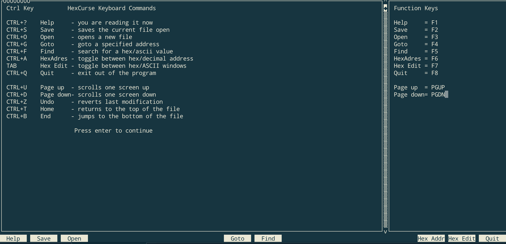

# 🫥 Steg

[TOC]


## 🔭 File Lookup

### File Type & File Head

#### `file` 

```yaml
file

Determine file type.
More information: <https://manned.org/file>.

- Give a description of the type of the specified file. Works fine for files with no file extension:
    file filename

- Look inside a zipped file and determine the file type(s) inside:
    file -z foo.zip

- Allow file to work with special or device files:
    file -s filename

- Don't stop at first file type match; keep going until the end of the file:
    file -k filename

- Determine the MIME encoding type of a file:
```


Md5sum, sahsum,

### Hex-editor:

> [Top Hex Editors for Linux](https://www.tecmint.com/best-hex-editors-for-linux/)

Editor plugins: 

- nodepad++
- sublime text
- vscode
- ...

[hexyl](https://github.com/sharkdp/hexyl) 

[hexcurse](https://github.com/LonnyGomes/hexcurse) 




### File breakup

[Binwalk](https://github.com/ReFirmLabs/binwalk)

foremost

dd

```yaml
dd

Convert and copy a file.
More information: <https://ss64.com/osx/dd.html>.

- Make a bootable USB drive from an isohybrid file (such like `archlinux-xxx.iso`):
    dd if=file.iso of=/dev/usb_drive

- Clone a drive to another drive with 4 MB block and ignore error:
    dd if=/dev/source_drive of=/dev/dest_drive bs=4m conv=noerror

- Generate a file of 100 random bytes by using kernel random driver:
    dd if=/dev/urandom of=random_file bs=100 count=1

- Benchmark the write performance of a disk:
    dd if=/dev/zero of=file_1GB bs=1024 count=1000000
    
- Skip counts (total number of $count, but skip the first $skip):
	dd if=/input/file/path of=output/file/path count=100 skip=2
	
```


### File converage

**Linux**: 

cat \<inputfile> > \<outputfile> 

md5sum, shasum,


**Win**:

copy

certutil -hashfile \<filename\> [md5]

 

## 🔭 Pic Lookup

1. 细微的颜色差别
2. gif图多帧隐藏
   1. 颜色通道隐藏
   2. 不同帧图信息隐藏
   3. 不同帧对比隐写
3. Exif信息隐藏
4. 图片修复
   1. 图片头修复
   2. 图片尾修复
   3. CRC校验修复
   4. 长，宽，高度修复
5. LSB
6. JPG图片加密
   1. Stegdetect
   2. outguess
   3. Jphide
   4. F5
7. 二维码


### Firework


### Exif


### Stegsolve


### LSB

#### [zsteg](https://github.com/zed-0xff/zsteg)


#### python


#### TweakPNG


#### Bftools (win)


## 💽  Compression

1. 伪加密
   1. zip
   2. rar
2. 暴力破解
   1. Archpr (win)
   2. ziperello


1. 

