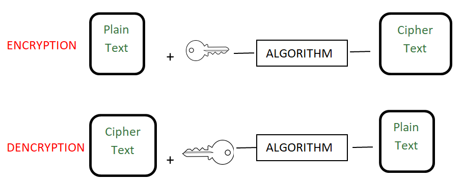

# Encoding

[TOC]

## Res
### Learning Resources
【【CTF全套120集】清华大学顶尖蓝莲花战队站教你学CTF从零基础内卷成大佬！| ctf入门| ctf比赛| ctf夺旗赛|ctfweb】 https://www.bilibili.com/video/BV1DL4y1T7v7/?p=8&share_source=copy_web&vd_source=7740584ebdab35221363fc24d1582d9

### Related Topics
↗ [Encodings in Digital Systems](../../../🔑%20CS_Core/🧬%20Computer%20System/😤%20Number,%20Data%20and%20Math%20in%20Digital%20Systems/Encodings%20in%20Digital%20Systems.md)

## Intro
Encoding, in an universal explanation, is the mapping between two sets. 

In CS, encoding in general map a set of character to a set of value/character. 

In fact, the classic cryptographic methods are all based on encoding methods. That's why encoding is brought up here as a part of the Cryptography.
↗️ [Classic Cryptography](Classic Cryptography/Classic Cryptography.md).

### Encoding 🆚 Encryption & Cryptography 🆚 Hashing

> 🔗 https://www.geeksforgeeks.org/encryption-encoding-hashing/

#### Encoding
In the Encoding method, data is transformed from one form to another. The main aim of encoding is to transform data into a form that is readable by most of the systems or that can be used by any external process.
It can’t be used for securing data, various publicly available algorithms are used for encoding.

Encoding can be used for **reducing the size** of audio and video files. Each audio and video file format has a corresponding coder-decoder (codec) program that is used to code it into the appropriate format and then decodes for playback.

#### Encryption 
Encryption in encoding technique in which message is encoded by using encryption algorithm in such a way that only authorized personnel can access the message or information.

It is a special type of encoding that is used for transferring private data, for example sending a combination of username and password over the internet for email login.

In encryption, data to be encrypted(called plain-text) is transformed using an encryption algorithm like AES encryption or RSA encryption using a secret key called cipher. The encrypted data is called cipher-text, and finally, the secret key can be used by the intended recipient to convert it back to plain-text.

There are two types of encryption algorithms – symmetric and asymmetric encryption.
In case of symmetric encryption data is encoded and decoded with the help of same key, for example AES encryption algorithm but in case of asymmetric encryption algorithm, data is encrypted with help of two keys, namely public and private key, for example. [RSA algorithm](https://www.geeksforgeeks.org/rsa-algorithm-cryptography/).

#### Hashing
In hashing, data is converted to the hash using some hashing function, which can be any number generated from string or text. Various hashing algorithms are MD5, SHA256. Data once hashed is non-reversible.

Hash function can be any function that is used to map data of arbitrary size to data of fixed size. The data structure [hash table](https://www.geeksforgeeks.org/hashing-data-structure/) is used for storing of data.

For example: When you send pictures and text messages over WhatsApp over StackOverflow(posting in questions), images are sent to different server and text is sent to a different server for efficiency purposes. So for verifying images that the images are not tampered in between data transfer over the internet, hashing algorithm like MD5 can be used.

## Encoding Schemes
The number of characters encoded has a direct relationship to the length of each representation which typically is measured as the number of bytes. **Having more characters to encode essentially means needing lengthier binary representations.**

### Single-Byte Encoding

### Multi-Byte Encoding
#TODO 

## 🪄 Encodings in Cryptography
### Base64

### Base32

### URL encoding

### JS obfuscation

↗️  [JS Obfuscation](../../../Software Engineering/🖥️ FrontEndDev/⬆️ FrontendOptimization/JS Obfuscation.md)

#### JSfuck

#### Jother

#### aaencode

### 📚 More encoding methods in cryptography

More of this part is included in ↗️ [CTF/Crypto](../../👻 CTF/Misc/Crypto/Crypto.md).

## 🫥 Compression

## Other Encodings
↗ [Encodings in Digital Systems](../../../🔑%20CS_Core/🧬%20Computer%20System/😤%20Number,%20Data%20and%20Math%20in%20Digital%20Systems/Encodings%20in%20Digital%20Systems.md)

## Ref