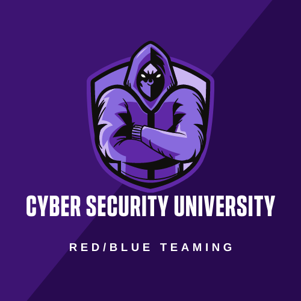

# Red Team & Blue Team

[TOC]

## Res
### Awesome Cyber Security University
🏠 https://brootware.github.io/awesome-cyber-security-university/

#### Contents
[About](https://github.com/brootware/awesome-cyber-security-university#about)

[Introduction and Pre-Security](https://github.com/brootware/awesome-cyber-security-university#introduction-and-pre-security) - (Completed/In Progress)

[Free Beginner Red Team Path](https://github.com/brootware/awesome-cyber-security-university#free-beginner-red-team-path) - (Add your badge here. The badge code is hidden in this repo)

[Free Beginner Blue Team Path](https://github.com/brootware/awesome-cyber-security-university#free-beginner-blue-team-path) - (Add your badge here. The badge code is hidden in this repo)

[Bonus CTF practice and Latest CVEs](https://github.com/brootware/awesome-cyber-security-university#bonus-ctf-practice-and-latest-cves) - (Completed/In Progress)

[Bonus Windows](https://github.com/brootware/awesome-cyber-security-university#bonus-windows) - (Completed/In Progress)

[Extremely Hard Rooms to do](https://github.com/brootware/awesome-cyber-security-university#extremely-hard-rooms-to-do) - (Completed/In Progress)

### Projects & Toolsets
https://github.com/A-poc/RedTeam-Tools
This github repository contains a collection of **130+** **tools** and **resources** that can be useful for **red teaming activities**.

Some of the tools may be specifically designed for red teaming, while others are more general-purpose and can be adapted for use in a red teaming context.

https://github.com/nccgroup/demiguise
HTA encryption tool for RedTeams
Released as open source by NCC Group Plc - [http://www.nccgroup.trust/](http://www.nccgroup.trust/)
ADeveloped by Richard Warren, richard [dot] warren [at] nccgroup [dot] trust

https://github.com/mantvydasb/RedTeaming-Tactics-and-Techniques
These are notes about all things focusing on, but not limited to, red teaming and offensive security.

https://github.com/bigb0sss/RedTeam-OffensiveSecurity
-NOTES [https://www.ired.team/](https://www.ired.team/) (RED TEAMING)

https://github.com/r0eXpeR/redteam_vul
红队中易被攻击的一些重点系统漏洞整理
配合EHole(棱洞)-红队重点攻击系统指纹探测工具使用效果更佳: https://github.com/EdgeSecurityTeam/EHole

https://github.com/Threekiii/Awesome-Redteam
一个攻防知识仓库

https://github.com/fengjixuchui/RedTeamer
红方人员实战手册

📑 https://xu-an.gitbook.io/sec/1/zy
红队资源

https://github.com/FiveAourThe/RedTeamTools
红队武器库

https://github.com/r0eXpeR/RedTeamAttack
⚠️此项目同步至：[https://forum.ywhack.com/bountytips.php?redteam](https://forum.ywhack.com/bountytips.php?redteam) 🙏欢迎提Issues进行推荐!

## Intro

## Ref
[2023红队必备工具列表总结]: https://cn-sec.com/archives/1591003.html
[红队工具合集，安全er值得拥有 | CSDN]: https://blog.csdn.net/qq_37865996/article/details/127063468