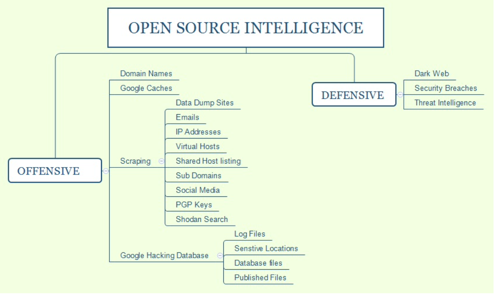

# OSINT

[TOC]





## Offensive OSINT

### DNS reconnaissance and route mapping

#### Sublist3r

Sublist3r is a Python-based tool that can be utilized during domain harvesting, which can enumerate sub-domains of a primary domain using OSINT. The tool utilizes APIs such as Google, Bing, Baidu, and ASK search engines. It also searches in NetCraft, Virustotal, ThreatCrowd, DNSdumpster, and reverseDNS; this also performs brute force using a specific wordlist


#### Maltego

Maltego is one of the most capable OSINT frameworks for personal and organizational reconnaissance. It is a GUI tool that provides the capability of gathering information on any individuals, by extracting the information that is publicly available on the internet by various methods. It is also capable of enumerating the DNS, brute-forcing the normal DNS and collecting the data from social media in an easily readable format.

The tasks in Maltego are named as transforms. Transforms come built into the tool and are defined as being scripts of code that execute specific tasks. There are also multiple plugins available in Maltego, such as the SensePost toolset, Shodan, VirusTotal, ThreatMiner, and so on.


#### OSRFramework

OSRFramework is a tool designed by i3visio in order to perform open source threat intelligence as a web interface, and with consoles as OSRFConsole. 

Available throuth `pip install osrframework`.


### Scraping

↗️ [Scraping](Scraping.md) 


## Defensive OSINT

Defensive OSINT is typically used to see what is already on internet including breached information and see whether that information is valuable during the penetration testing activity. If the goal of penetration testing is to demonstrate the real-world scenario where this data can be handy, the first step is to identify a similar target that has already been breached. The majority of organizations fix only the affected platform or the host, and often they forget about other similar environments. The defensive OSINT is largely divided into three places of search.

### Dark web

The dark web is the encrypted network that exists between Tor servers and their clients, whereas the deep web is simply the content of databases and other web services that for one reason or another cannot be indexed by conventional search engines such as Google.

Some sites like http://deepdotweb.com list available market list on dark web.

>  see ↗️  [Dark web](../../../../../🔑 CS_Core/🏎️ Networking/📌 Basics/0x02 Application Layer/Dark web/Dark web.md) for more.

### Security breach

A security breach is any incident that results in unauthorized access of data, applications, services, networks, and/or devices by bypassing their underlying security mechanisms. These websites have an archive of breached data.

- http://zone-h.com
- https://databases.today
- https://haveibeenpwned.com

### Threat Intelligence

Threat intelligence is controlled, calculated, and refined information about potential or current attacks that threaten an organization. The primary purpose of this kind of intelligence is to ensure organizations are aware of the current risks, such as **Advanced Persistent Threats** (**APTs**), **zero-day exploits**, and other severe external threats. 

Penetration testers or attackers will always subscribe to these kinds of open source threat intelligence frameworks, such as STIX and TAXII, or utilize, GOSINT framework for **indicators of compromise** (**IOCs**)


## Profiling users for password lists

Lists of commonly used passwords are available for download, and are stored locally on Kali in the `/usr/share/wordlists` directory. However this is only the relflection of mass choices. For particular user, there's a better way. 

### Creating custom wordlists for cracking passwords

#### CUPP

**Common User Password Profiler (CUPP)** allows the tester to **generate a wordlist that is specific to a particular user**. CUPP was present on Backtrack 5r3; however, it will have to be downloaded for use on Kali. To obtain CUPP, enter the following command:

```shell
git clone https://github.com/Mebus/cupp.git
```

This will download CUPP to the local directory.

CUPP is a Python script, and can be simply invoked from the CUPP directory by entering the following command:

```shell
python cupp.py -i
```

This will launch CUPP in interactive mode, which prompts the user for specific elements of information to use in creating wordlists. 


#### CeWL

CeWL is a Ruby app that spiders a given URL to a specified depth, optionally following external links, and returns a list of words that can then be used for password crackers such as John the Ripper.


#### twofi

While we can profile a user utilizing social media platforms such as Facebook, Twitter, LinkedIn, and so on, we can also use twofi, which stands for **Twitter words of interest**. This tool is written in Ruby script and utilizes the Twitter API to generate a custom list of words that can be utilized for offline password cracking.


## Res

[NATO Open Source Intelligence: Reference Documents](http://information-retrieval.info/docs/NATO-OSINT.html)

[ATP 2-22.9]

