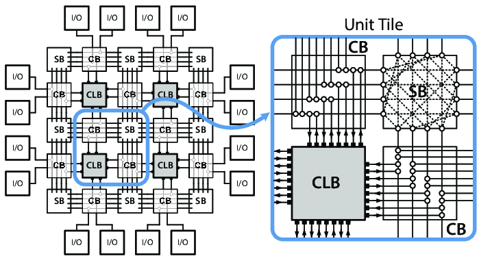

# FPGA (Field Programmable Gates Arrays)

[TOC]

## Res

## Intro
A third type of PLD, the **field-programmable gate array (FPGA)**, provides programmable logic using **lookup tables** instead of changing the wiring of the chip.

### FPGA Logic Element
Figure below shows a typical FPGA logic element consisting of **memory cells** and **multiplexers**. The inputs of the multiplexers (labeled MUX) are selected according to the values of the logic function inputs, x and y. These inputs trigger multiplexer selection of the appropriate memory cell, labeled “?” in the diagram. The value stored in the memory cell is then raised on the appropriate output of the multiplexer.

### Island Architecture
FPGA logic elements are interconnected through a routing architecture that consists of switches and connection multiplexers. A typical configuration, called an **island architecture**, is shown below. Each connection multiplexer and switch block is programmed to connect the outputs of one logic element to the inputs of another. A good portion of the chip area, usually about 70%, is devoted to connection and routing functions. This is one of the many things that make FPGAs slow and costly.

### FPGA with Microprocessors
To help reduce cost and improve speed and functionality, some FPGAs are also equipped with microprocessor cores. It would seem that such chips give designers the best of everything: The microprocessor can carry out the functions that it does best and fastest. Where the microprocessor functionality falls short, the FPGA can be programmed to make up the difference. Moreover, the programming process can be iterative. An FPGA permits continual changes while the circuit is debugged and tuned for performance.

## Ref

