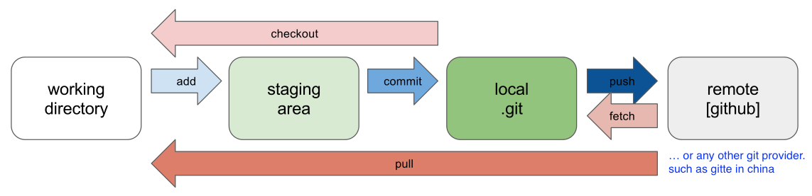

# Git

[TOC]


## Res
🏠 https://git-scm.com

### Related Topics
↗ [Code Management (CM) (Git Implementations)](../../../../☁️%20Cloud%20Native/🧘🏻%20Dev(Sec)Ops%20(Application%20Level%20Engineering)/🛫%20Continuous%20Integration/Code%20Management%20(CM)%20(Git%20Implementations)/Code%20Management%20(CM)%20(Git%20Implementations).md)


### 🥅 Tutorials
📂 ⭐️ [Git Official Docs](https://git-scm.com/doc)

📖 [廖雪峰的官方网站 liaoxuefeng.com](https://www.liaoxuefeng.com/wiki/896043488029600/898732864121440)

🤙🏾 [install Git](https://git-scm.com/book/it/v2/Per-Iniziare-Installing-Git)

🪠 And More ... (🔗 cited from [🏫 Missing Semester](../../../../../🗺%20CS_Overview/💋%20Intro%20to%20Computer%20Science/🏫%20Missing%20Semester.md))
- [Pro Git](https://git-scm.com/book/en/v2) is **highly recommended reading**. Going through Chapters 1–5 should teach you most of what you need to use Git proficiently, now that you understand the data model. The later chapters have some interesting, advanced material.
- [Oh Shit, Git!?!](https://ohshitgit.com/) is a short guide on how to recover from some common Git mistakes.
- [Git for Computer Scientists](https://eagain.net/articles/git-for-computer-scientists/) is a short explanation of Git’s data model, with less pseudocode and more fancy diagrams than these lecture notes.
- [Git from the Bottom Up](https://jwiegley.github.io/git-from-the-bottom-up/) is a detailed explanation of Git’s implementation details beyond just the data model, for the curious.
- [How to explain git in simple words](https://smusamashah.github.io/blog/2017/10/14/explain-git-in-simple-words)
- [Learn Git Branching](https://learngitbranching.js.org/) is a browser-based game that teaches you Git.
- [xkcd.com](https://xkcd.com/1597/)


### Cheat Sheet
https://www.ruanyifeng.com/blog/2015/12/git-cheat-sheet.html (git often-used commands)
⭐️ https://ndpsoftware.com/git-cheatsheet.html (Visual Git Cheat Sheet)  
⭐️ https://training.github.com (Github Git Cheat Sheet)

🔥 https://github.com/tiimgreen/github-cheat-sheet
A collection of cool hidden and not so hidden features of Git and GitHub. This cheat sheet was inspired by [Zach Holman](https://github.com/holman)'s [Git and GitHub Secrets](http://confreaks.tv/videos/aloharuby2012-git-and-github-secrets) talk at Aloha Ruby Conference 2012 ([slides](https://speakerdeck.com/holman/git-and-github-secrets)) and his [More Git and GitHub Secrets](https://vimeo.com/72955426)talk at WDCNZ 2013 ([slides](https://speakerdeck.com/holman/more-git-and-github-secrets)).


### Others
🔥 🔍 https://grep.app
Search across a half million git repos


## Intro
### 🧭 Quick - guide


> 🔗 https://git-scm.com/book/en/v2

Git is a [free and open source](https://git-scm.com/about/free-and-open-source) distributed version control system designed to handle everything from small to very large projects with speed and efficiency.
Git is [easy to learn](https://git-scm.com/doc) and has a [tiny footprint with lightning fast performance](https://git-scm.com/about/small-and-fast). ==It outclasses SCM tools like Subversion, CVS, Perforce, and ClearCase== with features like [cheap local branching](https://git-scm.com/about/branching-and-merging), convenient [staging areas](https://git-scm.com/about/staging-area), and [multiple workflows](https://git-scm.com/about/distributed).


> ==如何学习 Git==
>
> 和 Vim 不同，我不建议初学者在一知半解的情况下贸然使用 Git，因为它的内部逻辑并不能熟能生巧，而是需要花时间去理解。我推荐的学习路线如下：
>
> 1. 阅读这篇 [Git tutorial](https://missing.csail.mit.edu/2020/version-control/)，视频的话可以看这个[尚硅谷Git教程](https://www.bilibili.com/video/BV1vy4y1s7k6)
> 2. 阅读这本开源书籍 [Pro Git](https://git-scm.com/book/en/v2) 的 Chapter1 - Chapter5，是的没错，学 Git 需要读一本书（捂脸）。
> 3. 此时你已经掌握了 Git 的原理和绝大部分用法，接下来就可以在实践中反复巩固 Git 的命令了。但用好它同样是一门哲学，我个人觉得这篇[如何写好 Commit Message](https://chris.beams.io/posts/git-commit/) 的博客非常值得一读。
> 4. 好的此时你已经爱上了 Git，你已经不满足于学会它了，你想自己实现一个 Git！巧了，我当年也有这样的想法，[这篇 tutorial](https://wyag.thb.lt/) 可以满足你！
> 5. 什么？光实现一个 Git 无法满足你？小伙子/小仙女有前途，巧的是我也喜欢造轮子，这两个 GitHub 项目 [build-your-own-x](https://github.com/danistefanovic/build-your-own-x) 和 [project-based-learning](https://github.com/tuvtran/project-based-learning) 收录了你能想到的各种造轮子教程，比如：自己造个编辑器、自己写个虚拟机、自己写个 docker、自己写个 TCP 等等等等。

### 👼🏻 The Origin of Git
Linus is the founder of Linux OS and it's community. By the year of 2002, Linus manage codes from voluteers worldwide all by his own to maintain the community for Linus dislike the way  SCM softwares work. but as the community enlarged, the amount of workload piled up expotentially and it's growingly hard to handle this seas of code manually. hence, Linus writed his own version control system, by himself again, by C within 2 weeks. thus came the birth of the Git we're using today.

### 🛠 Implementation
1. download
2. create git repositery
3. set identity

```shell
$ git config --global user.name "Your Name"
$ git config --global user.email "email@example.com"

# --global here set that use this identity on every git repositery on the current machine 
```


## Ref
[你真的会高效的在GitHub搜索开源项目吗? - chainho的文章 - 知乎]: https://zhuanlan.zhihu.com/p/55294261
[Specify an SSH key for git push for a given domain]: https://stackoverflow.com/questions/7927750/specify-an-ssh-key-for-git-push-for-a-given-domain

 