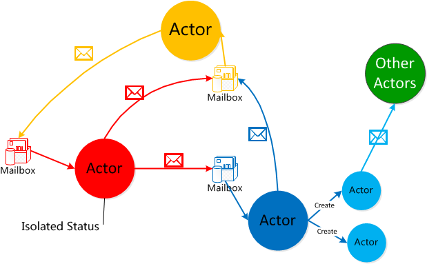

# [Akka](https://akka.io)

Akka is a toolkit for building highly concurrent, distributed, and resilient message-driven applications for Java and Scala. 

Akka Insights is intelligent monitoring and observability purpose built for Akka.

## Reading List

[Akka系列（一）：Akka简介与Actor模型]:https://segmentfault.com/a/1190000009256507
[AKKA~概念篇 - Stanley的文章 - 知乎]: https://zhuanlan.zhihu.com/p/25598361
[Akka Cluster（一） - Stanley的文章 - 知乎]: https://zhuanlan.zhihu.com/p/38454345

