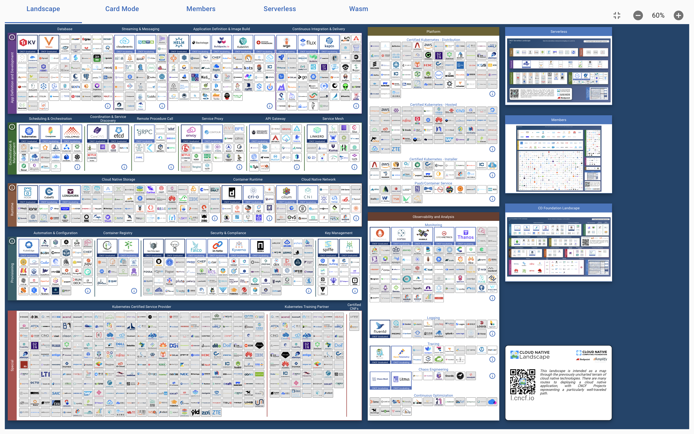

# [Cloud Native Computing Foundation](https://www.cncf.io/projects/)

The Cloud Native Computing Foundation (CNCF) hosts critical components of the global technology infrastructure.

We bring together the world’s top developers, end users, and vendors and run the largest open source developer conferences. CNCF is part of the nonprofit [Linux Foundation](https://linuxfoundation.org/).

> [到底什么是“云原生”？](http://dockone.io/article/10581)

## Resource

### 🗄 Doc

📂 [云原生资料库](https://lib.jimmysong.io) ⭐️⭐️⭐️

📂 [DevOps资料库](https://doc.devpod.cn)

👍 [CNCF Landscope](https://landscape.cncf.io)

👍 [CNCF landscope Guide](https://landscape.cncf.io/guide)

[jimmysong.io 云原生开源项目大全](https://jimmysong.io)

[云原生社区（中国）](https://cloudnative.to)

[GoogleCloud](https://cloud.google.com/docs)

[AWS](https://docs.aws.amazon.com/index.html?nc2=h_ql_doc_do)

[云原生实战](https://www.yuque.com/leifengyang/oncloud/vfvmcd)

### 🎬 Video

👍 [云原生Java架构师的第一课K8s+Docker+KubeSphere+DevOps](https://www.bilibili.com/video/BV13Q4y1C7hS?p=37&share_source=copy_web&vd_source=7740584ebdab35221363fc24d1582d9d)

+ 👍[配套文档](https://www.yuque.com/leifengyang/oncloud/ctiwgo)

## Intro

## FAQ

👉 [Diff between Docker & Containerd](https://www.theserverside.com/blog/Coffee-Talk-Java-News-Stories-and-Opinions/Whats-the-difference-between-containerd-and-Docker)

👉 [Tanzu vs OpenShift vs Ezmeral](https://www.techtarget.com/searchvmware/feature/Tanzu-vs-OpenShift-vs-Ezmeral-3-rivals-Kubernetes-offerings)

- [Redhat Openshift](https://access.redhat.com/documentation/en-us/openshift_container_platform/4.10)
- [VMWare Tanzu](https://docs.pivotal.io)
- 

## Extensive Readings ...

[What is SRE (Site Reliability Engineering)](https://www.redhat.com/en/topics/devops/what-is-sre)

[KVM](https://www.linux-kvm.org/page/Main_Page)

### Concepts

 [Serverless](Serverless/Intro.md) 

 [DevOps](DevOps/Orientation.md) 

Agile Dev

### Stack ()

[Cilium](https://docs.cilium.io/en/stable/)

[Quarkus](https://quarkus.io)

[openstack](https://www.openstack.org)

[nacos](https://github.com/alibaba/nacos)

[drone](https://github.com/harness/drone)

[filebeat](https://www.elastic.co/beats/filebeat)

[Puppet Forge](https://forge.puppet.com)

[Stackify Retrace](https://docs.stackify.com/v1/docs?_ga=2.2045431.795068548.1606150356-1374364069.1597069964)

[heroku](https://elements.heroku.com)

...

