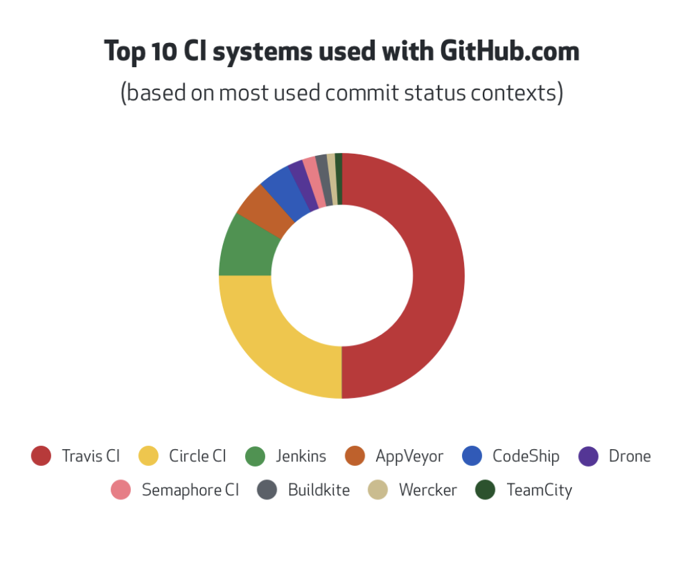

# [Travis CI](https://www.travis-ci.com)

Travis CI is the most used CI tool with GitHub.com !

<small>Src: [GitHub welcomes all CI tools! ](https://github.blog/2017-11-07-github-welcomes-all-ci-tools/)</small>

Continuous Integration ([CI](https://en.wikipedia.org/wiki/Continuous_integration)) tools help you stick to your team’s quality standards by running tests every time you push a new commit and [reporting the results](https://github.com/blog/2051-protected-branches-and-required-status-checks) to a pull request. Combined with continuous delivery ([CD](https://en.wikipedia.org/wiki/Continuous_delivery)) tools, you can also test your code on multiple configurations, run additional performance tests, and automate every step [until production](https://developer.github.com/changes/2014-01-09-preview-the-new-deployments-api/).

There are several [CI and CD](https://resources.github.com/ci-cd) tools that [integrate with GitHub](https://github.com/works-with/category/continuous-integration), some of which you can install in a few clicks from [GitHub Marketplace](https://github.com/marketplace/category/continuous-integration). With so many options, you can pick the best tool for the job—even if it’s not the one that comes pre-integrated with your system.

## Res

📂 [Travis CI - docs](https://docs.travis-ci.com/user/tutorial/)

[持续集成服务 Travis CI 教程 - 阮一峰](http://www.ruanyifeng.com/blog/2017/12/travis_ci_tutorial.html)