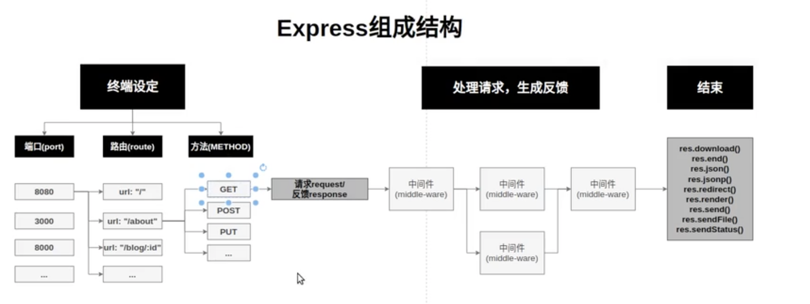

# [Express](https://expressjs.com)

[TOC]

## Features

1. **Web Applications**

   Express is a minimal and flexible Node.js web application framework that provides a robust set of features for web and mobile applications.

2. **APIs**

   With a myriad of HTTP utility methods and middleware at your disposal, creating a robust API is quick and easy.

3. **Performance**

   Express provides a thin layer of fundamental web application features, without obscuring Node.js features that you know and love.

4. **Frameworks**

   Many [popular frameworks](https://expressjs.com/en/resources/frameworks.html) are based on Express.

## Learn Express in prectice

### Express.com Res

[Getting Started](https://expressjs.com/en/starter/installing.html)

[Guides](https://expressjs.com/en/guide/routing.html)

[Api Reference](https://expressjs.com/en/4x/api.html)

[Advanced Topics](https://expressjs.com/en/advanced/developing-template-engines.html)

[Resources](https://expressjs.com/en/resources/glossary.html)

### Online Tutorials

[【Express.js教程05】 - 彻底搞懂中间件(Middleware)]:https://www.bilibili.com/video/BV1Zk4y1z7jj/?share_source=copy_web&vd_source=7740584ebdab35221363fc24d1582d9d

