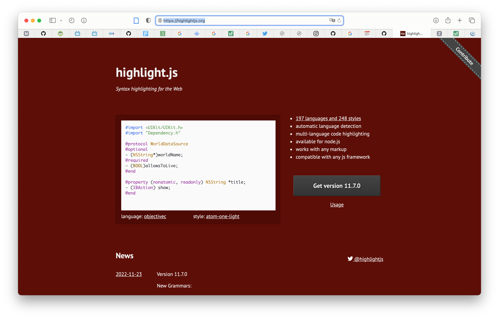

# [highlight.js](https://highlightjs.org)

Highlight.js is a syntax highlighter written in JavaScript. It works in the browser as well as on the server. It can work with pretty much any markup, doesn’t depend on any other frameworks, and has automatic language detection.

[TOC]

## Res

[Docs](https://highlightjs.readthedocs.io/en/latest/index.html)

[github.com/highlightjs](https://github.com/highlightjs/highlight.js#fetch-via-cdn)

## ⁉️ FAQ

### 👉 How to change theme in highlight.js

#### Refs

[TiddlyWiki5 and highlight.js - How to change style / theme of syntax highlighting?]:https://stackoverflow.com/questions/43517016/tiddlywiki5-and-highlight-js-how-to-change-style-theme-of-syntax-highlightin

