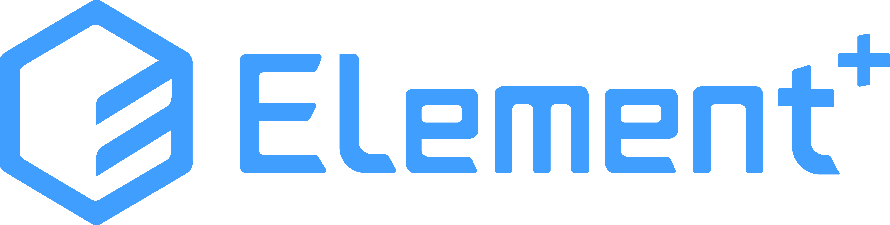

# [ElementUI](https://element-plus.org/en-US/)

Element Plus - A Vue.js 3 UI library

- 💪 Vue 3 Composition API
- 🔥 Written in TypeScript

## Getting Started

Alright, for you to get started if you are looking for making Element Plus better you should keep reading. For developers that uses Element Plus to develop your website you should go ahead visit [Getting Started](https://element-plus.org/).

- 中国大陆[加速镜像站点](https://element-plus.gitee.io/)

## Breaking change list

The first stable release of Element Plus suitable for use in production was released on February 07, 2022. The APIs is stable right now, and here's also a full list about how to get upgraded from [Element UI](https://element.eleme.io/) to Element Plus.

You can find the breaking change list here: [Breaking Change List](https://github.com/element-plus/element-plus/discussions/5658).

### Migration Tool 🛠️

We have made a migration tool for you to migrate your project from [Element UI](https://element.eleme.io/) to Element Plus.

You can find the [gogo code migration tool](https://github.com/thx/gogocode/tree/main/packages/gogocode-plugin-element) here.

We have tested this on [Vue Element Admin](https://github.com/PanJiaChen/vue-element-admin). You can find the transpiled code [here](https://github.com/gogocodeio/vue-element-admin).

### Playground

You can also try Element Plus out with the components built-in playground.

#### Try it with our built-in playground

[Playground](https://element-plus.run/)

#### Try it with code sandbox

[Edit element-plus on CodeSandbox](https://codesandbox.io/s/element-plus-demo-dxtcr)