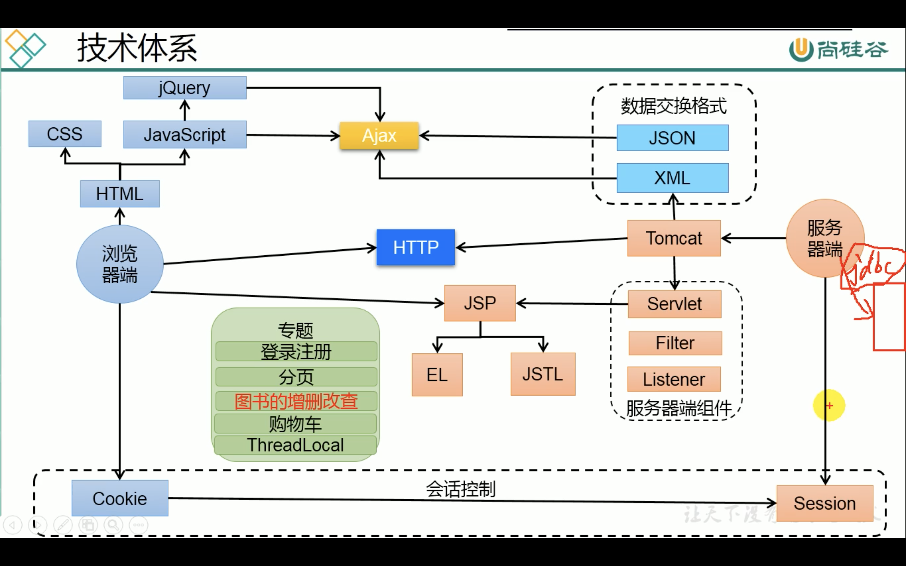

# 💰 Web-Dev Res:

[TOC]

###### 🤩 [MDN Guides](https://developer.mozilla.org/en-US/docs/Learn/Getting_started_with_the_web)

###### [MDN References](https://developer.mozilla.org/en-US/docs/Web/)

# 🏛 Web-Dev structure:

###### 

# 🙋 FAQ

### .NET vs Java
(.NET vs Java)

###### [.NET](https://dotnet.microsoft.com/en-us/learn/dotnet/what-is-dotnet)
- [.NET / .NET Framework / .NET Core](https://www.cnblogs.com/1996v/p/9037603.html)
- [.NET Framework tutorial](https://www.rocschool.com/tutorial/rocschool-show-442.html)
- [.NET Framework tutorial ](http://c.biancheng.net/view/2775.html)
- 

###### Java

### Web app framework

[nginx, tomcat, apache](https://blog.51cto.com/u_14246112/3142031)

[nginx & django](https://blog.csdn.net/weixin_38172774/article/details/104773354)

[javascript & node.js]
- [node.js pros&cons](https://www.zhihu.com/question/19653241)

[spring boot](https://www.liaoxuefeng.com/wiki/1252599548343744/1266265175882464)

[单工通信、半双工通信和全双工通信之间有什么区别。](https://www.cnblogs.com/kungfupanda/archive/2009/12/22/1629972.html)

###### [webkit](https://webkit.org/project/)

### DOM

https://developer.mozilla.org/en-US/docs/Learn/Getting_started_with_the_web
