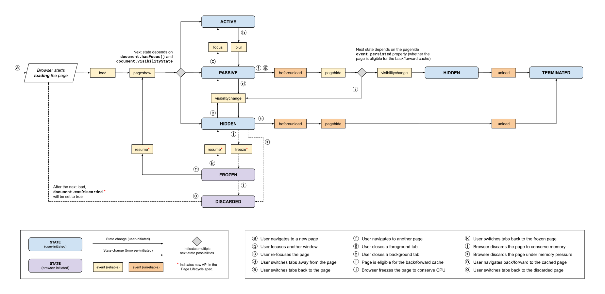

# Web Browser Development

[TOC]

## Res
### Related Topics
↗ [Web Browser Implementations](📌%20Web%20Browser%20Implementations/Web%20Browser%20Implementations.md)
↗ [Video & Streaming Service](../../🎨%20Computer%20Graphics%20Programming/Video%20&%20Streaming%20Service/Video%20&%20Streaming%20Service.md)

↗ [Web FrontEnd Dev](../../🕸️%20Web%20Development%20&%20The%20Internet/🖥️%20Web%20FrontEnd%20Dev/Web%20FrontEnd%20Dev.md)
↗ [HTML (HyperText Markup Language)](../../../../🔑%20CS%20Core/👩‍💻%20Computer%20Languages%20&%20Programming%20Methodology/Other%20Languages%20for%20Specific%20Areas/🪁%20DSL(Domain%20Specific%20Languages)%20&%20GPL(General%20Purpose%20Languages)/Markup%20DSL%20&%20GPL/HTML%20(HyperText%20Markup%20Language).md)
↗ [CSS (Cascading Style Sheets)](../../🕸️%20Web%20Development%20&%20The%20Internet/🖥️%20Web%20FrontEnd%20Dev/📌%20Web%20Frontend%20Basics/CSS%20(Cascading%20Style%20Sheets)/CSS%20(Cascading%20Style%20Sheets).md)

↗ [ECMAScript-Based Languages & JavaScript](../../../../🔑%20CS%20Core/👩‍💻%20Computer%20Languages%20&%20Programming%20Methodology/Compiled%20Languages/🐝%20ECMAScript-Based%20Languages%20&%20JavaScript/ECMAScript-Based%20Languages%20&%20JavaScript.md)
↗ [JavaScript Runtime Environments](../../../../🔑%20CS%20Core/👩‍💻%20Computer%20Languages%20&%20Programming%20Methodology/🛠️%20Programming%20Tools%20Chain/🚠%20Application%20Runtimes%20&%20SDKs/JavaScript%20Runtime%20Environments/JavaScript%20Runtime%20Environments.md)
- ↗ [JS Runtime Libraries & SDK](../../../../🔑%20CS%20Core/👩‍💻%20Computer%20Languages%20&%20Programming%20Methodology/🛠️%20Programming%20Tools%20Chain/🚠%20Application%20Runtimes%20&%20SDKs/JavaScript%20Runtime%20Environments/📌%20JS%20Runtime%20Libraries%20&%20SDK/JS%20Runtime%20Libraries%20&%20SDK.md)
- ↗ [JS Runtimes](../../../../🔑%20CS%20Core/👩‍💻%20Computer%20Languages%20&%20Programming%20Methodology/🛠️%20Programming%20Tools%20Chain/🚠%20Application%20Runtimes%20&%20SDKs/JavaScript%20Runtime%20Environments/JS%20Runtimes/JS%20Runtimes.md)
	- ↗ [JS Engines (JS Compilation)](../../../../🔑%20CS%20Core/👩‍💻%20Computer%20Languages%20&%20Programming%20Methodology/🛠️%20Programming%20Tools%20Chain/🚠%20Application%20Runtimes%20&%20SDKs/JavaScript%20Runtime%20Environments/JS%20Runtimes/🚒%20JS%20Engines%20(JS%20Compilation)/JS%20Engines%20(JS%20Compilation).md)
		- ↗ [Google V8](../../../../🔑%20CS%20Core/👩‍💻%20Computer%20Languages%20&%20Programming%20Methodology/🛠️%20Programming%20Tools%20Chain/🚠%20Application%20Runtimes%20&%20SDKs/JavaScript%20Runtime%20Environments/JS%20Runtimes/🚒%20JS%20Engines%20(JS%20Compilation)/Google%20V8/Google%20V8.md)
		- ↗ [Apple JavaScriptCore](../../../../🔑%20CS%20Core/👩‍💻%20Computer%20Languages%20&%20Programming%20Methodology/🛠️%20Programming%20Tools%20Chain/🚠%20Application%20Runtimes%20&%20SDKs/JavaScript%20Runtime%20Environments/JS%20Runtimes/🚒%20JS%20Engines%20(JS%20Compilation)/Apple%20JavaScriptCore%20(SquirrelFish%20&%20Nitro)/Apple%20JavaScriptCore.md)
		- ↗ [Mozilla SpiderMonkey](../../../../🔑%20CS%20Core/👩‍💻%20Computer%20Languages%20&%20Programming%20Methodology/🛠️%20Programming%20Tools%20Chain/🚠%20Application%20Runtimes%20&%20SDKs/JavaScript%20Runtime%20Environments/JS%20Runtimes/🚒%20JS%20Engines%20(JS%20Compilation)/Mozilla%20SpiderMonkey/Mozilla%20SpiderMonkey.md)

↗ [Web Security](../../../../CyberSecurity/Application%20Security/💉%20Web%20Security/Web%20Security.md)
↗ [Browser Security](../../../../CyberSecurity/Application%20Security/💉%20Web%20Security/🍭%20Web%20Application%20Security%20Mechanisms/Browser%20Security/Browser%20Security.md)

### Other Resources
Browser Docs & Developer Tools
[Firefox Developer Docs](https://firefox-source-docs.mozilla.org)
- [Firefox Developer Tools](https://firefox-source-docs.mozilla.org/devtools-user/index.html)
	- Documentation for the set of web-developer tools built into Firefox.
[Chrome for Developers](https://developer.chrome.com/)
- [Chrome DevTools](https://developer.chrome.com/docs/devtools/)
	- Documentation for the set of web-developer tools built into Chrome.
[Safari Web Inspector](https://webkit.org/web-inspector/)
- Documentation for the set of web-developer tools built into Safari.
[Edge DevTools](https://learn.microsoft.com/en-us/microsoft-edge/devtools-guide-chromium/landing/)
- Documentation for the set of web-developer tools built into Edge.

🏠 https://www.chromium.org/chromium-projects/
🚧 https://chromium.googlesource.com/chromium/src.git
📂 https://www.chromium.org/developers/
The Chromium projects include Chromium and ChromiumOS, the open-source projects behind the [Google Chrome](https://www.google.com/chrome) browser and Google ChromeOS, respectively. This site houses the documentation and code related to the Chromium projects and is intended for developers interested in learning about and contributing to the open-source projects.
- [Chromium](https://www.chromium.org/Home) is an open-source browser project that aims to build a safer, faster, and more stable way for all users to experience the web. This site contains design documents, architecture overviews, testing information, and more to help you learn to build and work with the Chromium source code.
	- [Getting Involved](https://www.chromium.org/getting-involved): learn how you can help the Chromium project
	- [For Developers](https://www.chromium.org/developers): design docs, how-tos, and other useful information for developers
		- ⭐ [Design Documents](https://www.chromium.org/developers/design-documents/)
			- Start Here: Background Reading
				- [Multi-process Architecture](https://www.chromium.org/developers/design-documents/multi-process-architecture): Describes the high-level architecture of Chromium **Note:** Most of the rest of the design documents assume familiarity with the concepts explained in this document.
				- [How Blink works](https://docs.google.com/document/d/1aitSOucL0VHZa9Z2vbRJSyAIsAz24kX8LFByQ5xQnUg) is a high-level overview of Blink architecture.
				- The "Life of a Pixel" talk ([slides](http://bit.ly/lifeofapixel) / [video](http://bit.ly/loap-2020-video)) is an introduction to Chromium's rendering pipeline, tracing the steps from web content to displayed pixels.
				- (somewhat outdated) [How Chromium Displays Web Pages](https://www.chromium.org/developers/design-documents/displaying-a-web-page-in-chrome): Bottom-to-top overview of how WebKit is embedded in Chromium
			- See Also
				- [Design docs in source code](https://chromium.googlesource.com/chromium/src/+/HEAD/docs/README.md)
				- [Design doc template](https://docs.google.com/document/d/14YBYKgk-uSfjfwpKFlp_omgUq5hwMVazy_M965s_1KA/edit)
	- [For Testers](https://www.chromium.org/for-testers): bug reporting guidelines, test plans, and other quality-related documentation
	- [User Experience](https://www.chromium.org/user-experience): the design philosophy behind many of Chromium's features
	- [Issue Tracking](https://www.chromium.org/issue-tracking): process documentation related to issue tracking and management
	- [Contact](https://www.chromium.org/contact): report a bug or a security issue, or get in touch with individual members of the team
	- [Security](https://www.chromium.org/Home/chromium-security): learn about Chromium security, and how to contact us or get involved
	- [Privacy](https://www.chromium.org/Home/chromium-privacy): information about Chromium privacy, how to get more information, and how to contact us
	- [Events](https://www.chromium.org/events): information about Chromium events
- [ChromiumOS](https://www.chromium.org/chromium-os) is an open-source project that aims to provide a fast, simple, and more secure computing experience for people who spend most of their time on the web. Learn more about the [project goals](https://googleblog.blogspot.com/2009/11/releasing-chromium-os-open-source.html), obtain the latest build, and learn how you can get involved, submit code, and file bugs.

## Intro

<small>A simplified diagram of the web workflow. Note the tree major agents here: client, web server, and database.</small>

> 🔗 https://en.wikipedia.org/wiki/Web_browser (2024)

A web browser is an application for accessing websites. When a user requests a web page from a particular website, the browser retrieves its files from a web server and then displays the page on the user's screen. Browsers are used on a range of devices, including desktops, laptops, tablets, and smartphones. By 2020, an estimated 4.9 billion people had used a browser. The most-used browser is Google Chrome, with a 67% global market share on all devices, followed by Safari with 18%.

A web browser is not the same thing as a search engine, though the two are often confused. A search engine is a website that provides links to other websites. However, to connect to a website's server and display its web pages, a user must have a web browser installed. In some technical contexts, browsers are referred to as user agents.

As of 2024, most used browsers worldwide are: Chrome, Safari ([macOS](https://en.wikipedia.org/wiki/MacOS "MacOS") and [iOS](https://en.wikipedia.org/wiki/IOS "IOS") only), [Firefox](https://en.wikipedia.org/wiki/Firefox "Firefox"), [Edge](https://en.wikipedia.org/wiki/Microsoft_Edge "Microsoft Edge"), [Opera](https://en.wikipedia.org/wiki/Opera_\(web_browser\) "Opera (web browser)"), [Samsung Internet](https://en.wikipedia.org/wiki/Samsung_Internet "Samsung Internet") ([Android](https://en.wikipedia.org/wiki/Android_\(operating_system\) "Android (operating system)") only), [UC Browser](https://en.wikipedia.org/wiki/UC_Browser "UC Browser") (Android and iOS only), [Yandex](https://en.wikipedia.org/wiki/Yandex_Browser "Yandex Browser"), [Brave](https://en.wikipedia.org/wiki/Brave_\(web_browser\) "Brave (web browser)") and [Vivaldi](https://en.wikipedia.org/wiki/Vivaldi_\(web_browser\) "Vivaldi (web browser)").

## Intro to Browser Inner Working: Chrome as an Example
↗ [Chrome & Chromium Development](📌%20Web%20Browser%20Implementations/Chrome%20&%20Chromium%20Development.md)

### Browser as An Application Software
> 🔗 https://developer.chrome.com/blog/inside-browser-part1

<small>Three layers of computer architecture. Machine Hardware at the bottom, Operating System in the middle, and Application on top.</small>
#### Browser's Architecture
> 🔗 https://www.geeksforgeeks.org/browser-architecture/

Browser architecture is designed to provide a faster, more secure, and more feature-rich platform that helps users interact easily with the internet. The browser architecture is broadly divided into seven parts.

<small>Browser Architecture</small>

> 🔗 https://developer.chrome.com/blog/inside-browser-part1

<small>Diagram of Chrome's multi-process architecture. Multiple layers are shown under Renderer Process to represent Chrome running multiple Renderer Processes for each tab.</small>

> 🔗 https://www.chromium.org/developers/design-documents/multi-process-architecture/

Chromium uses multiple processes to protect the overall application from bugs and glitches in the rendering engine or other components. It also restricts access from each rendering engine process to other processes and to the rest of the system. In some ways, this brings to web browsing the benefits that memory protection and access control brought to operating systems.

We refer to the main process that runs the UI and manages renderer and other processes as the "**browser process**" or "browser." Likewise, the processes that handle web content are called "**renderer processes**" or "renderers." The renderers use the [Blink](https://www.chromium.org/blink) open-source layout engine for interpreting and laying out HTML.

#### \*Servicification in Chrome
The same approach is applied to the browser process. Chrome is undergoing architecture changes to run each part of the browser program as a service allowing to split into different processes or aggregate into one.

General idea is that when Chrome is running on powerful hardware, it may split each service into different processes giving more stability, but if it is on a resource-constraint device, Chrome consolidates services into one process saving memory footprint. Similar approach of consolidating processes for less memory usage have been used on platform like Android before this change.
#### \*Site Isolation in Chrome: Per-frame renderer processes
[Site Isolation](https://developers.google.com/web/updates/2018/07/site-isolation) is a recently introduced feature in Chrome that runs a separate renderer process for each cross-site iframe. We've been talking about one renderer process per tab model which allowed cross-site iframes to run in a single renderer process with sharing memory space between different sites. Running a.com and b.com in the same renderer process might seem okay. The [Same Origin Policy](https://developer.mozilla.org/docs/Web/Security/Same-origin_policy) is the core security model of the web; it makes sure one site cannot access data from other sites without consent. Bypassing this policy is a primary goal of security attacks. Process isolation is the most effective way to separate sites. With [Meltdown and Spectre](https://developers.google.com/web/updates/2018/02/meltdown-spectre), it became even more apparent that we need to separate sites using processes. With Site Isolation enabled on desktop by default since Chrome 67, each cross-site iframe in a tab gets a separate renderer process.

Enabling Site Isolation has been a multi-year engineering effort. Site Isolation isn't as simple as assigning different renderer processes; it fundamentally changes the way `iframes` talk to each other. Opening `devtools` on a page with `iframes` running on different processes means `devtools` had to implement behind-the-scenes work to make it appear seamless. Even running a simple Ctrl+F to find a word in a page means searching across different renderer processes. You can see the reason why browser engineers talk about the release of Site Isolation as a major milestone!

### Site Navigation Flow
> 🔗  https://developer.chrome.com/blog/inside-browser-part2

#### Response Handling ⭐
↗ [MIME (Multipurpose Internet Mail Extensions)](../../../../🔑%20CS%20Core/🏎️%20Computer%20Networking%20and%20Communication/📌%20Computer%20Networking%20Basics%20(Protocol%20Part)/0x01%20Application%20Layer/🚔%20Network%20Managements%20&%20Standards/MIME%20(Multipurpose%20Internet%20Mail%20Extensions).md)
[SafeBrowsing](https://safebrowsing.google.com/)
[Cross-Origin Read Blocking for Web Developers](https://www.chromium.org/Home/chromium-security/corb-for-developers/)

#### Navigation Preload
> 🔗 https://web.dev/blog/navigation-preload

#### Service Worker
> 🔗 https://developer.chrome.com/docs/workbox/service-worker-overview/

Service workers offer incredible utility, but can be tricky to work with at first. Workbox makes service workers easier to use. However, because service workers solve hard problems, any abstraction of that technology will also be tricky without understanding it. Thus, these first few bits of documentation will cover that underlying technology before getting into Workbox specifics.

> To view a running list of service workers, enter `chrome://serviceworker-internals/` into your address bar.

Service workers are specialized JavaScript assets that act as proxies between web browsers and web servers. They aim to improve reliability by providing offline access, as well as boost page performance.

> 🔗 [The service worker lifecycle](https://web.dev/articles/service-worker-lifecycle)

### Page/Tab Management
#### Page Life Circle
> 🔗 https://developer.chrome.com/docs/web-platform/page-lifecycle-api

- Application lifecycle is a key way that modern operating systems manage resources. 
- On the web, there has historically been no such lifecycle, and apps can be kept alive indefinitely. 
- While the web platform has long had events that related to lifecycle states — like [`load`](https://developer.mozilla.org/docs/Web/Events/load), [`unload`](https://developer.mozilla.org/docs/Web/Events/unload), and [`visibilitychange`](https://developer.mozilla.org/docs/Web/Events/visibilitychange) — these events only allow developers to respond to user-initiated lifecycle state changes. For the web to work reliably on low-powered devices (and be more resource conscious in general on all platforms) browsers need a way to proactively reclaim and re-allocate system resources.
- The [Page Lifecycle API](https://wicg.github.io/page-lifecycle/spec.html) attempts to solve this problem by:
	- Introducing and standardizing the concept of lifecycle states on the web.
	- Defining new, system-initiated states that allow browsers to limit the resources that can be consumed by hidden or inactive tabs.
	- Creating new APIs and events that allow web developers to respond to transitions to and from these new system-initiated states.

<small>Page Lifecycle API state and event flow.</small>

#### Page Rendering & Rendering Pipeline
> 🔗 https://developer.chrome.com/blog/inside-browser-part3
> Renderer process touches many aspects of web performance. If you'd like to dig deeper, [the Performance section of Web Fundamentals](https://developers.google.com/web/fundamentals/performance/why-performance-matters/) has many more resources.

> In chrome, the rendering process is largely done under the render engine called "blink" engine.  Below description is an overview of how blink is executing the rendering pipeline.  For deeper and more detailed explanation, [how blink works](https://docs.google.com/document/d/1aitSOucL0VHZa9Z2vbRJSyAIsAz24kX8LFByQ5xQnUg/) and [life of a pixel](https://docs.google.com/presentation/d/1boPxbgNrTU0ddsc144rcXayGA_WF53k96imRH8Mp34Y/edit#slide=id.ga884fe665f_64_6) are excellent resources. Also, you can check the documentations of chromium projects, especially [design documentation](https://www.chromium.org/developers/design-documents/).
> 
> If you want to learn more:
> 	Overview: [Life of a pixel](https://docs.google.com/presentation/d/1boPxbgNrTU0ddsc144rcXayGA_WF53k96imRH8Mp34Y/edit#slide=id.p)
> 	DOM: [core/dom/README.md](https://chromium.googlesource.com/chromium/src/+/master/third_party/blink/renderer/core/dom/README.md)
> 	Style: [core/css/README.md](https://chromium.googlesource.com/chromium/src/+/master/third_party/blink/renderer/core/css/README.md)
> 	Layout: [core/layout/README.md](https://chromium.googlesource.com/chromium/src/+/master/third_party/blink/renderer/core/layout/README.md)
> 	Paint: [core/paint/README.md](https://chromium.googlesource.com/chromium/src/+/master/third_party/blink/renderer/core/paint/README.md)
> 	Compositor thread: [Chromium graphics](https://www.chromium.org/developers/design-documents/chromium-graphics)

The renderer process is responsible for everything that happens inside of a tab. In a renderer process, the main thread handles most of the code you send to the user. Sometimes parts of your JavaScript is handled by worker threads if you use a web worker or a service worker. Compositor and raster threads are also run inside of a renderer processes to render a page efficiently and smoothly.

The renderer process's core job is to turn HTML, CSS, and JavaScript into a web page that the user can interact with.

<small>Life of A Pixel <a>https://docs.google.com/presentation/d/1boPxbgNrTU0ddsc144rcXayGA_WF53k96imRH8Mp34Y/edit#slide=id.ga884fe665f_64_1800</a></small>
##### Parsing & Sub-resources Loading
Parsing an HTML document into a DOM is defined by the [HTML Standard](https://html.spec.whatwg.org/). You may have noticed that feeding HTML to a browser never throws an error. For example, missing closing `
` tag is a valid HTML. Erroneous markup like `Hi! <b>I'm <i>Chrome</b>!</i>` (b tag is closed before i tag) is treated as if you wrote `Hi! <b>I'm <i>Chrome</i></b><i>!</i>`. This is because the HTML specification is designed to handle those errors gracefully. If you are curious how these things are done, you can read on "[An introduction to error handling and strange cases in the parser](https://html.spec.whatwg.org/multipage/parsing.html#an-introduction-to-error-handling-and-strange-cases-in-the-parser)" section of the HTML spec.

**JavaScript can block the parsing**
When the HTML parser finds a `<script>` tag, it pauses the parsing of the HTML document and has to load, parse, and execute the JavaScript code. Why? because JavaScript can change the shape of the document using things like `document.write()` which changes the entire DOM structure ([overview of the parsing model](https://html.spec.whatwg.org/multipage/parsing.html#overview-of-the-parsing-model) in the HTML spec has a nice diagram). This is why the HTML parser has to wait for JavaScript to run before it can resume parsing of the HTML document. If you are curious about what happens in JavaScript execution, [the V8 team has talks and blog posts on this](https://mathiasbynens.be/notes/shapes-ics).

<small>Overview of the parsing model <a>https://html.spec.whatwg.org/multipage/parsing.html#overview-of-the-parsing-model</a></small>

**Hint to browser how you want to load resources**
There are many ways web developers can send hints to the browser in order to load resources nicely. If your JavaScript does not use `document.write()`, you can add [`async`](https://developer.mozilla.org/docs/Web/HTML/Element/script#attr-async) or [`defer`](https://developer.mozilla.org/docs/Web/HTML/Element/script#attr-defer) attribute to the `<script>` tag. The browser then loads and runs the JavaScript code asynchronously and does not block the parsing. You may also use [JavaScript module](https://developers.google.com/web/fundamentals/primers/modules) if that's suitable. `<link rel="preload">` is a way to inform browser that the resource is definitely needed for current navigation and you would like to download as soon as possible. You can read more on this at [Resource Prioritization – Getting the Browser to Help You](https://developers.google.com/web/fundamentals/performance/resource-prioritization).
##### Style Calculation
Having a DOM is not enough to know what the page would look like because we can style page elements in CSS. The main thread parses CSS and determines the computed style for each DOM node. This is information about what kind of style is applied to each element based on CSS selectors. You can see this information in the `computed` section of DevTools.

Even if you do not provide any CSS, each DOM node has a computed style. `<h1>` tag is displayed bigger than `<h2>` tag and margins are defined for each element. This is because the browser has a default style sheet. If you want to know what Chrome's default CSS is like, [you can see the source code here](https://cs.chromium.org/chromium/src/third_party/blink/renderer/core/html/resources/html.css).
##### Layout
The layout is a process to find the geometry of elements. The main thread walks through the DOM and computed styles and creates the layout tree which has information like x y coordinates and bounding box sizes. Layout tree may be similar structure to the DOM tree, but it only contains information related to what's visible on the page. If `display: none` is applied, that element is not part of the layout tree (however, an element with `visibility: hidden` is in the layout tree). Similarly, if a pseudo-element with content like `p::before{content:"Hi!"}` is applied, it is included in the layout tree even though that is not in the DOM.

Determining the Layout of a page is a challenging task. Even the simplest page layout like a block flow from top to bottom has to consider how big the font is and where to line break them because those affect the size and shape of a paragraph; which then affects where the following paragraph needs to be.

CSS can make element float to one side, mask overflow item, and change writing directions. You can imagine, this layout stage has a mighty task. In Chrome, a whole team of engineers works on the layout. If you want to see details of their work, [few talks from BlinkOn Conference](https://www.youtube.com/watch?v=Y5Xa4H2wtVA) are recorded and quite interesting to watch.
##### Paint
At this paint step, the main thread walks the layout tree to create paint records. Paint record is a note of painting process like "background first, then text, then rectangle". If you have drawn on `<canvas>` element using JavaScript, this process might be familiar to you.

The most important thing to grasp in rendering pipeline is that at each step the result of the previous operation is used to create new data. For example, if something changes in the layout tree, then the Paint order needs to be regenerated for affected parts of the document.

**janky in animation**
If you are animating elements, the browser has to run these operations in between every frame. Most of our displays refresh the screen 60 times a second (60 fps); animation will appear smooth to human eyes when you are moving things across the screen at every frame. However, if the animation misses the frames in between, then the page will appear "**janky**".

You can divide JavaScript operation into small chunks and schedule to run at every frame using `requestAnimationFrame()`. For more on this topic, please see [Optimize JavaScript Execution](https://developers.google.com/web/fundamentals/performance/rendering/optimize-javascript-execution) . You might also run your [JavaScript in Web Workers](https://www.youtube.com/watch?v=X57mh8tKkgE) to avoid blocking the main thread.
##### Compositing
> 🔗 https://web.dev/articles/stick-to-compositor-only-properties-and-manage-layer-count
> 🔗 https://developer.chrome.com/blog/inside-browser-part3
> 🔗 https://developer.chrome.com/blog/inside-browser-part4

## WebView
### What is WebView
> 🔗 https://www.mobiloud.com/blog/native-app-vs-webview-app#:~:text=Webviews%20can%20be%20found%20in,most%20common%20in%20mobile%20apps.

A WebView is an embeddable, in-app browser, which shows live web pages, but with the address bar and browser tabs removed.

WebViews allow an app to display web content without using a traditional web browser (e.g. Chrome or Safari).

==WebViews can be found in all kinds of applications (including desktop apps), but are most common in mobile apps.==

<small>Example of an app that uses webviews to recreate a mobile website, swapping the browser UI for native app elements.</small>

<small>Blink render engine and other components of some major web platforms</small>

> 🔗 https://en.wikipedia.org/wiki/WebView

A WebView is a web browser that is embedded within an app. Thus a WebView is a large-scale software component, enabling the use of web content within apps. In some cases, the entire functionality of the app is implemented this way.

The prominent ones are bundled in operating systems:
- Android System WebView, based on Google Chrome
- Apple's WebView for its devices, based on its Safari browser
- Microsoft Edge WebView2

Other examples are Microsoft's legacy WebView, based on its deprecated [EdgeHTML](https://en.wikipedia.org/wiki/EdgeHTML "EdgeHTML") and [MSHTML](https://en.wikipedia.org/wiki/MSHTML "MSHTML") [engines](https://en.wikipedia.org/wiki/Browser_engine "Browser engine"), and the WebView component in [JavaFX](https://en.wikipedia.org/wiki/JavaFX#WebView "JavaFX").

> 🔗 https://www.pcmag.com/encyclopedia/term/webview

(WebView is) A browser engine contained within an application. The WebView allows the programmer to write the bulk of the application using HTML, JavaScript and CSS, which are the standard Web programming tools. WebView also allows Web content on external sites to be displayed within an application without switching users to their Web browser and a different interface. For example, Android System WebView provides this capability for Android app developers. 

### Web View and Hybrid Mobile App
> 🔗 https://www.pcmag.com/encyclopedia/term/hybrid-mobile-app

(A hybrid mobile app is) A smartphone or tablet application that is programmed like a Web page rather than a mobile app. Hybrid mobile apps are coded in Web language such as HTML and Javascript rather than Swift and Java for Apple and Android.

The HTML and Javascript "WebView" is wrapped within native iOS, iPadOS or Android shells that have access to the hardware (camera, GPS, Wi-Fi, etc.) as well as settings and notifications.

**WebViews Make It Easier**
It is clearly faster to program one WebView that runs on all platforms than to write a native app for each one. When apps are native, any change in design requires changes to each set of source code.

Another advantage of the hybrid is the much greater availability of Web programmers than native. In addition, efficient native programming requires experience in that specific platform because, not only the architecture, but many of the development tools used by Apple and Android barely resemble one another (see [IDE](https://www.pcmag.com/encyclopedia/term/ide)).

However, for video games and apps requiring complete control, native programming is generally mandatory (see [native mobile app](https://www.pcmag.com/encyclopedia/term/native-mobile-app)).

<small>Hybrid vs. Native. From a programmer's point of view, the hybrid app is much easier to write and maintain. <a>https://www.pcmag.com/encyclopedia/term/hybrid-mobile-app</a></small>

<small>There Are Several Mobile App Options. Mobile users run programs that come from either an app store or a website. Downloading an app from an online store is easy, but the user must accept updates from time to time to keep current. However, nothing is easier than launching a browser and going to a website because updates are already there. <a>https://www.pcmag.com/encyclopedia/term/hybrid-mobile-app</a></small>
See [mobile website](https://www.pcmag.com/encyclopedia/term/mobile-website), [responsive Web design](https://www.pcmag.com/encyclopedia/term/responsive-web-design) and [progressive Web app](https://www.pcmag.com/encyclopedia/term/progressive-web-app).

## Ref
[Explore the Magic Behind Google Chrome | Medium (2018)]: https://zicodeng.medium.com/explore-the-magic-behind-google-chrome-c3563dbd2739

[Conceptual Architecture of Google Chrome (2009)]: https://archrometects.wordpress.com/wp-content/uploads/2009/10/assignment-01-conceptual-architecture-of-google-chrome-archrometects.pdf

[👍 Inside look at modern web browser (part 1)]: https://developer.chrome.com/blog/inside-browser-part1
- we looked at how different processes and threads handle different parts of a browser.
[👍 Inside look at modern web browser (part 2)]: https://developer.chrome.com/blog/inside-browser-part2
- we dig deeper into how each process and thread communicate in order to display a website.
[👍 Inside look at modern web browser (part 3)]: https://developer.chrome.com/blog/inside-browser-part3
- Inner workings of a Renderer Process
[👍 Inside look at modern web browser (part 4)]: https://developer.chrome.com/blog/inside-browser-part4#understanding_non-fast_scrollable_region
- In this post, we'll look at how compositor is enabling smooth interaction when user input comes in.

[WebView overview | google documentation]: https://developer.chrome.com/docs/webview

[👍 Native Apps vs Webview Apps - What's the Best Choice for Your Business?]: https://www.mobiloud.com/blog/native-app-vs-webview-app
