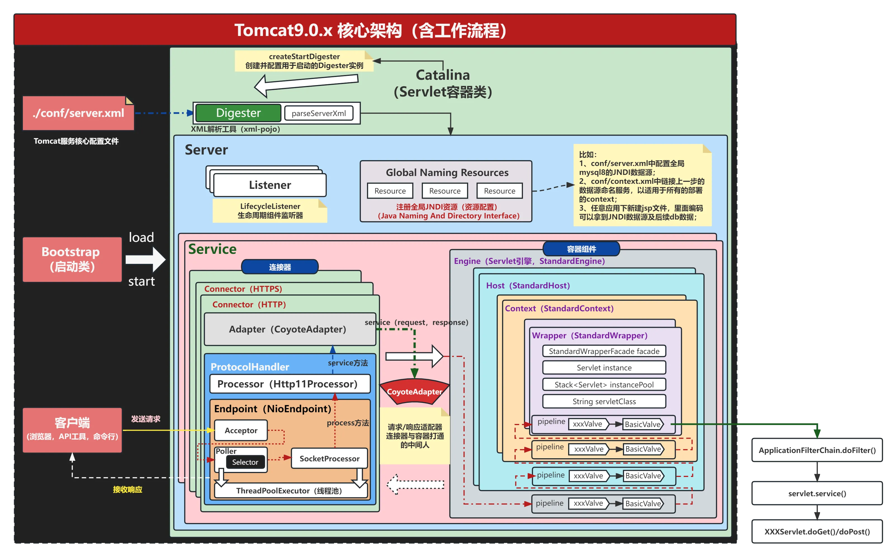

# Apache Tomcat

[TOC]


## Res
### Related Topics
↗ [ASF (Apache Software Foundation)](../../../../../../Open%20Source%20(Free%20Software)%20Spirits%20&%20Software%20License/Free%20Software%20Organizations/ASF%20(Apache%20Software%20Foundation).md)


## Intro
The Apache Tomcat® software is an open source implementation of the [Jakarta Servlet](https://projects.eclipse.org/projects/ee4j.servlet), [Jakarta Server Pages](https://projects.eclipse.org/projects/ee4j.jsp), [Jakarta Expression Language](https://projects.eclipse.org/projects/ee4j.el), [Jakarta WebSocket](https://projects.eclipse.org/projects/ee4j.websocket), [Jakarta Annotations](https://projects.eclipse.org/projects/ee4j.ca) and[Jakarta Authentication](https://projects.eclipse.org/projects/ee4j.authentication) specifications. These specifications are part of the [Jakarta EE platform](https://projects.eclipse.org/projects/ee4j.jakartaee-platform).

The Jakarta EE platform is the evolution of the Java EE platform. Tomcat 10 and later implement specifications developed as part of Jakarta EE. Tomcat 9 and earlier implement specifications developed as part of Java EE.

The Apache Tomcat software is developed in an open and participatory environment and released under the [Apache License version 2](http://www.apache.org/licenses/). The Apache Tomcat project is intended to be a collaboration of the best-of-breed developers from around the world. We invite you to participate in this open development project. To learn more about getting involved, [click here](https://tomcat.apache.org/getinvolved.html).

Apache Tomcat software powers numerous large-scale, mission-critical web applications across a diverse range of industries and organizations. Some of these users and their stories are listed on the [PoweredBy](https://cwiki.apache.org/confluence/display/TOMCAT/PoweredBy) wiki page.

Apache Tomcat, Tomcat, Apache, the Apache feather, and the Apache Tomcat project logo are trademarks of the Apache Software Foundation.


## Tomcat Architecture

<small>Software Architecture of Tomcat 9.0.x </small>
#### Architecture Elements of Tomcat
> 🔗 https://jiminbyun.medium.com/apache-tomcat-1-core-components-and-their-interactions-939f1f476544

```shell
Server (Tomcat Instance)  
|  
+-- Service (1)  
|   |  
|   +-- Engine (1)  
|       |  
|       +-- Host (1)  
|       |   |  
|       |   +-- Context (1): web app  
|       |   +-- Context (2)  
|       |  
|       +-- Host (2)  
|  
+-- Connector (1)  
+-- Connector (2)  
|  
+-- Service (2)  
    |  
    +-- Engine (1)  
        |  
        +-- Host (1)  
        |   |  
        |   +-- Context (1): web app  
        |   +-- Context (2)  
        |  
        +-- Host (2)
```

1. **Server**
	- Represents the whole Tomcat instance.  
    - The top-level element in server.xml.  
    - Can contain multiple Services.
2. **Service**
	- Groups one or more Connectors to a single Engine.  
    - Acts as a conduit between the network and the servlet processing.
3. **Engine**
	 - Responsible for the request processing pipeline of a Service.  
    - Directs requests to the appropriate Host.
4. **Host**
	- Represents a virtual host/domain within Tomcat.  
    - Contains multiple Contexts (web applications).
5. **Context**
	- Encapsulates an individual web application.  
    - Where servlets and JSPs live and execute.


<small>Tomcat's architecture <a>https://medium.com/@nikhilmanikonda/tomcat-who-i-am-and-what-i-do-e91ff72fb2ea</a></small>

> 🔗 https://www.freebuf.com/articles/web/274466.html

一个 Tomcat 代表一个 Server 服务器，一个 Server 服务器可以包含多个 Service 服务，Tomcat 默认的 Service 服务是 Catalina，而一个 Service 服务可以包含多个连接器，因为 Tomcat 支持多种网络协议，包括 HTTP/1.1、HTTP/2、AJP 等等，一个 Service 服务还会包括一个容器，容器外部会有一层 Engine 引擎所包裹，负责与处理连接器的请求与响应，连接器与容器之间通过 ServletRequest 和 ServletResponse 对象进行交流。  
一个engine可以对一个多个host，也就是虚拟主机，一个host可以对应多个context，也就是web应用，一个context对应多个wrapper，也就是servlet。这个映射关系，通过mapper组件来关联，mapper组件保存了Web应用的配置信息，容器组件与访问路径的映射关系。Host容器的域名，Context容器中的web路径，Wrapper容器中的servlet映射的路径，这些配置信息是多层次的Map。根据请求定位到指定servlet的流程图如下：


### Core Components of Tomcat
> 🔗 https://p4d0rn.gitbook.io/java/memory-shell/tomcat#id-3.-listener
> 🔗 https://jiminbyun.medium.com/apache-tomcat-1-core-components-and-their-interactions-939f1f476544

主要有server、service、connector、container 四个部分
核心组件：Connector 和 Container
- Connector 主要负责对外交流，进行 Socket 通信(基于 TCP/IP)，解析 HTTP 报文
- Container 主要处理 Connector 接受的请求，主要是处理内部事务，加载和管理 Servlet，由 Servlet 具体负责处理 Request 请求
#### Catalina (The Servlet Engine, or the Servlet Container)
- Catalina is the powerhouse of Tomcat. It’s where the real magic happens.  
- When a request arrives, Catalina decides whether it’s a servlet or a JSP (JavaServer Page). If it is a servlet, Catalina takes charge.  
- Catalina **manages the lifecycle of servlets, including loading, initialization, and handling requests**.

Container（又名Catalina）用于处理Connector发过来的servlet连接请求，它是容器的父接口，所有子容器都必须实现这个接口，Container 容器的设计用的是典型的责任链的设计模式，它有四个子容器组件构成，分别是：Engine、Host、Context、Wrapper，这四个组件不是平行的，而是父子关系，Engine 包含 Host，Host 包含 Context，Context 包含 Wrapper。
- Engine: 最顶层容器组件，可以包含多个 Host。实现类为 `org.apache.catalina.core.StandardEngine`
- Host: 代表一个虚拟主机，每个虚拟主机和某个域名 Domain Name 相匹配，可以包含多个 Context。实现类为 `org.apache.catalina.core.StandardHost`
- Context: 一个 Context 对应于一个 Web 应用，可以包含多个 Wrapper。实现类为 `org.apache.catalina.core.StandardContext`
- Wrapper: 一个 Wrapper 对应一个 Servlet。负责管理 Servlet ，包括 Servlet 的装载、初始化、执行以及资源回收。实现类为 `org.apache.catalina.core.StandardWrapper`（每个JSP其实也是一个个的Servlet。）

每一个 Context 都有唯一的 path。这里的 path 不是指 servlet 绑定的 WebServlet 地址，而是指独立的一个 Web 应用地址。


#### Coyote (The HTTP Connector)
- Imagine Coyote as **the gatekeeper of Tomcat**. It listens for incoming HTTP requests (those messages from web browsers) and directs them to the right place.  
- Coyote handles the low-level network communication, ensuring that requests find their way into Tomcat’s heart.

负责接收浏览器的发过来的 tcp 连接请求，创建一个 Request 和 Response 对象分别用于和请求端交换数据，然后会产生一个线程来处理这个请求并把产生的 Request 和 Response 对象传给处理这个请求的线程，处理这个请求的线程就是 Container 组件要做的事了。
- EndPoint: 负责网络通信，将字节流传递给 Processor；
- Processor: 负责处理字节流生成 Tomcat Request 对象，将 Tomcat Request 对象传递给 Adapter；
- Adapter: 负责将 Tomcat Request 对象转化成 ServletRequest 对象，传递给容器。


> 🔗 https://p4d0rn.gitbook.io/java/memory-shell/tomcat-middlewares/executor

Connector主要由ProtocolHandler与Adapter构成。

Connector就是依靠ProtocolHandler来处理网络连接和应用层协议。
ProtocolHandler构成：
- Endpoint
- Processor
ProtocolHandler下面有好几个子实现类
- Ajp和Http11是不同的协议
- Nio、Nio2、Apr是不同的通信方式

EndPoint五大组件：
- LimitLatch：连接控制器，控制Tomcat所能接收的最大数量连接
- Acceptor：负责接收新的连接，然后返回一个Channel对象给Poller
- Poller：可以将其看成是NIO中Selector，负责监控Channel的状态
- SocketProcessor：可以看成是一个被封装的任务类
- Executor：Tomcat自己扩展的线程池，用来执行任务类

> 🔗 https://p4d0rn.gitbook.io/java/memory-shell/tomcat-middlewares/upgrade
> 上篇的Executor内存马是在EndPoint下的，实际上Processor中也能找到内存马的植入点
#### Jasper (The JSP Engine)
- JSPs are dynamic web pages with embedded Java code. But how do they become something browsers can understand?  That’s where Jasper comes in. It’s the JSP engine within Tomcat. JSP is associated with the Context element.
- **Jasper compiles JSP files into Java bytecode**. Think of it as translating JSPs into a language that Catalina can sync with.  
- Once compiled, Jasper hands over the Java bytecode to Catalina for execution.
#### Valve
- **Valve** is a component that allows you to intercept requests in Tomcat, **providing services like logging, security checks, and request filtering**.
- Pluggable components for intercepting requests at any point in the processing pipeline.  
- Can be attached at the Server, Service, Engine, Host, or Context levels.
##### Tomcat Pipeline Mechanism
> 🔗 https://p4d0rn.gitbook.io/java/memory-shell/tomcat-middlewares/valve

当Tomcat接收到客户端请求时，首先通过Connector解析成ServletRequest，再发送到Container进行处理。
Container下面有四个子容器，Engine、Host、Context、Wrapper，这四个组件不是平行的，而是父子关系。
消息在这四个子容器中层层传递，最终发送给Servlet进行处理。这个过程就涉及到了Tomcat管道机制。
- Pipeline：管道
- Valve：阀门

我们传递的信息就像水流，在Pipeline里面流动。通过Valve，可以让水流流向不同的Pipeline，过滤水流的杂质。对比SpringMVC的拦截器，Pipeline 就相当于拦截器链，而Valve就相当于拦截器。


Pipeline 中会有一个最基础的 Valve（Basic），它始终位于末端（最后执行），它在业务上面的表现是封装了具体的请求处理和输出响应。

四大组件 Engine、Host、Context 以及 Wrapper 都有其对应的 Valve 类
- `StandardEngineValve`
- `StandardHostValve`
- `StandardContextValve`
- `StandardWrapperValve`
他们同时维护一个 StandardPipeline 实例
#### Cluster
- Facilitates Tomcat’s ability to run in a clustered environment, providing **load balancing and failover capabilities for high availability**.


### A Simple Client HTTP Request Handling Procedure by Tomcat
> 🔗 https://jiminbyun.medium.com/apache-tomcat-1-core-components-and-their-interactions-939f1f476544

```
+-------------------+    +-----------------+      +--------------------+  
|                   |--->|                 | ---> |                    |  
|  Client (Browser) |    |   Coyote (HTTP  |      |   Servlet Engine   |  
|                   |<---|   Connector)    | <--- |   (Catalina)       |  
+-------------------+    +-----------------+      +--------------------+  
    HTTP Request           Acceptor Threads           Servlets/JSPs  
    HTTP Response          Worker Threads             Processing  
                           SSL/TLS Encryption   
                           (if HTTPS)    
                                                         |    ^     
                                                         |    |     
                                                         v    |     
                                                   +-------------------+  
                                                   |                   |  
                                                   |   Jasper (JSP     |  
                 JSP Compilation (if JSP file) and |   Engine, if JSP) |  
 Delivery of Java bytecode for Catalina to process |                   |  
                                                   +-------------------+
```

1. **Client Request (User Clicks a Link)**
	- Imagine you click a link on a website or type a URL in your browser.  
    - This action sends an **HTTP request** to the web server.
2. **Coyote (The Gatekeeper)**
	- Meet **Coyote**, our gatekeeper. It checks the request’s format and ensures it’s valid.  
    - If everything looks good, Coyote lets the request in.
3. **Catalina (The Decision Maker)**
	- Catalina is like the manager. It decides what to do with the request.  
    - If it’s a **servlet** (a Java program), Catalina takes charge.  
    - If it’s a **JSP (JavaServer Page)** (a mix of HTML and Java), Jasper (our translator) steps in.
4. **Servlets (The Doers)**
	- If it’s a servlet:  
	    - Catalina finds the right servlet (like picking the right tool for the job).  
	    - The servlet processes the request: reads data, talks to databases, and does calculations.  
	    - Finally, it generates an **HTTP response**.
5. **JSPs (The Dynamic Pages)**
	- If it’s a JSP: 
	    - Jasper compiles it into Java code.  
	    - The compiled JSP becomes part of the servlet team.  
	    - The rest is similar to servlet handling: creating a response and sending it back.
6. **The Encore (Sending the Response)** 
    - Catalina wraps up by sending the response back to your browser.  
    - Your browser displays the web page, and you see the result.


## Ref
[Tomcat 使用笔记]: http://masikkk.com/article/Apache-Tomcat/

[【Tomcat】tomcat logs 目录下各日志文件的含义]: https://www.cnblogs.com/qlqwjy/p/8036091.html

[Mac 下安装Tomcat]: https://www.jianshu.com/p/db08d23049ce

[IDEA配置Tomcat （Mac os Catalina）]: https://blog.csdn.net/GouGe_CSDN/article/details/105477849

[👍 Tomcat 使用笔记 -- 小马的笔记]: http://masikkk.com/article/Apache-Tomcat/

[servelets | geeksforgeeks]: https://www.geeksforgeeks.org/introduction-java-servlets/
