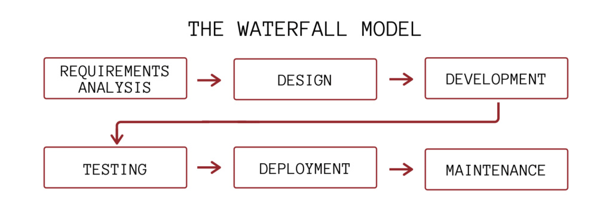
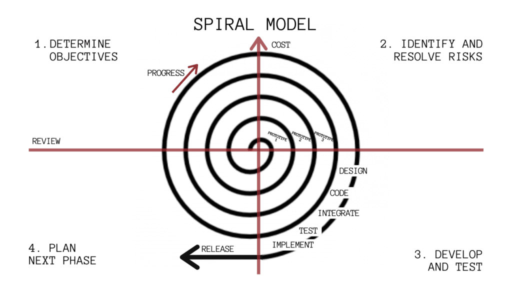
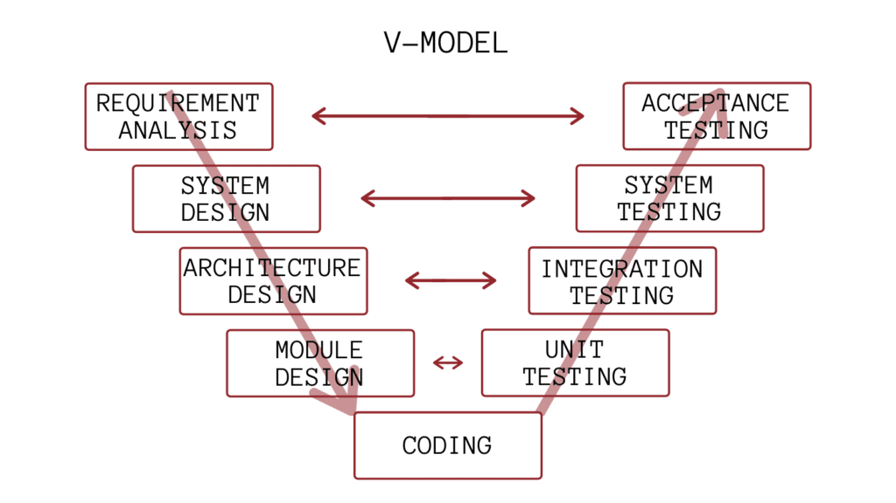
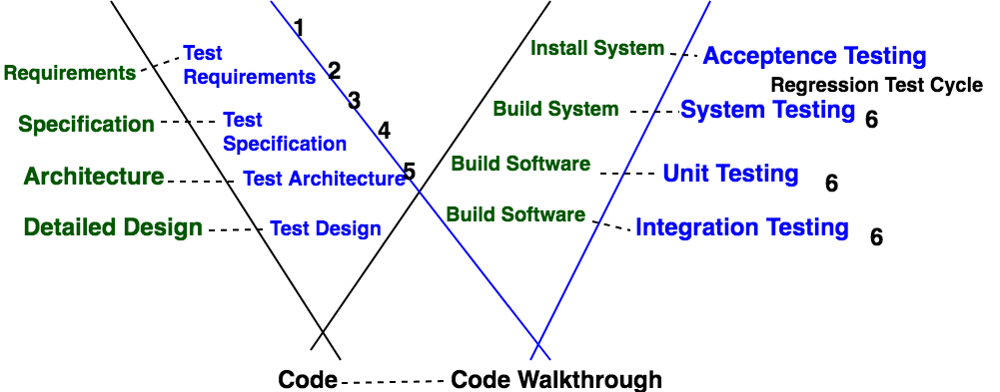
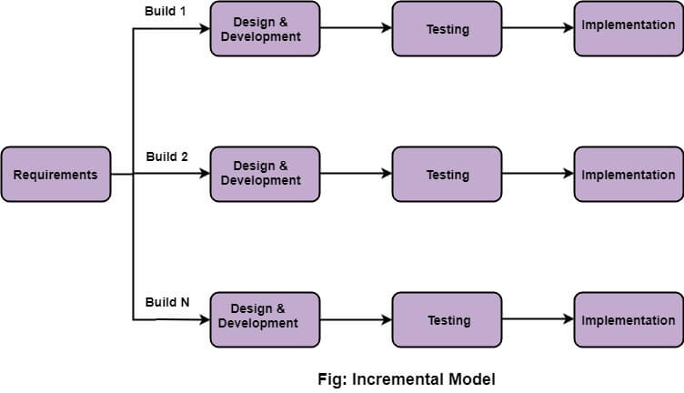
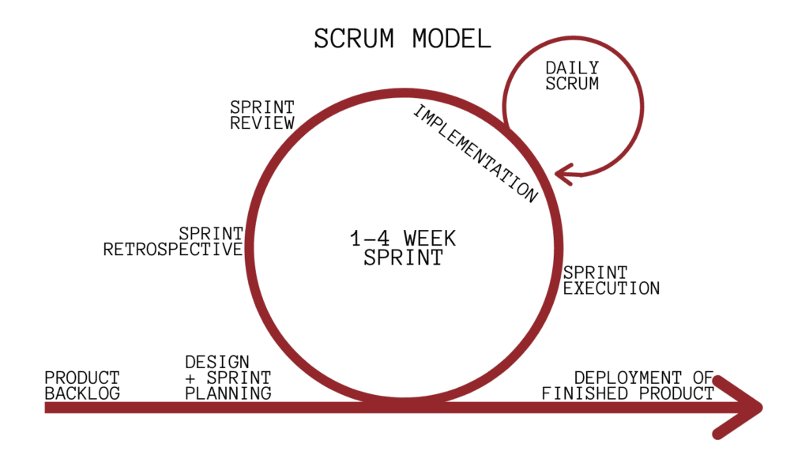
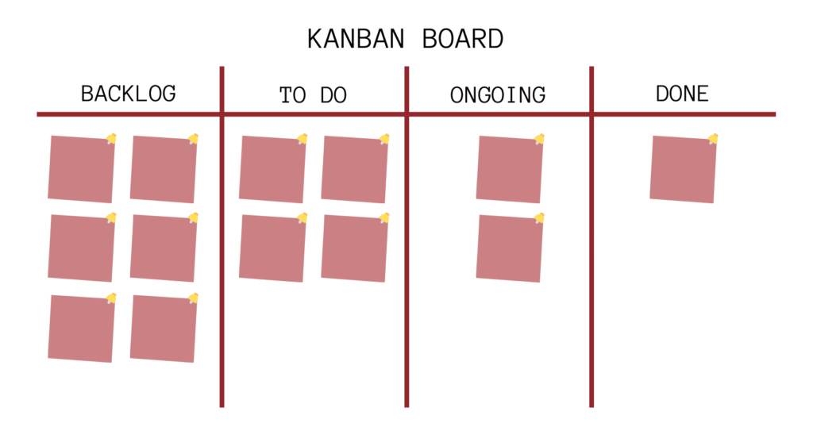
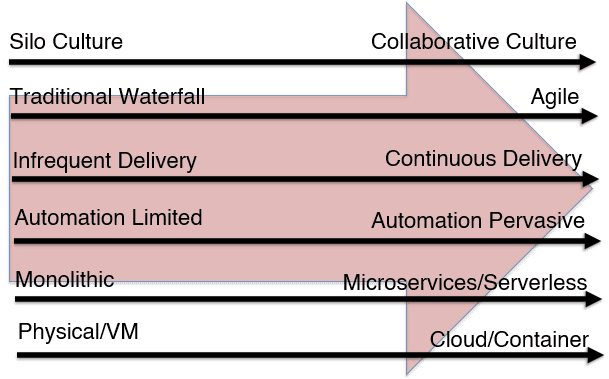
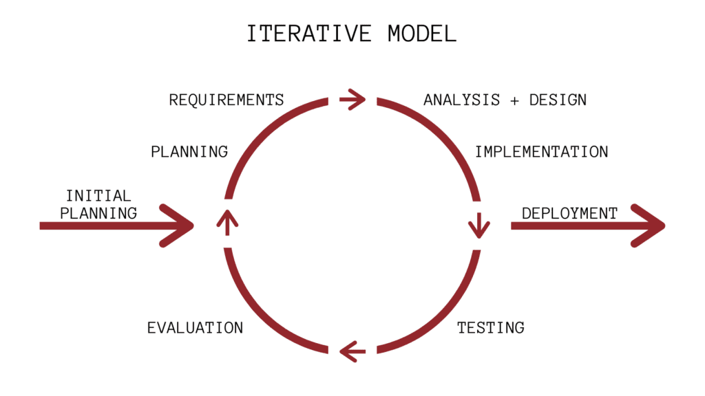
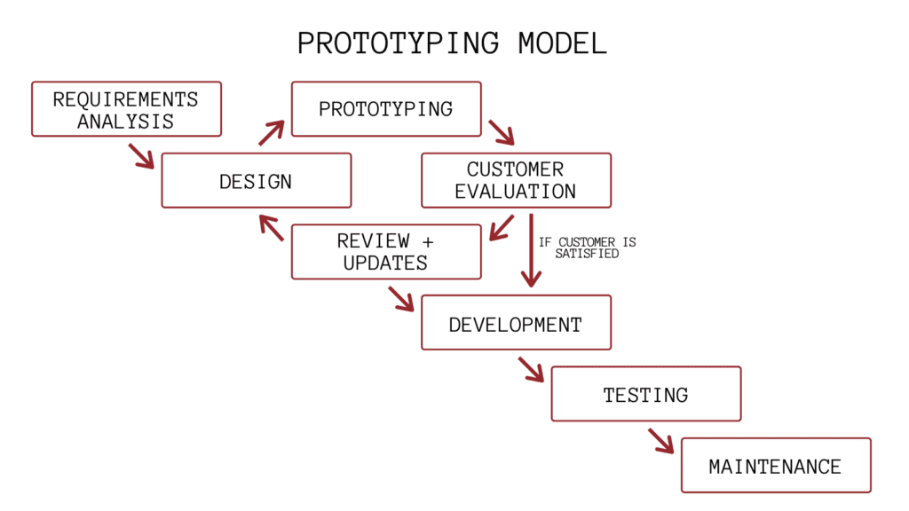

# SDLC (Software Development Life Circle) & SDLC Models

[TOC]

## Res
### Related Topics
↗ [SDL (Secure Development Lifecycle)](../../../CyberSecurity/🏰%20Cybersecurity%20Basics%20&%20InfoSec/🍦%20Software%20Security/Software%20Supply%20Chains%20Security/SDL%20(Secure%20Development%20Lifecycle).md)
↗ [Dev(Sec)Ops (Application Level Engineering)](../../☁️%20Cloud%20Native/🧘🏻%20Dev(Sec)Ops%20(Application%20Level%20Engineering)/Dev(Sec)Ops%20(Application%20Level%20Engineering).md)
↗ [Web Dev & Ops](../../👾%20Web%20Dev%20&%20Ops/Web%20Dev%20&%20Ops.md)

## Intro
### SDLC (Software Development Life Circle)
Also Software Develop Process.

**Software Development life cycle (SDLC)** is a spiritual model used in project management that defines the stages included in an information system development project, from an initial feasibility study to the maintenance of the completed application.

### SDLC Models
There are different software development life cycle models specify and design, which are followed during the software development phase. These models are also called "**Software Development Process Models**." Each process model follows a series of phase unique to its type to ensure success in the step of software development.

### Securing The SDLC
↗ [SDL (Secure Development Lifecycle)](../../../CyberSecurity/🏰%20Cybersecurity%20Basics%20&%20InfoSec/🍦%20Software%20Security/Software%20Supply%20Chains%20Security/SDL%20(Secure%20Development%20Lifecycle).md)
↗ [Dev(Sec)Ops (Application Level Engineering)](../../☁️%20Cloud%20Native/🧘🏻%20Dev(Sec)Ops%20(Application%20Level%20Engineering)/Dev(Sec)Ops%20(Application%20Level%20Engineering).md)

## 🎯 Waterfall Model
> 🔗 https://www.javatpoint.com/software-engineering-waterfall-model

Winston Royce introduced the Waterfall Model in 1970. 

Waterfall model has five phases

1. Requirements analysis and specification  --->  SRS
2. design --->  SDD
3. implementation and unit testing
4. integration and system testing
5. operation and maintenance. 

The steps always follow in this order and do not overlap. The developer must complete every phase before the next phase begins. 

## 🎯 RAD (Rapid Application Development) Model
RAD is a linear sequential software development process model that emphasizes a concise development cycle using an element based construction approach. 

RAD (Rapid Application Development) is a concept that products can be developed faster and of higher quality through:

- Gathering requirements using workshops or focus groups
- Prototyping and early, reiterative user testing of designs
- The re-use of software components
- A rigidly paced schedule that refers design improvements to the next product version
- Less formality in reviews and other team communication

The various phases of RAD are as follows: 

1. Business modelling
2. Data modeling
3. Process modeling
4. Application generation
5. Testing & Turnover

## 🎯 Spiral Model
> 🔗 https://www.javatpoint.com/software-engineering-spiral-model

The spiral model is a **risk-driven process model**. This SDLC model helps the group to adopt elements of one or more process models like a waterfall, incremental, waterfall, etc. The spiral technique is a combination of rapid prototyping and concurrency in design and development activities.

## 🎯 V-Model
> 🔗 https://www.javatpoint.com/software-engineering-v-model

The V-model, or Validation and Verification model, expands on the Waterfall model with the addition of early test planning. Instead of moving down linearly through the software development stages, the V-Model moves down until the coding phase when it pivots and begins to ascend upward to form a “V” shape.

The addition of early test planning gives the V-Model a greater chance of success than that of the Waterfall model. However, the V-Model is still linear, making it inflexible.

### W-Model (double V Model)
> 🔗 https://www.geeksforgeeks.org/software-engineering-w-model/

**W-model** is the most recent software development model where we start real testing activity simultaneously software development process starts. Where as software development process is a method in which a software or product is made through various stages of planning, development and testing before the final software or product is delivered. testing is such a stage that is extremely crucial to ensure the delivery of an optimum quality product.

- V-model and W-model are two of the most important models that are used in software testing.
- W-Model covers those activities which are skipped by V-Model and also, it deals with problems which couldn’t be catch by V-Model.
- W-Model approach attempts to address and tackle the shortcomings W-Model approach attempts to address and tackle the shortcomings of V-Model.
- W-model can be done only once the development of the product is complete with no modifications required to be done in between. This type of testing is most suitable for short projects.
- With the help of W-Model, we ensure that the testing of the product starts from the very first day of the inception of product and each phase of the product development is verified and validated.

## 🎯 Incremental (and Iterative) Model
> 🔗 https://www.javatpoint.com/software-engineering-incremental-model

Incremental Model is a process of software development where requirements divided into multiple standalone modules of the software development cycle. In this model, each module goes through the requirements, design, implementation and testing phases. Every subsequent release of the module adds function to the previous release. The process continues until the complete system achieved.

## 🏃‍♂️ Agile Methodology Development Models
> 🔗 https://www.javatpoint.com/software-engineering-agile-model

Agile is a methodology based on the 12 principles outlined in the *[Agile Manifesto](https://agilemanifesto.org)*. It is a mindset rather than a set of strict protocols.

Agile was developed to deliver better software more effectively and efficiently than previous methodologies, including Waterfall, through a focus on collaboration, communication, and constant change.

The adoption of Agile was swift and continuous. According to the [Project Management Institute](https://www.pmi.org/-/media/pmi/documents/public/pdf/learning/thought-leadership/pulse/pulse-of-the-profession-2017), “A full 71 percent of organizations report using agile approaches for their projects sometimes, often, or always.”

There are several Agile software development models. These models focus on **teamwork**, **cross-functional** **collaboration**, **iterative development**, and **early customer feedback**. **Testing**, **feedback**, and **making adjustments** allow teams to develop and deliver the best software.

🪜 A partial list of Agile: 

- Scrum
- Crystal
- Dynamic Software Development Method(DSDM)
- Feature Driven Development(FDD)
- Lean Software Development
- eXtreme Programming(XP)

### Scrum Model
The Scrum model is the most popular Agile model. Its iterations of software development are known as sprints. During these 1-4 weeklong sprints, teams assess the previous sprint, add new features (coded and tested functionality), and plan the next sprint. Changes are not allowed after the sprint’s activities are defined.

After each sprint, new features/items are added to be coded and tested in the next sprint. This occurs until all features have been added and the project is deemed ready for release.

### Kanban Model
Unlike the other models, Kanban does not have pronounced iterations. If a team does plan iterations, they are incredibly short sprints, sometimes as short as one day.

A Kanban board with sticky notes is used to visually outline the projects and their details, including project owners and progress status. This visualization allows the team to narrow their concentration on the most important feature in development at the moment.

Additionally, the Kanban board highlights the room remaining for continual improvement to the perfection of features.

### The Shift to Agile Software Development
Companies are adopting enabling technologies and processes like [continuous integration](https://flexagon.com/flexdeploy/build-automation/), [continuous delivery](https://flexagon.com/blog/continuous-integration-vs-continuous-delivery-whats-the-difference-and-how-do-they-improve-your-bottom-line/), [release automation](https://flexagon.com/flexdeploy/release-orchestration/), and [DevOps](https://flexagon.com/flexdeploy/devops-vsdp-platform/).

## 🎯 Iterative Model

> 🔗  https://www.javatpoint.com/software-engineering-iterative-model

In this Model, you can start with some of the software specifications and develop the first version of the software. After the first version if there is a need to change the software, then a new version of the software is created with a new iteration. Every release of the Iterative Model finishes in an exact and fixed period that is called iteration.

The Iterative Model allows the accessing earlier phases, in which the variations made respectively. The final output of the project renewed at the end of the Software Development Life Cycle (SDLC) process.

## 🎯 Prototyping Model

> 🔗 https://www.javatpoint.com/software-engineering-prototype-model

The Prototyping model is centered around increasing the development team’s understanding of the customer’s wants/needs by creating prototypes. By creating a working small-scale replica of the desired software program, miscommunications or misunderstandings can be resolved before full development occurs.

Before developers begin working on the final product, they create a prototype of what they believe the customer wants. The prototype is developed, tested, and refined according to customer feedback. Once the prototype is accepted, the team begins developing the final product.

## Ref
[SDLC Models]: https://www.javatpoint.com/software-engineering-sdlc-models
[7 Software Development Models in Engineering You Should Know]: https://flexagon.com/blog/7-software-development-models-you-should-know/
[面试被问到了解哪些开发模型？看这一篇就够了！]:http://testingpai.com/article/1656568768296
[软件开发模式的种类有哪些？ - 悟空打印坊的文章 - 知乎]: https://zhuanlan.zhihu.com/p/43885605

