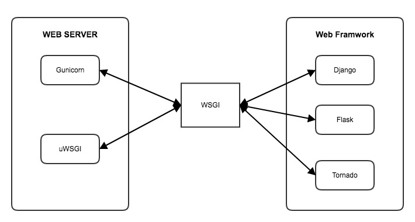

# WSGI (Web Server Gateway Interface)

[TOC]

## Res
📂 https://peps.python.org/pep-0333/

📂 https://wsgi.readthedocs.io/en/latest/index.html
📂 https://wsgi.readthedocs.io/en/latest/what.html
WSGI is the Web Server Gateway Interface. It is a specification that describes how a web server communicates with web applications, and how web applications can be chained together to process one request.

WSGI is a Python standard described in detail in [**PEP 3333**](https://www.python.org/dev/peps/pep-3333).

For more, see [Learn about WSGI](https://wsgi.readthedocs.io/en/latest/learn.html).

### Other Materials
https://www.liaoxuefeng.com/wiki/1016959663602400/1017805733037760
廖雪峰

## Intro

## Ref
[WSGI 是什么，看完一定懂]: https://foofish.net/python-wsgi.html

[What Is WSGI (Web Server Gateway Interface)]: https://www.liquidweb.com/kb/what-is-wsgi/#:~:text=WSGI%20stands%20for%20%22Web%20Server,Python%20web%20application%20or%20framework

[WSGI Servers]: https://www.fullstackpython.com/wsgi-servers.html