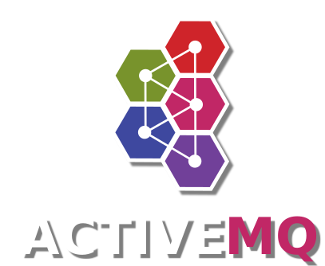

# Apache ActiveMQ

[TOC]

## Res
🏠 https://activemq.apache.org

## Intro

Apache ActiveMQ® is the most popular open source, multi-protocol, Java-based message broker. It supports industry standard protocols so users get the benefits of client choices across a broad range of languages and platforms. Connect from clients written in JavaScript, C, C++, Python, .Net, and more. Integrate your multi-platform applications using the ubiquitous **AMQP** protocol. Exchange messages between your web applications using **STOMP** over websockets. Manage your IoT devices using **MQTT**. Support your existing **JMS** infrastructure and beyond. ActiveMQ offers the power and flexibility to support any messaging use-case.

## Ref
