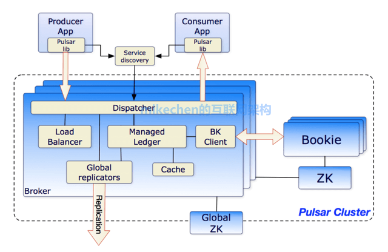

# Pulsar

Apache Pulsar is a cloud-native, multi-tenant, high-performance solution for server-to-server messaging and queuing built on the publisher-subscribe (pub-sub) pattern. Pulsar combines the best features of a traditional messaging system like RabbitMQ with those of a pub-sub system like Apache Kafka – scaling up or down dynamically without downtime. It's used by thousands of companies for high-performance data pipelines, microservices, instant messaging, data integrations, and more.

## Res

[Doc Portal](https://pulsar.apache.org/docs/2.10.x/)

