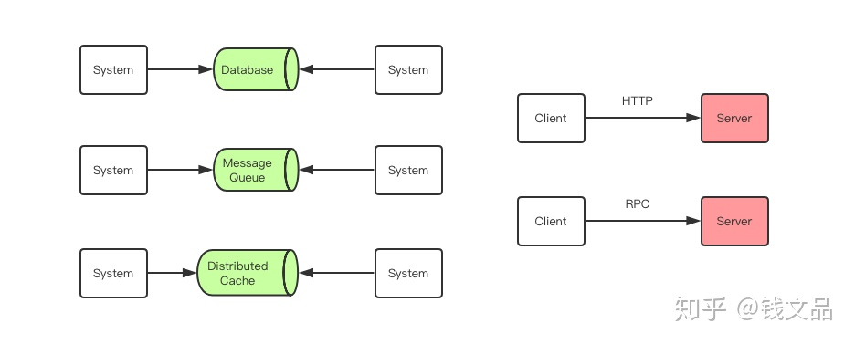

# RPC 是什么

## 1

作者：老钱
链接：https://www.zhihu.com/question/25536695/answer/417707733
来源：知乎
著作权归作者所有。商业转载请联系作者获得授权，非商业转载请注明出处。

随着企业 IT 服务的不断发展，单台服务器逐渐无法承受用户日益增长的请求压力时，就需要多台服务器联合起来构成「服务集群」共同对外提供服务。同时业务服务会随着产品需求的增多越来越肿，架构上必须进行服务拆分，一个完整的大型服务会被打散成很多很多独立的小服务，每个小服务会由独立的进程去管理来对外提供服务，这就是「[微服务](https://www.zhihu.com/search?q=微服务&search_source=Entity&hybrid_search_source=Entity&hybrid_search_extra={"sourceType"%3A"answer"%2C"sourceId"%3A417707733})」。

当用户的请求到来时，我们需要将用户的请求分散到多个服务去各自处理，然后又需要将这些子服务的结果汇总起来呈现给用户。那么服务之间该使用何种方式进行交互就是需要解决的核心问题。RPC 就是为解决服务之间信息交互而发明和存在的。

### 什么是 RPC ？
RPC (Remote Procedure Call)即[远程过程调用](https://www.zhihu.com/search?q=远程过程调用&search_source=Entity&hybrid_search_source=Entity&hybrid_search_extra={"sourceType"%3A"answer"%2C"sourceId"%3A417707733})，是分布式系统常见的一种通信方法，已经有 40 多年历史。当两个物理分离的子系统需要建立逻辑上的关联时，RPC 是牵线搭桥的常见技术手段之一。==除 RPC 之外，常见的多系统数据交互方案还有[分布式消息队列](https://www.zhihu.com/search?q=分布式消息队列&search_source=Entity&hybrid_search_source=Entity&hybrid_search_extra={"sourceType"%3A"answer"%2C"sourceId"%3A417707733})、HTTP 请求调用、数据库和分布式缓存等。==

其中 RPC 和 HTTP 调用是没有经过中间件的，它们是端到端系统的直接数据交互。HTTP 调用其实也可以看成是一种特殊的 RPC，只不过传统意义上的 RPC 是指长连接数据交互，而 HTTP 一般是指即用即走的短链接。

RPC 在我们熟知的各种中间件中都有它的身影。Nginx/Redis/MySQL/Dubbo/Hadoop/Spark/Tensorflow 等重量级开源产品都是在 RPC 技术的基础上构建出来的，我们这里说的 RPC 指的是广义的 RPC，也就是分布式系统的通信技术。RPC 在技术中的地位好比我们身边的空气，它无处不在，但是又有很多人根本不知道它的存在。

## 2
**RPC([远程过程调用](https://www.zhihu.com/search?q=远程过程调用&search_source=Entity&hybrid_search_source=Entity&hybrid_search_extra={"sourceType"%3A"answer"%2C"sourceId"%3A109977506}))是什么**
- 简单的说，RPC就是从一台机器（客户端）上通过参数传递的方式调用另一台机器（服务器）上的一个函数或方法（可以统称为服务）并得到返回的结果。
- RPC 会隐藏底层的通讯细节（不需要直接处理Socket通讯或Http通讯）
- RPC 是一个[请求响应模型](https://www.zhihu.com/search?q=请求响应模型&search_source=Entity&hybrid_search_source=Entity&hybrid_search_extra={"sourceType"%3A"answer"%2C"sourceId"%3A109977506})。客户端发起请求，服务器返回响应（类似于Http的工作方式）
- RPC 在使用形式上像调用本地函数（或方法）一样去调用远程的函数（或方法）。

**远程过程调用发展历程**
- ONC RPC （开放网络计算的远程过程调用），OSF RPC（开放软件基金会的远程过程调用）
- CORBA（Common Object Request Broker Architecture公共对象请求代理体系结构）
- DCOM（[分布式组件对象模型](https://www.zhihu.com/search?q=分布式组件对象模型&search_source=Entity&hybrid_search_source=Entity&hybrid_search_extra={"sourceType"%3A"answer"%2C"sourceId"%3A109977506})），COM+
- Java RMI
- .NET Remoting
- XML-RPC，SOAP，Web Service
- PHPRPC，Hessian，JSON-RPC
- Microsoft WCF，WebAPI
- ZeroC Ice，Thrift，GRPC
- Hprose

**早期的 RPC**
- 第一代 RPC（ONC RPC，OSF RPC）不支持对象的传递。
- CORBA 太复杂，各种不同实现不兼容，一般程序员也玩不转。
- DCOM，COM+ 逃不出 Windows 的手掌心。
- RMI 只能在 Java 里面玩。
- .NET Remoting 只能在 .NET 平台上玩。

**XML-RPC，SOAP，WebService**
- 冗余数据太多，处理速度太慢。
- RPC 风格的 Web Service 跨语言性不佳，而 Document 风格的 Web Service 又太过难用。
- Web Service 没有解决用户的真正问题，只是把一个问题变成了另一个问题。
- Web Service 的规范太过复杂，以至于在 .NET 和 Java 平台以外没有真正好用的实现，甚至没有可用的实现。
- 跨语言跨平台只是 Web Service 的一个口号，虽然很多人迷信这一点，但事实上它并没有真正实现。

**PHPRPC**
- 基于 PHP 内置的序列化格式，在跨语言的类型映射上存在硬伤。
- 通讯上依赖于 HTTP 协议，没有其它底层通讯方式的选择。
- 内置的加密传输既是特点，也是缺点。
- 虽然比基于 XML 的 RPC 速度快，但还不是足够快。

**Hessian**
- 二进制的数据格式完全不具有可读性。
- 官方只提供了两个半语言的实现（Java，ActionScript 和不怎么完美的 Python 实现），其它语言的第三方实现良莠不齐。
- 支持的语言不够多，对 Web 前端的 JavaScript 完全无视。
- 虽然是动态 RPC，但动态性仍然欠佳。
- 虽然比基于 XML 的 RPC 速度快，但还不是足够快。

**JSON-RPC**
- JSON 具有文本可读性，且比 XML 更简洁。
- JSON 受 JavaScript 语言子集的限制，可表示的数据类型不够多。
- JSON 格式无法表示数据内的[自引用](https://www.zhihu.com/search?q=自引用&search_source=Entity&hybrid_search_source=Entity&hybrid_search_extra={"sourceType"%3A"answer"%2C"sourceId"%3A109977506})，互引用和循环引用。
- 某些语言具有多种版本的实现，但在[类型影射](https://www.zhihu.com/search?q=类型影射&search_source=Entity&hybrid_search_source=Entity&hybrid_search_extra={"sourceType"%3A"answer"%2C"sourceId"%3A109977506})上没有统一标准，存在兼容性问题。
- [JSON-RPC](https://www.zhihu.com/search?q=JSON-RPC&search_source=Entity&hybrid_search_source=Entity&hybrid_search_extra={"sourceType"%3A"answer"%2C"sourceId"%3A109977506}) 虽然有规范，但是却没有统一的实现。在不同语言中的各自实现存在兼容性问题，无法真正互通。

**Microsoft WCF，WebAPI**
- 它们是微软对已有技术的一个 .NET 平台上的统一封装，是对 .NET Remoting、WebService 和基于 JSON 、XML 等数据格式的 REST 风格的服务等技术的一个整合。
- 虽然号称可以在 .NET 平台以外来调用它的这些服务，但实际上跟在 .NET 平台内调用完全是两码事。它没有提供任何在其他平台的语言中可以使用的任何工具。

**ZeroC Ice，Thrift，GRPC**
- 初代 RPC 技术的跨语言面向对象的回归。
- 仍然需要通过[中间语言](https://www.zhihu.com/search?q=中间语言&search_source=Entity&hybrid_search_source=Entity&hybrid_search_extra={"sourceType"%3A"answer"%2C"sourceId"%3A109977506})来编写类型和接口定义。
- 仍然需要用代码生成器来将中间语言编写的类型和接口定义翻译成你所使用的编程语言的客户端和服务器端的占位程序（[stub](https://www.zhihu.com/search?q=stub&search_source=Entity&hybrid_search_source=Entity&hybrid_search_extra={"sourceType"%3A"answer"%2C"sourceId"%3A109977506})）。
- 你必须要基于生成的[服务器代码](https://www.zhihu.com/search?q=服务器代码&search_source=Entity&hybrid_search_source=Entity&hybrid_search_extra={"sourceType"%3A"answer"%2C"sourceId"%3A109977506})来单独编写服务，而不能将已有代码直接作为服务发布。
- 你必须要用生成的[客户端代码](https://www.zhihu.com/search?q=客户端代码&search_source=Entity&hybrid_search_source=Entity&hybrid_search_extra={"sourceType"%3A"answer"%2C"sourceId"%3A109977506})来调用服务，而没有其它更灵活的方式。
- 如果你的[中间代码](https://www.zhihu.com/search?q=中间代码&search_source=Entity&hybrid_search_source=Entity&hybrid_search_extra={"sourceType"%3A"answer"%2C"sourceId"%3A109977506})做了修改，以上所有步骤你都要至少重复一遍。

**Hprose**
- [无侵入式设计](https://www.zhihu.com/search?q=无侵入式设计&search_source=Entity&hybrid_search_source=Entity&hybrid_search_extra={"sourceType"%3A"answer"%2C"sourceId"%3A109977506})，不需要单独定义类型，不需要单独编写服务，已有代码可以直接发布为服务。
- 具有丰富的数据类型和完美的跨语言类型映射，支持自引用，互引用和循环引用数据。
- 支持众多传输方式，如 HTTP、TCP、Websocket 等。
- 客户端具有更灵活的调用方式，支持同步调用，异步调用，动态参数，可变参数，引用参数传递，多结果返回（Golang）等语言特征，Hprose 2.0 甚至支持推送。
- 具有良好的可扩展性，可以通过过滤器和中间件实现加密、压缩、缓存、代理等各种功能性扩展。
- 兼容的无差别跨语言调用
- 支持更多的常用语言和平台
- 支持浏览器端的跨域调用
- 没有中间语言，无需学习成本
- 性能卓越，使用简单