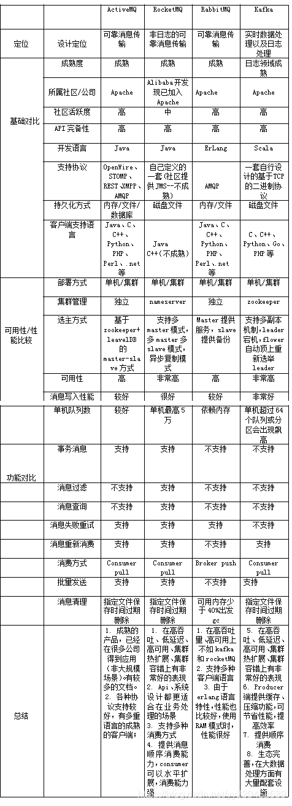

# Message Queue

## Reading List 

[消息队列详解：ActiveMQ、RocketMQ、RabbitMQ、Kafka]: https://www.dingsky.com/article/20.html

- 各类消息中间件的具体使用操作
  - activeMQ使用参考：https://blog.csdn.net/liuyuanq123/article/details/79109218
  - rabbitMQ使用参考：https://www.cnblogs.com/vipstone/p/9275256.html
  - rocketMQ使用参考：https://blog.csdn.net/zhangcongyi420/article/details/82593982
  - kafka使用参考：https://blog.csdn.net/tangdong3415/article/details/53432166

- 2.各类MQ实现原理
  - activeMQ原理篇参考：https://www.jianshu.com/p/3a29b032827a
  - rabbitMQ原理篇参考：https://blog.csdn.net/maihilton/article/details/80928661
  - rocketMQ原理参考：https://blog.csdn.net/qq_27641935/article/details/86539980
  - kafka原理篇参考：https://blog.csdn.net/lp284558195/article/details/80297208

- 3.总结
  - 个人认为，虽然消息中间件的种类很多，远不止我上面介绍的这几种。但上面分享的，都可谓目前行业中的主流。其实并不用每一种都会用且十分了解，但精通一种主流的消息中间件是必须的。所谓通而不精，其间也都是大同小异，所以精通一种，也就基本可达到触类旁通的效果。

参考链接：

https://blog.csdn.net/sinat_41523355/article/details/100515673

https://blog.csdn.net/yexiaomodemo/article/details/80444732

https://www.cnblogs.com/lifeibai/p/9167701.html

https://blog.csdn.net/wqc19920906/article/details/82193316

https://my.oschina.net/blogByRzc/blog/3012251

[面试官问你什么是消息队列？把这篇甩给他]: https://www.51cto.com/article/595020.html
[史上最强消息队列MQ万字图文总结]: https://mikechen.cc/7319.html

