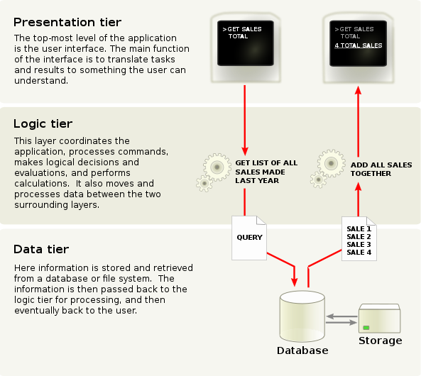

# Web Dev

[TOC]

## 🧭 Guides

### 🤑 Resources

[MDN](https://developer.mozilla.org/en-US/)

[Back4app](https://www.back4app.com/docs)

[Web前端HTML5&CSS3 - 尚硅谷Web前端HTML5&CSS3初学者零基础入门全套完整版学习笔记](https://www.yuque.com/u21195183/hfcamg)

### 🌐 Overview

#### Three-tier application diagram

Presentation tier:

- HTML
- JavaScript
  - Vue
  - Angular
  - React
- CSS
  - Bootstrap
  - Bulma

Logic tier:

- Java
- Ruby
- Phyton
- Php

Data tier:

- MySql
- Postgresql
- MongoDB database

##### 👉 Development Framework

[目前流行的9大前端框架](https://zhuanlan.zhihu.com/p/76463271)

[十大后端框架](https://blog.back4app.com/zh/十大后端框架/)

> node.js 和 js : https://www.zhihu.com/question/60164095

##### 👉 Server

[服务器软件大扫盲](https://cloud.tencent.com/developer/article/1632292)

[tomcat 与 nginx，apache的区别是什么？](https://www.zhihu.com/question/32212996)

##### 👉 MicroService

[微服务架构设计微服务详解](http://autumn200.com/2019/04/24/Micro-service-architecture-design/)

[微服务架构及其最重要的10个设计模式](https://cloud.tencent.com/developer/news/752585)

##### 👉 Streamlive

[直播技术栈](https://github.com/rainzhaojy/blogs/issues/10)

[漫谈直播：从0开始，全面了解直播并搭建专属直播平台](https://zhuanlan.zhihu.com/p/51710286)

[直播服务器搭建记录](https://ayaka.shn.hk/live/)