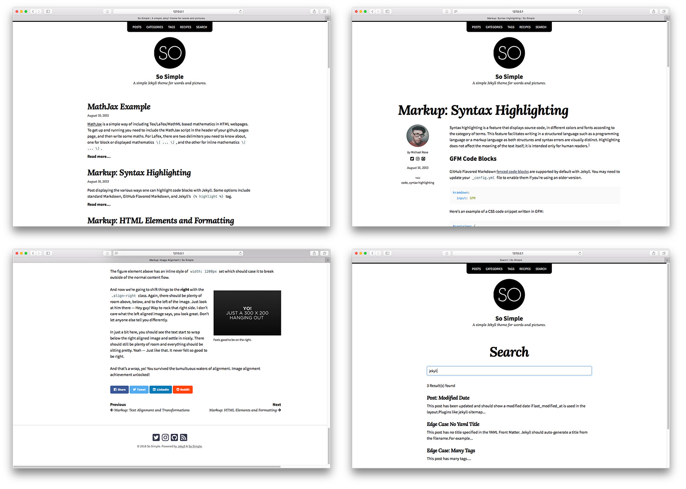

# [Jekyll](https://jekyllrb.com)


[TOC]


## Res
📂 [Jekyll Docs](https://jekyllrb.com/docs/)

[Ruby](../../../../🔑 CS_Core/👩‍💻 Programming Lang/Interpret/Ruby/Ruby.md) 

- gem
- [Bundler](../../../../🔑 CS_Core/👩‍💻 Programming Lang/Interpret/Ruby/Bundler.md) 

[GithubPage](../Manage System/GithubPage.md) 


## Intro
**Jekyll is a static site generator.** It takes text written in your favorite markup language and uses layouts to create a static website. You can tweak the site’s look and feel, URLs, the data displayed on the page, and more.

**Simple**
No more databases, comment moderation, or pesky updates to install—just *your content*.

➡ [How Jekyll works →](https://jekyllrb.com/docs/usage/)

**Static**
[Markdown](https://daringfireball.net/projects/markdown/), [Liquid](https://github.com/Shopify/liquid/wiki), HTML & CSS go in. Static sites come out ready for deployment.

➡  [Jekyll template guide →](https://jekyllrb.com/docs/templates/)

**Blog-aware**
Permalinks, categories, pages, posts, and custom layouts are all first-class citizens here.

➡  [Migrate your blog →](https://import.jekyllrb.com/)


## Quick-Start
### 🛫 to start a jekyll server
```shell
~ $ gem install bundler jekyll
~ $ jekyll new my-awesome-site
~ $ cd my-awesome-site
~/my-awesome-site $ bundle exec jekyll serve
# => Now browse to http://localhost:4000
```


### 🖼️ pick a theme
#### [So Simple Jekyll Theme](https://mmistakes.github.io/so-simple-theme/)



| Description                                                  |                                                              |                                                              |
| ------------------------------------------------------------ | ------------------------------------------------------------ | ------------------------------------------------------------ |
| A post with a large hero image.                              | [Preview](https://mmistakes.github.io/so-simple-theme/layout/layout-hero-image/) | [Source](https://github.com/mmistakes/so-simple-theme/blob/master/docs/_posts/2012-03-14-layout-hero-image.md) |
| A post with a variety of common HTML elements showing how the theme styles them. | [Preview](https://mmistakes.github.io/so-simple-theme/markup/markup-html-elements-and-formatting/) | [Source](https://github.com/mmistakes/so-simple-theme/blob/master/docs/_posts/2013-01-11-markup-html-elements-and-formatting.md) |
| Post displaying highlighted code.                            | [Preview](https://mmistakes.github.io/so-simple-theme/markup-syntax-highlighting/) | [Source](https://github.com/mmistakes/so-simple-theme/blob/master/docs/_posts/2013-08-16-markup-syntax-highlighting.md) |
| A post displaying images with a variety of alignments.       | [Preview](https://mmistakes.github.io/so-simple-theme/markup/markup-image-alignment/) | [Source](https://github.com/mmistakes/so-simple-theme/blob/master/docs/_posts/2013-01-10-markup-image-alignment.md) |
| All posts grouped by year.                                   | [Preview](https://mmistakes.github.io/so-simple-theme/posts/) | [Source](https://github.com/mmistakes/so-simple-theme/blob/master/docs/posts.md) |
| All posts grouped by category.                               | [Preview](https://mmistakes.github.io/so-simple-theme/categories/) | [Source](https://github.com/mmistakes/so-simple-theme/blob/master/docs/categories.md) |
| All posts grouped by tag.                                    | [Preview](https://mmistakes.github.io/so-simple-theme/tags/) | [Source](https://github.com/mmistakes/so-simple-theme/blob/master/docs/tags.md) |
| Category page.                                               | [Preview](https://mmistakes.github.io/so-simple-theme/categories/edge-case/) | [Source](https://github.com/mmistakes/so-simple-theme/blob/master/docs/edge-case.md) |
| Listing of documents in grid view.                           | [Preview](https://mmistakes.github.io/so-simple-theme/recipes/) | [Source](https://github.com/mmistakes/so-simple-theme/blob/master/docs/recipes.md) |


```shell
Bundle complete! 7 Gemfile dependencies, 91 gems now installed.
Use `bundle info [gemname]` to see where a bundled gem is installed.
Post-install message from dnsruby:
Installing dnsruby...
  For issues and source code: https://github.com/alexdalitz/dnsruby
  For general discussion (please tell us how you use dnsruby): https://groups.google.com/forum/#!forum/dnsruby
Post-install message from sass:

Ruby Sass has reached end-of-life and should no longer be used.

* If you use Sass as a command-line tool, we recommend using Dart Sass, the new
  primary implementation: https://sass-lang.com/install

* If you use Sass as a plug-in for a Ruby web framework, we recommend using the
  sassc gem: https://github.com/sass/sassc-ruby#readme

* For more details, please refer to the Sass blog:
  https://sass-lang.com/blog/posts/7828841

Post-install message from html-pipeline:
-------------------------------------------------
Thank you for installing html-pipeline!
You must bundle Filter gem dependencies.
See html-pipeline README.md for more details.
https://github.com/jch/html-pipeline#dependencies
-------------------------------------------------
Post-install message from rubyzip:
RubyZip 3.0 is coming!
**********************

The public API of some Rubyzip classes has been modernized to use named
parameters for optional arguments. Please check your usage of the
following classes:
  * `Zip::File`
  * `Zip::Entry`
  * `Zip::InputStream`
  * `Zip::OutputStream`

Please ensure that your Gemfiles and .gemspecs are suitably restrictive
to avoid an unexpected breakage when 3.0 is released (e.g. ~> 2.3.0).
See https://github.com/rubyzip/rubyzip for details. The Changelog also
lists other enhancements and bugfixes that have been implemented since
version 2.3.0.
```


## Ref
