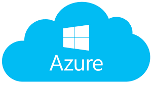

# Cloud Computing

[TOC]

## Res
【AWS入门视频】 https://www.bilibili.com/video/BV1NJ411n7LB/?share_source=copy_web&vd_source=7740584ebdab35221363fc24d1582d9d

🔗 https://docs.aws.amazon.com/whitepapers/latest/aws-overview/introduction.html

🌟 Highly recommended as an intro material.

## Intro
### What is Cloud Computing?

> 🔗 https://aws.amazon.com/what-is-cloud-computing/

Cloud computing is the on-demand delivery of IT resources over the Internet with pay-as-you-go pricing. Instead of buying, owning, and maintaining physical data centers and servers, you can access technology services, such as **computing power**, **storage**, **networking**, and **databases**, on an as-needed basis from a cloud provider like Amazon Web Services (AWS).

### Cloud Computing Models
↗ [Cloud Service Models](Cloud%20Models/Cloud%20Service%20Models.md)

### Cloud Computing Deployment Models
↗ [Cloud Deployment Models](Cloud%20Models/Cloud%20Deployment%20Models.md)

### Adcantages of Cloud Computing

> 🔗 [Six advantages of cloud computing](https://docs.aws.amazon.com/whitepapers/latest/aws-overview/six-advantages-of-cloud-computing.html)

### Cloud Native Communities
↗ [Communities & Ecos](Communities%20&%20Ecos.md)

### 🤔 To learn more
🔗 Go to [AWS](../Cloud%20Plantforms/AWS/AWS.md) to learn more. AWS is the world-leading cloud services provider.

🔗 [Cloud Computing](Cloud%20Computing.md)

## 🍱 Main Cloud Service Providers
### [AWS](https://aws.amazon.com)

↗️ [AWS](../Cloud%20Plantforms/AWS/AWS.md)

### Azure

### [Aliyun](https://promotion.aliyun.com/ntms/act/kubernetes.html)

### Google Cloud

### Others
[Dog Yun](https://cvm.dogyun.com/traffic/package/list)
[QingCloud](https://www.qingcloud.com)
Tencent Cloud
Baidu Cloud

## Ref
