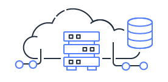
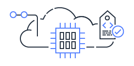

# Cloud Service Models

[TOC]

## Res

## IaaS

**Infrastructure as a Service**, sometimes abbreviated as IaaS, contains the basic building blocks for cloud IT and typically provide access to networking features, computers (virtual or on dedicated hardware), and data storage space. Infrastructure as a Service provides you with the highest level of flexibility and management control over your IT resources and is most similar to existing IT resources that many IT departments and developers are familiar with today.

### Openstack
🏠 https://www.openstack.org

### Rackspace
🏠 https://www.rackspace.com

## PaaS

**Platforms as a service** remove the need for organizations to manage the underlying infrastructure (usually hardware and operating systems) and allow you to focus on the deployment and management of your applications. This helps you be more efficient as you don’t need to worry about resource procurement, capacity planning, software maintenance, patching, or any of the other undifferentiated heavy lifting involved in running your application.

### Heroku
🏠 https://www.heroku.com/home

[![Salesforce Announces Heroku Elements--the Marketplace for the Builders of  the App Economy](data:image/png;base64,iVBORw0KGgoAAAANSUhEUgAAAYUAAACBCAMAAAAYG1bYAAAAyVBMVEX///9nYqX+/v5oY6b///36+vr///n///tsZ6loYqliW6f6+vjIx9pqZKxqZKnw8fFmXqfi4em/u9vp5+/Qz+KGgL5lXKne3enJyN+Pi7dqYa3BvtSVlL/4+vPr7O+insWLiL22stJxa7B7d7RiWaumo8ywrNCLiLxrZqXd3OZ3cbKXksLQ0N1fWqL29fm3tdGDfrW4uc5aUqbAvs54c7nFwtyDeru1sdCnos6RjcGvrNOYl73l5Oayscj///Jzb6x/fq+mo8N1cah4faL+AAAWsElEQVR4nO2di2LaOLOAsSQkZIOQCzU04RZwCBAMbP9l02yzTbvv/1BHki3Z+AIOodk2x9NLWrBlWZ9nRtKM5FqtkkoqqaSSSir55YWgi8h/fRu/rwAACMGXEoDAf31Dv6MAgJzOxWRDEKgwvFCUHmyaHy8mD6M6IhWGlwkAeDNgHmSswRqvFFEAg/SqcS0xVCDKi7BGe0YhhK8lYETwtCedyiq9QIQmbAMGGbRsz7NfL9ynFrQgfd5UFEqL6M1c20IRaGs377nLZe+V4i6vP62kZvFZvcJQVgAecdha2LMRwoSAVw8WiPy99S0I/T9w1WEtJ6J7NKBwQQdD0WRImPJXi0LhLqxFy+vgikIZEY3WsYURnzlh872+RKUQdXTtL2AwryiUEtH2XeEVrtzLdu9FsfccWo/VoKGcAOfag/QTuXB7AbIWcBubikIJAaBev/YYn5MLT8EBNOKNFncr91xGQN1p2szeX9qAA9CGkPFl1VctIyEF/uGYQTqrJcGIU8Z7lS6UEU0hrQthpzP6UdyS4PC4xJFgRCsKZSWfgnAXOIz4EIIBLhwDI+IAQsKRGiZO8jjUplT4hUv7m/cpkV9IUUDOprt8enLdTufJ7XWdgicaoHrXfep0XHmgu+yOSIwBaAoVhtOSrwsI7z/bPBLv8z6fgtCS+WdOufgtf3H/MXFcReEFkq8LAN9wBkOhzH7IpwDIqNGCRhr+bUXhPCmgQLYB1a3L7G0uBeE7xPg4FvbvpqJwnhRRuLapFQm0r3ODZoC0FxDqgyAM/iCgonCWFHjnJAUrnwIA6AuHBhW0ZqKPlPj6BAXx+e/TiZU1RT+x012gC6gEBdQWvsMcxOzlQTWPUAhnbxFAx0Yiv5LI7AjRZxd98p+U4XM+BQf98KxYFyw5N54sopACqG3a7c1G/DXa/BaDOjF6Gskat8VfP+fBOZsCwEvbeAVrYbVSEZ1CCgD1fNtT4gc9Qi5/T5cWsGnoCvvNn2JHz6UAAB7EXsGy/DEmZSmsvbBPBRf+Gv/6zhuAkSdrq7qL+R2VV1/iPArCUPYTqgD5qp0yLkUUECCuF54pbsr9DbpQwiAxxsIuSND/KRU+lwIZrniimxosM9OBRRQQ6XjRiZS76Ne3SIJCwzIUfsrE2HkUhD2aB7E9gvY2MzN+hIKrKcDfgoJoo6gv+IvpAqi5nCa8wjQ761pReNEVzqAA8OZZTiBFbdnwcsII74uC9etRAKT+yUz2qY7Dt5ye7PuhgDYN9itS2H/27ECJ+OGPkZMzQK4olJfzKDjrnqtXjLjuMC91oKLwAjnTL4hePyHhZBAhuYP6isIL5DwK6czUvIIrCuXlXAomS6Ow4IpCeSlF4X8xhWhSWmdnF3OoKLxASlCAnqQgzE7Y9MRkdkc4CgquKJSXMhSkLogHXzpigp1ls3kbyt/9J/FZAYezKLwgdf+iy9uPF/ULUZAA3P7D/V+e73HOg0D8ZXuzf3rORfpISRt3LJAS9whk5Ov4saXuXyv4kSzEX4NC0EQEt7vjqS2aXqVmMCkWY5B69vderjqUpRDePpEAiEzww4TklqeefYyVTiKllUSmD8rH4wQIeZDoWYtzccr8AVJXPEVB8rJEaXzOpYsp6LVLiKiFUPIjue8BQGHVciZ2gFy0Jv+ARGilFIVrfP2nLT6IpizMF2G+kj3HOcO2chQ68s5FAyGn7Tb7+/vJvr90CMokAypIWLTW0Gmvm81mt3v7111zfb2uY5Svi4lWIhJVTTZ2qqtXF22P2ut+/+Hjl25z32urzSMyz0AxBVV3lSIqpe6ojxxM1LMk7yoT4tInyCs5L6JgLXZ8cQggIXDhjXMiZuUojMTjiTrbwWTFroSFkxl+9mqyJ/gwhi26BoRs+l8mk2fGuOd56lAZhpzuHpukoKumdECcWau7/ZvBZLcbkWSZAk/vy2565dm2J69t89bsbu6iWrq0IxRI9/bvGykP88HfQBVPnA/z+YP4aP7lAaT7HgB17+fqhPnNtv4SCjLEX0Agqpt9k30eS1IgvZtPMFYzdR1qT1ziJFKbHDTsbu+nAbUODjRHXwOcxaCUjOBOczuecVucKyN7cY8b4Hrz0eaWdVgY5/fdIThUmkIK4rGfSXpCKPVa6l4Bcj/L/8oPrxycqhMhH6U/lV8GduIOS1A4JQJDJ2MBS1GgX7+LGrFDxMrKNRMGGuDNxI9yBXMuLo6etNMUlL2ud/7YcV/Y0rCNExTE4U8fbc4OL62O4v7EPfQOxRRIP6DCQ1JxgYZ9jcPB7NKjLHSdrTwKVDlVUWt6WQoWo4OMMpSiACnLbVvIuBtbcYAeVCamVaCOouWmnYO8QMkAd/5p2TrPUx1mPyFzQLgiO1ui4hBsD3SriIJQtn8tHf/h9+FqGwBGUUAewtYw3R0AeEJVyEjWKUZ0EQrQ8tdn6UKhoYN01cbxgzujxQYxbIPVJsag3Mh+5nlXB84spgCQM/DoohAqlXnPiaUYRRTQMtAQYLAk0cVPUaD61uMvX0jh0CTHH9sP6f5iGQpplsn/2H1TItrYh9/lKA/9+A1HCZqid7K52QktsGCqyE5UpICQTCuMCk1URHq6ON2zgAKoD++opuA9RCMfuaxSP2S5FLi5ibMo6KanwvX40pQkvqP3aZP0IgpZtNCKd9FATz7MHJc6Adp7FDl0MByt/LSeJfyCTF2wdfXzSpM//W5slPIpiGL2OgMCMmjSDE9QuOO6rDMoyH4SpYFHG7PHx32v+ePjNEiAgFMn3RkvS0HlW4kuhRc0GjCwTOv43fC+xIBr7ZtPLbmsxbYbjcViQYVnX+iQMKX6SZdp/wmLL62/EOFC/SdZoujb96ixcMJPCv8tSqOez80NiZ/Tkemw5lIQTqG9YvoaUnN/MgV5E+r5n1y77boccMhRx3CbTAvzOqlEnZIUVBfHbz3O1+6TM3Qeroy7s7fhTK444UMQPaQt+3G777nLzlAOi+ruzTRIKEPUEADtOUtUXZCzfY8z4WpUJwbjFY2bO2iN1yOHkLa7vKU2NZ/Lyx+lUK/90A0A6Uybw9AiwWIKk7MoyCeJ8YBPPvTa0WxL+KOOH0wyDGxc9c6gIPsjNh103bYcfSIx6ERPDY2B/6ip8JG43XH0dEH7DzUqJWoAKm4Jba45pFFLPEYUEOnbWkMaYjjh7W77y2Wn3XbCruS3faCdgri5ZrsWTo0gjNpNZnSIPZuFAPkUkEv1g9qyOrGhujyFcCTjrb5cd4iaKlC3ER1C3CCm0HJTeb/lKHgDUTKJIxakNjAUBuFMp+D9rCnwEdGTbnI7OHnCwF5EDcpHKNKFZvQICT1bja9dNRePohE2QMPY8FDWw8mlwt96LeNv7QftGfIoiPacWUYNE4udLk1BaTMNnifbunz20sNThNaBFetCek1tubHzVhTsxFNoCKBb3QxXhsLIM03TRgfhVXFXzjPVSa/7WkShrykwvqwRYhgrcGr3Ff21exA1F/rQs3QGGN2RYgpAXkT7cvqYaJtLUiDXsqdn+Ve7tUPyg5ug1rRfTSF6thOFjq3QsxpdQOhJuzs6TfeHxRHRgiLRGPe1lC5Y1oqk9hQVKjzQhnTBu4c9O2lmb0yvuLGJKp+lABzsWvrRoI3kooELUkDkhtPAvl9uwvne3ABCrW9u9jUUUoWOLXZIgSBj+VgjPXkrLPoHK6LAP0UUiKkYXDmpCiDUbulG4pmdcISFG+kOLrSbqJAC2sw0BGYvk5O1l9QFfPN5tl2GtrRw3rhvHpuzKWTOqo31cNT4hdjMW7PM9L9wkpGmMLrTJ8QUGvXU8YR09QWY18vmoiOkl2UsrnbRCOSAgrwhQMggamrRw3s4qNQFKRDSmbcxOBFTvAiFlE8/SoF+OXROyuDXp9FN06mTpiDTmNPNoJPNBdMcM4tI19ftS6NGTFEA4Xgt0kD/K3YOTd7lLBIIA08nKASvp4BOU6gZCnyslviFMRUSRsfQcKdvehpOYR6jUAPGLQg/kjcfTlzf9JKimdoEBb9LEKnjnq19ON+l0tUvSKFWKqD7xhSE5Z8jqacJkX3c7/q2pvXTFAjZaT8SzHNipaJHZoa+QTQaT1DwlnJg42pzJLrHT2nXckEKpeSNKIj+WlRxtvj69evgU0IGg6/fqW6SaZ2E7XDEIgkKZizh5gVqE97bdsO5Z0NBPvrr5v6hodXJWvQys5jvlAL6YZ5OSHlGzBQrnG5KUNg0tMFpjXJC/QA4ejQGg25KF+TDb/u2nv8Q1enldBfeJQUxnI5nd6DFUmKmpJUunPTOZswmDm/n5A2IdjLjRtEtzVCAcAHNJBWdf0tbvPdKAdW+JhdvFQqk0/rpPhJae5Ey0DHONKEaMdxwQyHlndNX5M1sEe+UAoh14agwSUHFD0pRgHRM8vwCIA+lKVhTMWpO3d87pYBq43jutpCBnPJim5N9JEHBDLfGtZwcWUFhHluktF/QNTCzgatheivx909BTvBaKtiXFYu2aPsiFI5aJCguROMIH8+YtXdMwTzvj/eTyd0kK3eT3W51r2e2j/WR1l6CQp5FwvOYQso7C31bDCa7u0UcEUwE2aIC3icF6Rf0czjAmBQIxnUTayvpnfMpoLvYItXSFOymvNYyMNpJp6lUrHdMQc85zOWmosckbIdjutA1unCX752dlZ6dCNZpXWB2D4kaCIUyaTT8Ezq4xnudwUDGRFg7fJLBKQpuZE0YXdWdPAptMyize+kZDGZHs3lNM5EE5e7YP2dOFdQxyKliSt5qBmMfmJmiMi9cOm6RzKPOaDq4ER7QMaG4IIreJCiEu5EIszWOA3bBE/k58QWCu5kEo6y8FQUTOqONMu8nOE4BmQkKvs6jUFuawXXQTs0jxVEe4Hw0UVh+l1Sqi0Y89/6n+qlbfjNdMEEb5rxWF+rkXjdfzkY2MoL6Pz2zzabRLeXFnXHPZITBwx370Sg4RuEl+Uika9v3p95t9DYUaonQmV3mfQ7H4wtmmsii99nCEHa+62wC/gUVUpDeSse4IGOj5Eayx3XhRRSWNgu+nLDCbzReIK6h4G1R7hJ3ZWrifx6hgPCNibVNs1Ee8M1kaLTkpn4FcWd5JF5l8rXDqycpZDLnZc52aQoqmhSMc4JRCXkjiyTf5BAdT7/jvL26ZF5SnN17XBfAUkc0pSXB6ZLwo4nqt3QUrYBCj5veFG8aLyo6WUZJpsP0JJODTPllKLgyn9a+z1kfF8tbUQC7K90ydvrdY7qL6vS+lempiuOHcfbEykmWplY9bI1RP5qPJBsUj/XQA/IV1h3lJIVDi6Sy3vDgBRRk3p2M5w2OjRvearyAHuLFP3dDEG3/UAvXfToAY2c9XtmdWjkK6A+TAc4HMifNgEQOdo3aJZx3Qc42apuYGwz2cZ5/J04XazsIRdVFMqGTjH7Ekx8lKciqDOrFW1e+kV9AZBnnbNtjEo/S1OLc0frmo02hvS5FIdEVlSOCweZbXBoZ3lzxRXSmNUP4KAVhMK7jzHnfTGSQkQnBypdOIV04cXrN25ZtUmRZGYskLyADfANSOHx7oz4SAJs4OxwGdx1HZWEgoQMjt/+JymVTVDhuPXY6TkE8YdGiJtVOjfXGUQtjERr2diZx34L+B2OMiyiQ9oLqSW45uRJ9PFyZRGu+DPeFxptRbz6zbW7Kl5LoVxVQiNYKHfUNb0YhsWGlzJxlk3m/3/97N2MyIz5a/sHvtBk/RQGPbKingcT9+dPJ7X7/YTy7ClNzo6vv4qFJ4Voe3DQjaBh0wyYUtR2bbtCVvdv3+/d/rrjn88MFUPAFFBSGonXdP4cCT1MQOu08XxlLAVuQcvFYUYtZjEL9WDOqHXciTxXmUBDP1NhPPJELplIKhH7EIT3RqInkioI9JAEBdWomV61xFHYDuOvFU/Fy1QsN17FYSRHtGpxc72woyCt/yqxjfRsK5lxQewjiOEt2OVV4V/2sRcqjIHOCd8nNYLOliXtONojcQzJ3b2Egc4v12ID2wjlaaUCN8c9WNPzY4n9ulyfXeCYpQO9Lvk16OwqAfOSHN5ISWcubqJaJbGErk6caHrBZ8caRZfQL+yY5Uop38mSHFEQPrWFMkrWLPCjA9wGMH5pU4Wr9mP08Hybf53CSgkwLnF+cgqq72mc7TeHW+IX7JIWO3FC6oN2UW/D9ZnQPCPftaE1xPgU5cZrYnzpTGvO3B+MIVG9E+2wzO7XqnNybMQPkxjO0V0Urg8VhDc+e7p3DTSNOU7CC+fCCFknNSERqSr30q3RBTa2BVe36iZgigUPakyCj2REB4bCDu25bd+bk9J/e7ZXlvs5VdByd+4DnlCc/CqY9koQnTIx+B5TUheReGgQveSO8FmO0EVlugt1GHgZ1V4E9dh3sHI7DTnpnlsoMfzUFgNafWRSyt7vf0hQmFlXh/RbdJUYqwpYPbywv3CogeVtMLnvcfViSmqmltNZR+cwf5VIQv0j3zuc8abPVP2lA5+1UY8id/1WNmdCSVHyT3On0A8a8rbGJPcYTHjlCSD2/ddvv4Mx2JyV6qg9Fu4GdSaEGRrvVajUTMv2rnT4LfQi/W61afx+MFwnGnR+Tq+DQm/Lg+X7eG+JkHRHqTVerv1Qhj0WDHeCg+vX988E+KKI4vrvtyAh2qo0eW7K6s9V01k0pL2pOw3tZraYL7ZlE+3UGV2orKab+SIvCW9/H+w7GeVswHR21SZ/wUHLsXHalrWzpmsp9x+EeUYffRRvDyXW0tYPaym12EH76MZtOVc9S6MV0dvdl7aivDle7IceJcgJqhfNgahLW6Y930+mV6PfywJpOZ3M3XDiTqVQ9ShGvZRbXyz2Dou2R6igxs4o6g9mUB3J1NhMlT27dqKZ5k8JHKEgRGliKArx6Kk0h3HJKb0WZ+S7ceyt3e0pQV5s8tUdPoyd35Ih/49S6ONMGhWUkrwRkAQS33dHoqdNW2485IO/tN8kaF9X38EvgyHWTI1myqwbnNXJkr8fjFPztkYfpvLU8Ud1VpQtCBeGXud+E02IgesNV9rGNxDRMQd2T5dV1GyJSvG4GFNYYaA6H30XzR+pGwjOPvbnuCAUmIJBiTZCrO86l8BrJ5Fz8YuXlFX3ywCLvbMOGXEx9RKMFhXijg+w6werdheWlMO7Mmf/P0YinsEjxTgbZNzlXFF4gBW/ZJn37SBc1PKa2D/SOZ5B5FYVXSJEu3Hyen4j9AzT3oRyuyI3vGn635P5IleRIQVYY6G1PvWUTqMHRLBqxTEYVhfOlKE8V1U55djkZ46jhkfyR6QlICoz3KgplJN8vhFMtp04tGrEoQRWF8qIplEkAzZHiMap877CwSL/FS2v/c9EW6UwKxYJCv1BRKCOSggeDi1OQ6wAY9NzLD0jfowgK157cYOLC5huAJxtWFEqKsOhyOujukm/2UMXKZXx0ln2/ZyV5ItOzYbwv1oWkTpwZg/zr6aUolUgRBtyDTG7NUZSUfk6ZBNwHDRjcnLNo8f+lAKy2p52NyNABlxGC618DCFvTUUWhpKCh06ALRq+26WT+84vs7WRc3W6m38FSSaGAWo8JDNBeHWwA9Qr5LjM+mT/+CYGTdysA4N5C5gssKOW5e0yUlvB0lWBi+T9IbkpWJQUCau4qoC0WvcjktdKArZbVKkxjqiRfZDJC91/ft3312uxXiu37AR+3T60QrSQjMllg1On2190LSN8dbcjJmfFKshLmbThO/dXiiF+VWz5XwuSci0gF4VVyoVHbf30b71yq9q2kkkoqecfyfwTvYAOPrWu7AAAAAElFTkSuQmCC)](https://www.google.com/url?sa=i&url=https%3A%2F%2Fwww.prnewswire.com%2Fnews-releases%2Fsalesforce-announces-heroku-elementsthe-marketplace-for-the-builders-of-the-app-economy-300066795.html&psig=AOvVaw33z81DyymDaP17MnudjE1L&ust=1684283059077000&source=images&cd=vfe&ved=0CBAQjRxqFwoTCMCtw73J-P4CFQAAAAAdAAAAABAE)

Heroku is a cloud platform as a service supporting several programming languages. One of the first cloud platforms, Heroku has been in development since June 2007, when it supported only the Ruby programming language, but now supports Java, Node.js, Scala, Clojure, Python, PHP, and Go.

### Render
🏠 https://render.com

Render is a unified cloud to build and run all your apps and websites with free TLS certificates, a global CDN, DDoS protection, private networks, and auto deploys from Git.

### Dgraph
🏠 https://dgraph.io

### CloudFoundry
🏠 https://www.cloudfoundry.org

### Google App Engine

## SaaS

**Software as a Service** provides you with a completed product that is run and managed by the service provider. In most cases, people referring to Software as a Service are referring to end-user applications. With a SaaS offering you do not have to think about how the service is maintained or how the underlying infrastructure is managed; you only need to think about how you will use that particular piece of software. A common example of a SaaS application is web-based email where you can send and receive email without having to manage feature additions to the email product or maintaining the servers and operating systems that the email program is running on.

## FaaS

## Ref

