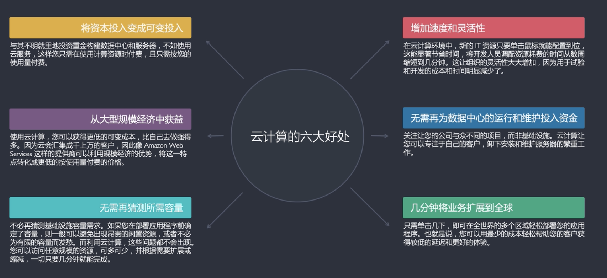

# Cloud Overview

[TOC]

## Res

【AWS入门视频】 https://www.bilibili.com/video/BV1NJ411n7LB/?share_source=copy_web&vd_source=7740584ebdab35221363fc24d1582d9d

:link: https://docs.aws.amazon.com/whitepapers/latest/aws-overview/introduction.html

:star2: Highly recommended as an intro material.

## Intro

### What is cloud computing?

> :link: https://aws.amazon.com/what-is-cloud-computing/

Cloud computing is the on-demand delivery of IT resources over the Internet with pay-as-you-go pricing. Instead of buying, owning, and maintaining physical data centers and servers, you can access technology services, such as **computing power**, **storage**, **networking**, and **databases**, on an as-needed basis from a cloud provider like Amazon Web Services (AWS).

### Cloud computing models

#### IaaS

**Infrastructure as a Service**, sometimes abbreviated as IaaS, contains the basic building blocks for cloud IT and typically provide access to networking features, computers (virtual or on dedicated hardware), and data storage space. Infrastructure as a Service provides you with the highest level of flexibility and management control over your IT resources and is most similar to existing IT resources that many IT departments and developers are familiar with today.

#### PaaS

**Platforms as a service** remove the need for organizations to manage the underlying infrastructure (usually hardware and operating systems) and allow you to focus on the deployment and management of your applications. This helps you be more efficient as you don’t need to worry about resource procurement, capacity planning, software maintenance, patching, or any of the other undifferentiated heavy lifting involved in running your application.

#### SaaS

**Software as a Service** provides you with a completed product that is run and managed by the service provider. In most cases, people referring to Software as a Service are referring to end-user applications. With a SaaS offering you do not have to think about how the service is maintained or how the underlying infrastructure is managed; you only need to think about how you will use that particular piece of software. A common example of a SaaS application is web-based email where you can send and receive email without having to manage feature additions to the email product or maintaining the servers and operating systems that the email program is running on.

### Cloud computing deployment models

#### Cloud (公有云)

A cloud-based application is fully deployed in the cloud and all parts of the application run in the cloud.

#### Hybrid (混合云)

A hybrid deployment is a way to connect infrastructure and applications between cloud-based resources and existing resources that are not located in the cloud. 

#### On-premises (私有云)

The deployment of resources on-premises, using virtualization and resource management tools, is sometimes called the “private cloud.” 

### Adcantages of cloud computing

> :link: [Six advantages of cloud computing](https://docs.aws.amazon.com/whitepapers/latest/aws-overview/six-advantages-of-cloud-computing.html)

### 🤔 To learn more

Go to [AWS](AWS/AWS.md) to learn more. AWS is the world-leading cloud services provider.

## 🍱 Main Cloud Service Providers

### [AWS](https://aws.amazon.com)

↗️ [AWS](AWS/AWS.md) 

### Azure

### [Aliyun](https://promotion.aliyun.com/ntms/act/kubernetes.html)

### Google Cloud

### Others

#### [Dog Yun](https://cvm.dogyun.com/traffic/package/list)

#### [QingCloud](https://www.qingcloud.com)

#### Tencent Cloud

#### Baidu Cloud

## Ref
