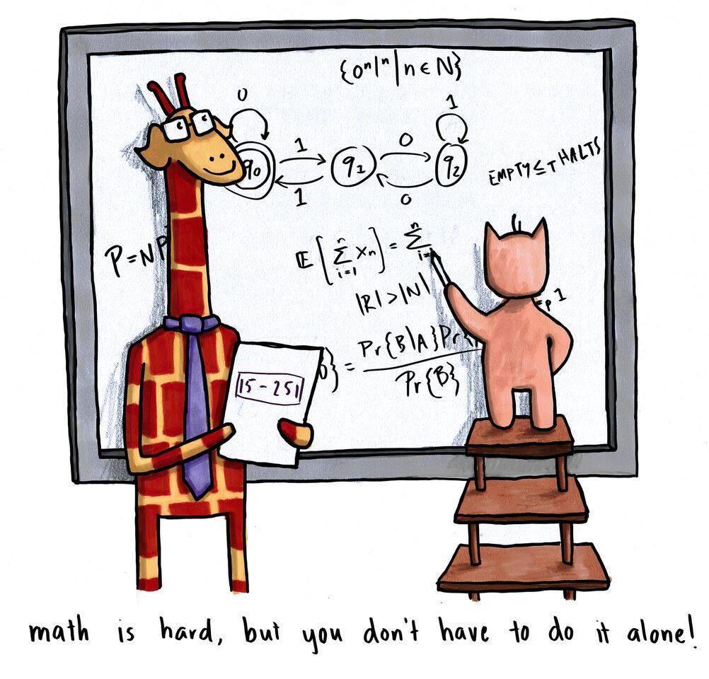

# 15-251 Great Ideas in Theoretical Computer Science

> :link: 
>
> [15-251 Great Ideas in Theoretical Computer Science --- fall 2018](http://www.cs.cmu.edu/~15251/)
>
> [CS251 Great Ideas in Theoretical Computer Science --- Spring 2022](https://www.cs251.com/index.html)

**Welcome to 15-251, Great Ideas in Theoretical Computer Science.** This course is about the rigorous study of computation, which can be described as the process of manipulating information. Computation is a fundamental component of minds, civilizations, nature and the universe. Therefore, having the right language and tools to reason about computation is an important goal. This course teaches the mathematical underpinnings of computation and explores some of the central results and questions regarding the nature of computation.

**Instructor**

odonnell 

:house: http://www.cs.cmu.edu/~odonnell/

 https://scholar.google.com/citations?user=Z8U0BwcAAAAJ&hl=en

## Videos

### Course:

- 【CMU 美国卡耐基梅隆大学 15251 Great Ideas in Theoretical Computer Science 计算机科学理论的伟大思想】 https://www.bilibili.com/video/BV1Wh411y7V9/?share_source=copy_web&vd_source=7740584ebdab35221363fc24d1582d9d