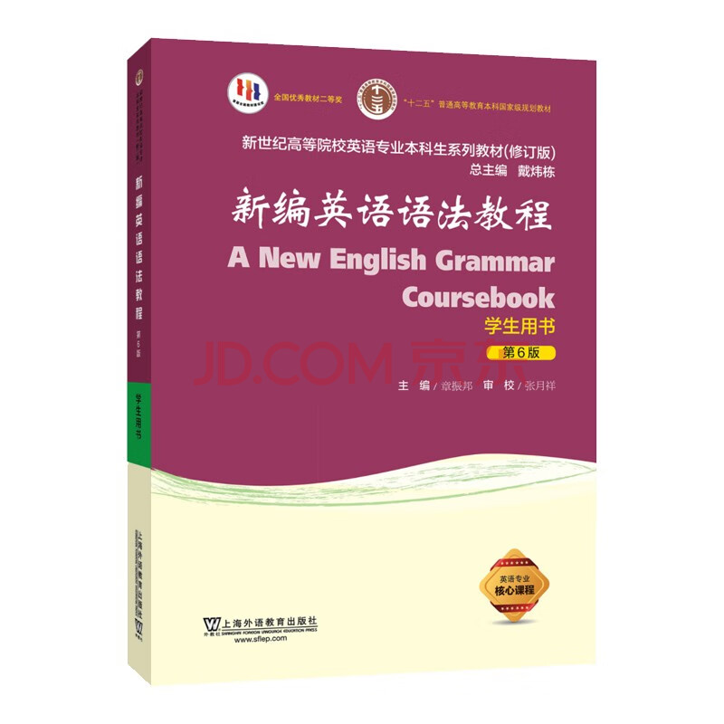

# Grammer

[TOC]

## Res

<small>https://item.jd.com/13254459.html</small>

## Grammatical Hierarchy

### Morpheme

#### Free Morpheme

#### Bound Morpheme

### Word

#### word-building wise

##### Simple Word

##### Derivative

##### Compound Word

#### Function wise

##### Closed Class

##### Open Class

### Phrase

#### Noun Phrase

#### Verb Phrase

#### Adjective Phrase

#### Adverb Phrase

#### Prepositional Phrase

### Clouse

#### Independent Clouse /Dependent (Subordinate) Clouse

#### Simple Clause /Complex Clause

#### Main Clause /Subordinate Clause

#### Finite Clause /Non-finite Clause

### Sentence

#### Full Sentence /Minor Sentence

#### Simple Sentence /Compoud Sentence/ Complex Sentence /Compound-complex Sentence

## Ref

