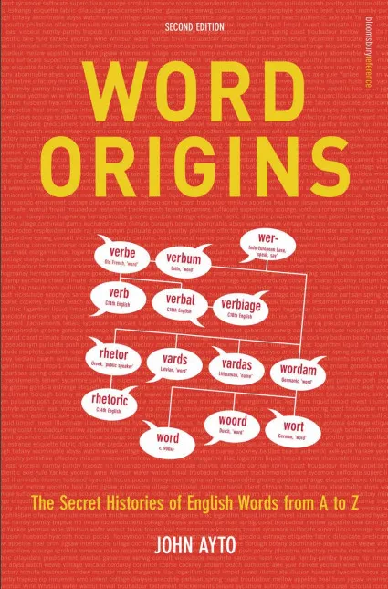
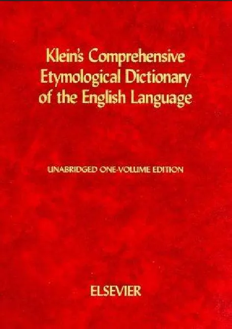
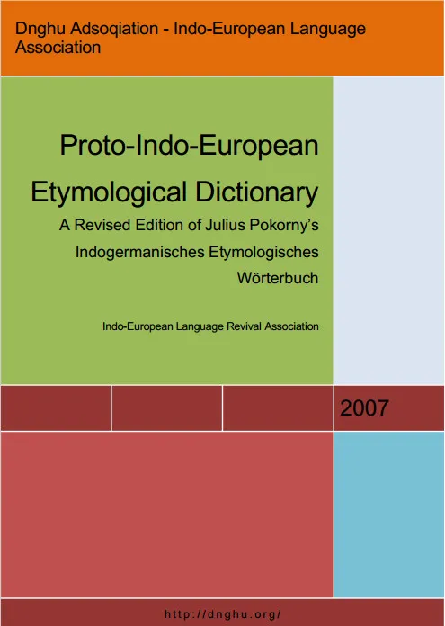
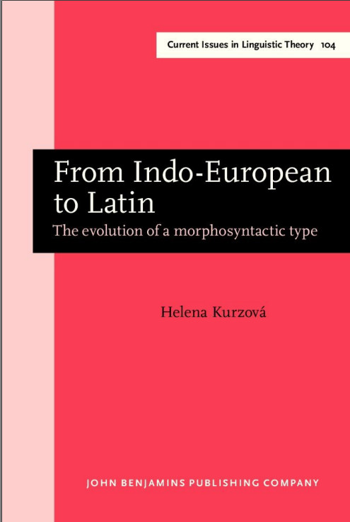
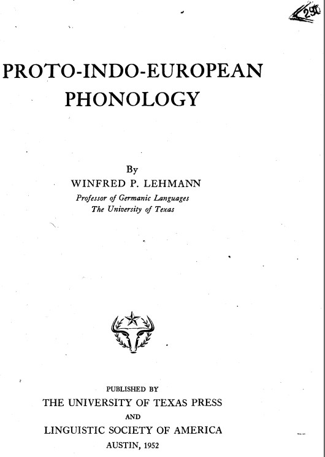

# 英语词源的学习之路 - 问心的文章 - 知乎 https://zhuanlan.zhihu.com/p/20700365

[TOC]

## 1、实用价值

- 理解一词多义并辨析近义词（考试工作）
- 扩充英语词汇量并加深对英语词汇的理解（自我提高）
- 辅助其它欧洲语言的学习（二外学习）
- 基于印欧词根研究成果解读英语常用词根的表意（学术研究）

## 2、知识板块

- 基础语音知识：常见的语音类型（尤其是清浊音和送气音）和发音机制
- 常见音变规则：格里姆法则（Grimm's Law）、维尔纳法则（Verner's Law）、辅音音变和元音音变、语流音变（同化、异化、弱化、省音等）、印欧语喉音理论。
- 历史背景知识：英语的历史变迁和3个主要阶段的构词特点、法语/德语/拉丁语/希腊语的基础构词知识（重点是不定式、现在分词和过去分词，词汇在“性/数/格”方面的词尾变化等）。
- 英语构词知识：英语单词的常见构词法类型、常见词根的核心词义、常见前后缀的语义和功能、复合形式的后缀。
- 英语用词知识：认知语言学中的隐喻原理、词义的放大缩小（虚无化和具体化）、常见的修辞手法等。

## 3、适用人群

- 高中及以上学力的在校学生（尤其是参加出国考试的学生）
- 大中小学校和英语培训机构的英语老师
- 在职英语翻译人士和外企职员
- 英语词汇或文字学研究者和爱好者
- 以欧洲语言为二外的英语学习者

## 4、个人分享

- 【单词攻略】[单词攻略 - 兴趣部落](https://link.zhihu.com/?target=http%3A//buluo.qq.com/p/barindex.html%3Fbid%3D294363)
- 【在线图表】[词根词缀图表 | ProcessOn](https://link.zhihu.com/?target=https%3A//www.processon.com/u/englishster)
- 【今日头条】[单词新知 - 头条号](https://link.zhihu.com/?target=http%3A//toutiao.com/m5495658338)
- 【喜马拉雅】[英语人 - 喜马拉雅](https://link.zhihu.com/?target=http%3A//www.ximalaya.com/11613493)
- 【简书文集】[单词新知 - 简书](https://link.zhihu.com/?target=http%3A//www.jianshu.com/users/c0e56f05e06d)
- 【新浪微博】[单词新知 - 新浪微博](https://link.zhihu.com/?target=http%3A//weibo.com/englishster)

## 5、学习步骤

本人是2012年4月份开始接触英语词源学和原始印欧词根的，下面列出的步骤基于自己的真实学习经历（以纯自学为前提），而且自认为还是比较高效的，仅供读者们参考。

（1）**精读**：李平武《英语词根与单词的说文解字》和《英语词缀和英语派生词》

（2）**泛读**：李赋宁《英语史》、信德麟《拉丁语和希腊语》、周展《古典希腊语教程》和其它介绍原始印欧语的英文原版书籍（参照文末推荐书目）。

（3）**查阅**：有了拉丁语和希腊语的基础入门知识后，看懂Watkins编写的《美国传统印欧根词典》和Klein编写的《综合性英语词源词典》是没有太多难度的。基本可行的做法就是：

> 【A】在电脑上安装Lingoes词霸（软件）并从官网（[Lingoes -- free dictionary and full text translation software](https://link.zhihu.com/?target=http%3A//www.lingoes.net/)）下载网友制作的词源词典库（基于Ayto编写的《Word Origin》一书），当然，Lingoes官网也有《美国传统词典》和《韦伯斯特词典》这2本词典的词库文件，里面也有简要的英语词源介绍。如此即可随时在电脑上搜索了解常用单词的词源资料。
> 【B】如果不想在电脑上安装Lingoes软件，也可以去在线词源网站（[Online Etymology Dictionary](https://link.zhihu.com/?target=http%3A//www.etymonline.com/)）搜索和学习，但是这个在线服务是需要你联网的，而Lingoes是本地软件，只要装了对应的词典库就可以随时使用。
> 【C】直接去词典里面搜索或查找自己感兴趣的单词，并尽量看懂它的词源解释，不懂的地方去各大英语词源类QQ群（如《单词新知》）提问。
> 【D】逐一精读《美国传统印欧根词典》中的后缀部分，熟悉印欧词根的结构形式和扩展方式，只有熟悉了这些后缀我们自己才能给单词去后缀进而找出它的词根来，为后续的词根学习和研究打牢基础。
> 【E】逐一查阅先前从李平武老师或其它老师的词根词缀类参考书中（已经）记住的各类日耳曼、拉丁、希腊词根所对应的原始印欧词根，自行分析出它们与相关印欧词根的语音对应关系和简单的语义逻辑。

（4）**钻研**：利用空余时间反复研读《原始印欧语词源词典》，重点关注每个印欧词根的表意理据性并探求各印欧词根之间可能存在的互证关系，力图为每个印欧词根的表意找出它的理据性。

> **6、推荐书目**

估计有些网友会推荐《牛津英语词源词典》，但是在我个人看来，牛津大学出版的英语词源词典的整体质量还不及下面提及的前3本中的任何一本，故本人不把它归在推荐学习的书目之列。当然咯，如果你已经看完前面提到的那3本又苦于找不到别的词源参考书，那么看看《牛津英语词源词典》也是一个不错的选择。

（1）单词起源词典

Word Origin: The Secret histories of English words from A to Z, by John Ayto, 2005

（2）美国传统印欧根词典（专注于印欧词根的美国传统词典）

The American Heritage Dictionary of Indo-European Roots, by Calvert Watkins, 2000

（3）克莱因（的）英语综合性词源词典

Klein's Comprehensive Etymological Dictionary of The English Language, by Ernest Klein, 1965

（4）原始印欧语词源词典

Proto-Indo-European Etymological Dictionary - A Revised Edition of Julius Pokorny's Indogermanishches Etymologisches Wörterbuch, by Indo-European Language Revival Association, 2007

（5）比较印欧语言学

Comparative Indo-European Linguistics, by Robert S.P. Beekes, 2011

（6）语言学重建和印欧语句法

Linguistic Reconstruction and Indo-European Syntax, by Paolo Ramat, 1980

（7）从印欧语到拉丁语

From Indo-European to Latin: The evolution of a morphosyntactic type, by Helena Kurzova, 1993

（8）原始印欧语音系学

Proto-Indo-European Phonology, by Winfred P. Lehmann, 1980

编辑于 2017-12-26 00:28