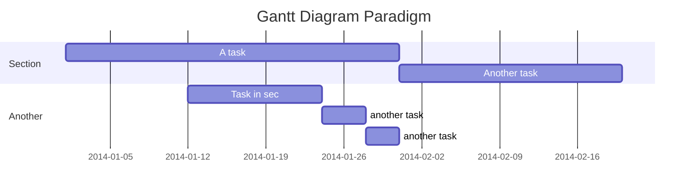

```mermaid
gantt
title To-dos

section Lan & Alg
Python meachine learning : pml, 2022-02-26, 100d
Linux :2022-02-26,220d

section meth
Calculars : 2022-02-26, 120d
Linear Algebra: 2022-02-26, 120d

section CS
CSAPP: 


```


- [ ] 机器学习
	- [ ] Python 机器学习
- [ ] Linux 就该这么学
	- [ ]  learn kali Linux
- [ ] 深入理解计算机系统
	- [ ] NJU, PA
	- [ ] CMU, ICS
- [ ] CTF
- [ ] 网站建设
	- [ ] MIT 
- [ ] 算法竞赛
	- [ ] 书
	- [ ] 题
- [ ] 数学
	- [ ] 线性代数
		- [ ] Linear Algebra Done right
	- [ ] 微积分
		- [ ] 教材
		- [ ] 微积分学教材，菲
	- [ ] 


- [ ] MCM/ICM
	- [ ] 算法
	- [ ] Tex
	- [ ] 论文网站
	- [ ] Python 数据分析/画图 
		- [ ] turtle
		- [ ] SciPy, NumPy, Matplotlib, pandas 


---

# Jan.23.22
