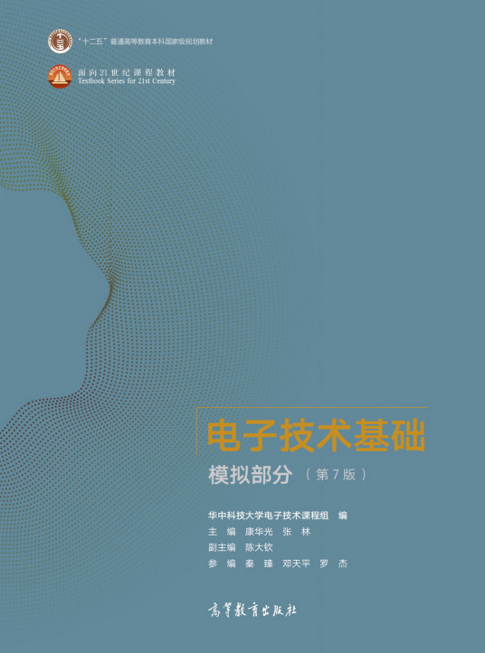

# Digital (Logic) Electronics Foundations

[TOC]

## Res
### Related Topics
↗ [Boolean Algebra](../../../🧮%20Math%20&%20Theoretical%20Computer%20Science%20(TCS)/🧊%20Algebra/Boolean%20Algebra/Boolean%20Algebra.md)
↗ [Classical Electromagnetism](../🍏%20Other%20EE%20Theories%20Related%20with%20CS/Classical%20Electromagnetism.md)
↗ [Theory of Computation](../../../🧮%20Math%20&%20Theoretical%20Computer%20Science%20(TCS)/🤼‍♀️%20Mathematical%20Logics/😶‍🌫️%20Theory%20of%20Computation/Theory%20of%20Computation.md)

↗ [HDL (Hardware Definition Languages)](../../../Computer%20Engineering,%20Embedded%20Development%20&%20Internet%20of%20Things/Embedded%20Programming%20&%20Software%20Development/Languages/HDL%20(Hardware%20Definition%20Languages)/HDL%20(Hardware%20Definition%20Languages).md)
↗ [Verilog](../../../Computer%20Engineering,%20Embedded%20Development%20&%20Internet%20of%20Things/Embedded%20Programming%20&%20Software%20Development/Languages/HDL%20(Hardware%20Definition%20Languages)/Verilog/Verilog.md)

↗ [Electronics Computer Engineering (ECE)](../../../🧮%20Math%20&%20Theoretical%20Computer%20Science%20(TCS)/Electronics%20Computer%20Engineering%20(ECE).md)

### Learning Resources

<small><url>https://baike.baidu.com/item/电子技术基础（第7版）/60079805#4_1</url></small>
👍 So far the best i've read in China. 
The 6th edition is available at ↗ [Appendix](Appendix.md)

https://www.bilibili.com/video/BV1XE411X7qU?share_source=copy_web&vd_source=7740584ebdab35221363fc24d1582d9d
清华大学-电子技术基础（数电+模电+实验)

https://www.bilibili.com/video/BV1jX4y1V78k?share_source=copy_web&vd_source=7740584ebdab35221363fc24d1582d9d
数字电子技术基础（阎石版）电子科技大学（金艳华 主讲）全60讲

https://www.bilibili.com/video/BV1J7411a7sW/?p=6&spm_id_from=pageDriver&vd_source=72104416ad988548ac73d9710091a9af
FPGA入门 -- 电子科技大学

https://www.yuque.com/u32007683/wcvfxs
数字电子技术基础

🏫 [欢迎来到实验课程主页 --- 在这里，从门电路开始，一步一步设计出有限状态机](https://vlab.ustc.edu.cn/guide/index.html)

[FPGA & CPU](https://yearn.xyz/docs/fpgacpu/)
[小脚丫 STEP FPGA 开发板上手及初阶 FPGA 实验](https://steinslab.io/archives/1289)

## Intro
> 🔗 电子技术基础（第7版）

电子技术是20世纪以来发展最迅速、应用最广泛的技术，已经渗透到人类生活的各个方面。 特别是数字电子技术，取得了令人瞩目的进步。 

电子技术的发展是以电子器件的发展为基础的。20世纪初直至中叶，主要使用真空管，也称电子管。随着固体微电子学的进步，第一只晶体管于1947年问世，开创了电子技术的新领域。随后，在 20世纪60 年代初，模拟和数字集成电路相继上市。20世纪 70 年代微处理器的问世，使电子器件及其应用出现了崭新的局面。20 世纪80 年代末，微处理器每个芯片的晶体管数目突破百万大关。到 20世纪90年代末，可以制造包含千万个晶体管的芯片。当前的制造技术可以在芯片上集成几十亿个晶体管。在过去的40年间，集成电路的集成度和性能以惊人的速度发展着，印证了**摩尔定理**，即**单个芯片上集成的晶体管数量每18个月就翻一番**。以集成电路为核心的电子信息产业已超过了汽车、石油和钢铁工业成为第一大产业。

数字技术应用的典型代表是**电子计算机**，它是伴随着电子技术的发展而发展的，经历了**电子管、晶体管、集成电路和超大规模集成电路**四个发展阶段。其体积越来越小，功能越来越强，价格越来越低，应用范围越来越广，目前正朝着智能化方向发展。计算机技术的影响已遍及人类经济生活的各个领域，掀起了一场"数字革命"。数字技术被广泛地应用于广播、电视、通信、医学诊断、测量、控制、文化娱乐以及家庭生活等方面。**由于数字信息具有便于存储、处理和传输的特点，使得许多传统使用模拟技术的领域转而运用数字技术**。

随着微电子技术的发展，将会有更多的数字电子产品陆续问世。数字技术的发展、计算机的应用正在改变着人类的生产方式、生活方式及思维方式，它使得工业自动化，农业现代化办公自动化和通信网络化成为现实。但是，无论数字技术如何发展，也不能代替模拟技术。**自然界中绝大多数物理量都是**[模拟量](https://link.zhihu.com/?target=https%3A//zhidao.baidu.com/question/325975594.html)，数字技术不能直接接受模拟信号进行处理，也无法将处理后的数字信号直接送到外部物理世界。因此，模拟技术在电子系统中是不可缺少的。由于模拟技术难度远高于数字技术，其发展自然较慢。**实际电子系统一般是模拟电路和数字电路的结合**，在发展数字技术的同时，也应重视模拟技术的发展。

<small>https://en.wikipedia.org/wiki/Digital_electronics#External_links</small>

### Digital Integrated Circuits Features /Taxonomy

### Digital Integrated Circuits Analysis, Design, and Test

### IC & Signal

#### Analog Signal 

#### Digital Signal

## Ref
