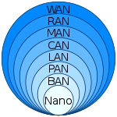

# Computer Network and Communication Introduction & Overview

[TOC]

## Res
### Related Topics

### Other Resources

## Overview

<small>Web & Internet: The Architecture</small>

### Computer Network Definition
🔗【深入浅出计算机网络 - 1.4 计算机网络的定义和分类】 https://www.bilibili.com/video/BV1BP411j7XH/?share_source=copy_web&vd_source=7740584ebdab35221363fc24d1582d9d

### Computer Network Nodes

### Communication Protocols
↗ [Computer Network Protocol Suites Standardizations & Administration](Computer%20Network%20Protocol%20Suites%20Standardizations%20&%20Administration/Computer%20Network%20Protocol%20Suites%20Standardizations%20&%20Administration.md)
↗ [Internet and Internet Protocol Suites (TCP&IP Protocol Suites)](Computer%20Network%20Protocol%20Suites%20Standardizations%20&%20Administration/Internet%20and%20Internet%20Protocol%20Suites%20(TCP&IP%20Protocol%20Suites)/Internet%20and%20Internet%20Protocol%20Suites%20(TCP&IP%20Protocol%20Suites).md)
↗ [OSI-ISO Protocol Suites](Computer%20Network%20Protocol%20Suites%20Standardizations%20&%20Administration/OSI-ISO%20Protocol%20Suites/OSI-ISO%20Protocol%20Suites.md)

## Comput Network Taxonomy 
### by Switching Methods
↗ [History of Computer Networks and Internet /Evolution of Communication Technologies](History%20of%20Computer%20Networking%20and%20Communication%20Evolution.md)

### by Users
Public Network
Private Network

### by Link Media
↗ [0x07 Physical Layer](../0x07%20Physical%20Layer/0x07%20Physical%20Layer.md)

### by Spatial Scope (Geographic Scale)
> 🔗 [Computer network](https://en.wikipedia.org/wiki/Computer_network)

- [Nanoscale](https://en.wikipedia.org/wiki/Nanonetwork)
- [Near-field (NFC)](https://en.wikipedia.org/wiki/Near-field_communication)
- [Body](https://en.wikipedia.org/wiki/Body_area_network)
- [Personal (PAN)](https://en.wikipedia.org/wiki/Personal_area_network)
- [Near-me](https://en.wikipedia.org/wiki/Near-me_area_network)
- [Local (LAN)](https://en.wikipedia.org/wiki/Local_area_network)
  - [Storage (SAN)](https://en.wikipedia.org/wiki/Storage_area_network)
  - [Wireless (WLAN)](https://en.wikipedia.org/wiki/Wireless_LAN)
  - [Virtual (VLAN)](https://en.wikipedia.org/wiki/VLAN)
- [Home (HAN)](https://en.wikipedia.org/wiki/Home_network)
- [Building](https://en.wikipedia.org/wiki/Building_area_network)
- [Campus (CAN)](https://en.wikipedia.org/wiki/Campus_network)
- [Backbone](https://en.wikipedia.org/wiki/Backbone_network)
- [Metropolitan (MAN)](https://en.wikipedia.org/wiki/Metropolitan_area_network "Metropolitan area network")
  - [Municipal wireless (MWN)](https://en.wikipedia.org/wiki/Municipal_wireless_network)
- [Wide (WAN)](https://en.wikipedia.org/wiki/Wide_area_network)
- Enterprise private network
- Virtual private network
- Global area network
- [Cloud](https://en.wikipedia.org/wiki/Internet_area_network)
- [Internet](https://en.wikipedia.org/wiki/Internet "Internet")
- [Interplanetary Internet](https://en.wikipedia.org/wiki/Interplanetary_Internet)

### by Topology
↗ [Computer Network Topology](../0x06%20Data%20Link%20Layer/Computer%20Network%20Topology.md)
#### 🤔 Overlay Network
↗ [Overlay Network](../../Network%20Virtualization/Overlay%20Network.md)

Recall Overlay/Underlay Architecture in ↗ [SDN Standardizations & Architectures](../../🙌🏻%20Software%20Defined%20Network%20(SDN)/SDN%20Overview/SDN%20Standardizations%20&%20Architectures.md)

## 🎸 Development of Computer Networks and the Internet

↗ [History of Computer Networking and Communication Evolution](History%20of%20Computer%20Networking%20and%20Communication%20Evolution.md)

> 🤔 Network, Computer Networks, internet, the Internet, Web, and WWW?
> Answer at ↗ [FAQ](../FAQ.md) or above notes ⏫

## 🍔 Computer Network Layering Architecture
↗ [Computer Network Layering Architecture](Computer%20Network%20Layering%20Architecture.md)

## ⏲️ Computer Network Performance
↗ [Computer Network Performance Metrics](Computer%20Network%20Performance%20Metrics.md)

## Computer Network Communication Process Overview
#TODO 

## Ref

[网络协议分析与运维实战]: https://mp.weixin.qq.com/s/G4oNdrqgIozEH_rf0lQk2w

[👍 全网最全网络基础思维导图（38张) | SDNLAB]: https://mp.weixin.qq.com/s/jlstOkjnJtrLKOGtWedebA
